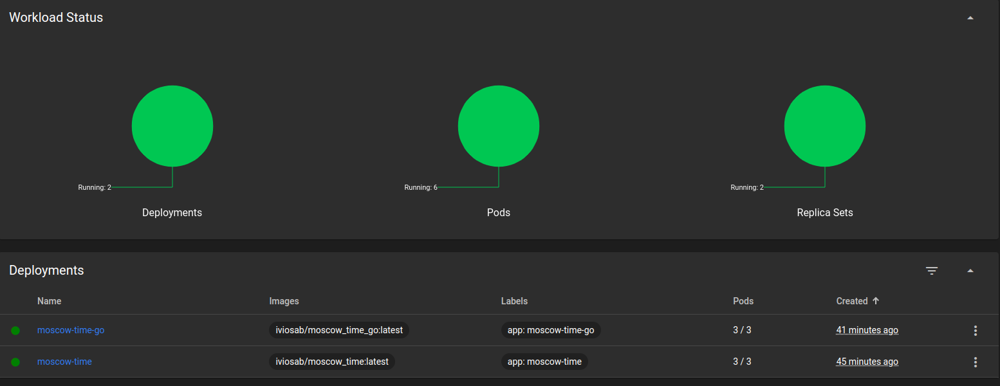
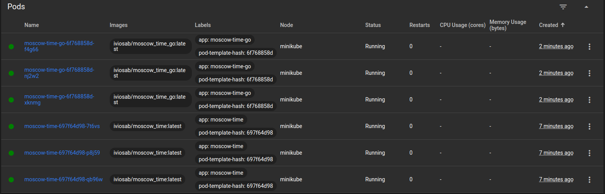
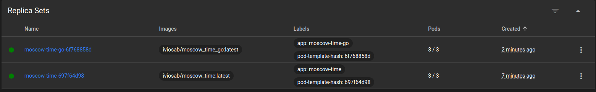
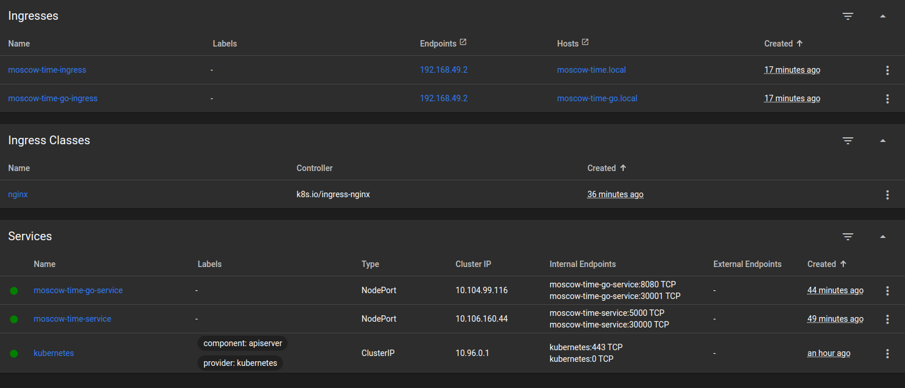
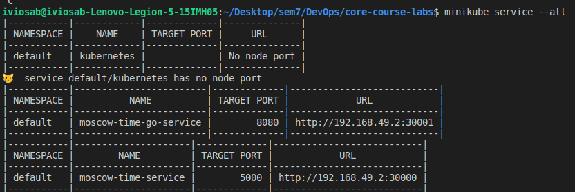
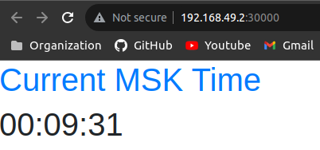
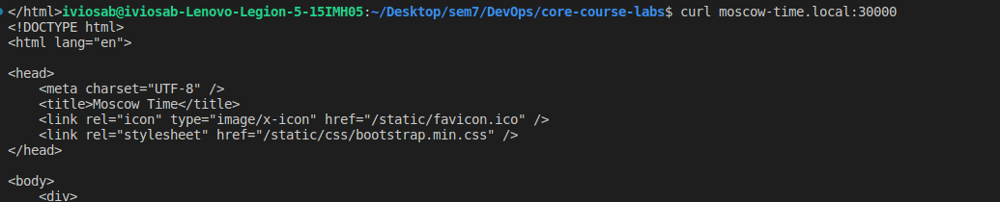

# Kubernetes

## Descriptions:

#### K8s
Kubernetes (K8s) is a powerful platform developed by Google for managing containerized applications across various machines. It offers tools for deploying, scaling, and updating applications, as well as optimizing hardware utilization.

#### Deployment
Kubernetes Deployments monitor Pods' health, restarting failed Containers and handling Pod creation and scaling. They define the application’s desired state, including container images, replica numbers, and update strategies.

#### Service
A Kubernetes Service is an abstraction that groups Pods and defines access policies, acting as a micro-service. It exposes applications on Pods to external users and allows for consuming external services.

#### Ingress
In Kubernetes, an Ingress manages external access to services, providing load balancing, SSL termination, and name-based virtual hosting primarily for HTTP traffic.

#### Pods
A Pod in Kubernetes is the smallest deployable unit, consisting of one or more containers sharing storage and network, along with specifications for running the containers.

## Outputs:
#### Deployements:
 
#### Pods

#### Replica Sets: 

#### Services: 

#### Python:

#### GO:

