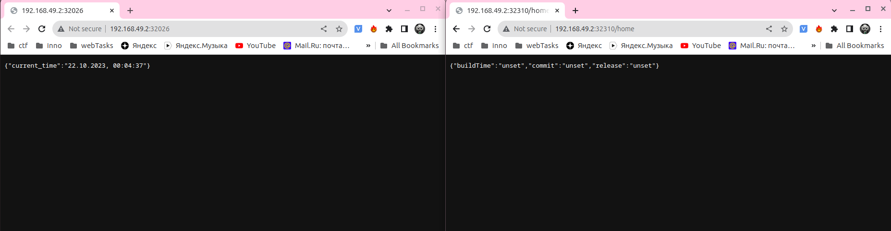

# Kubernetes

## Basic deployment

1. Let's create deployment for the applications:

    ```shell
    kubectl create deployment app-python --image=yesliesnayder/app_python:1.0.5
    kubectl create deployment app-golang --image=yesliesnayder/webservicego:1.0.0
    kubectl get deployments
    ```
    ```text
    deployment.apps/app-python created
    deployment.apps/app-golang created
    NAME         READY   UP-TO-DATE   AVAILABLE   AGE
    app-golang   1/1     1            1           13s
    app-python   1/1     1            1           83s
    ```

1. Expose the Pods to the public internet using the `kubectl expose` command.
It will create new services to access the applications:

    ```shell
    kubectl expose deployment app-python --type=LoadBalancer --port=8000
    kubectl expose deployment app-golang --type=LoadBalancer --port=8000
    ```
    ```text
    service/app-python exposed
    service/app-golang exposed
    ```

1. Show running pods and services:

    ```shell
    kubectl get pods,svc
    ```
    ```text
    NAME                              READY   STATUS    RESTARTS   AGE
    pod/app-golang-57b7596b46-kjrnh   1/1     Running   0          9m30s
    pod/app-python-868f94d4c-gwx87    1/1     Running   0          10m
    
    NAME                 TYPE           CLUSTER-IP       EXTERNAL-IP   PORT(S)          AGE
    service/app-golang   LoadBalancer   10.98.139.103    <pending>     8000:32668/TCP   5m43s
    service/app-python   LoadBalancer   10.104.142.180   <pending>     8000:30793/TCP   5m48s
    service/kubernetes   ClusterIP      10.96.0.1        <none>        443/TCP          24m
    ```
   
    The following command opens up a browser window that serves all running applications and shows their response:
    ```shell
    minikube service --all
    ```
    ```text
    |-----------|------------|-------------|---------------------------|
    | NAMESPACE |    NAME    | TARGET PORT |            URL            |
    |-----------|------------|-------------|---------------------------|
    | default   | app-golang |        8000 | http://192.168.49.2:32668 |
    |-----------|------------|-------------|---------------------------|
    |-----------|------------|-------------|---------------------------|
    | NAMESPACE |    NAME    | TARGET PORT |            URL            |
    |-----------|------------|-------------|---------------------------|
    | default   | app-python |        8000 | http://192.168.49.2:30793 |
    |-----------|------------|-------------|---------------------------|
    |-----------|------------|-------------|--------------|
    | NAMESPACE |    NAME    | TARGET PORT |     URL      |
    |-----------|------------|-------------|--------------|
    | default   | kubernetes |             | No node port |
    |-----------|------------|-------------|--------------|
    😿  service default/kubernetes has no node port
    🎉  Opening service default/app-golang in default browser...
    🎉  Opening service default/app-python in default browser...
    ```
    

1. Cleanup:

    ```shell
    kubectl delete svc app-python app-golang
    kubectl delete deployment --all
    ```

## Declarative deployment

1. Apply manifests:

   ```shell
   kubectl apply -f app_python/deployment.yml
   kubectl apply -f app_python/service.yml
   kubectl apply -f app_golang/deployment.yml
   kubectl apply -f app_golang/service.yml
   ```
   ```text
   deployment.apps/app-python-deployment created
   service/app-python-service created
   deployment.apps/app-golang-deployment created
   service/app-golang-service created
   ```

1. Show running pods and services:

   ```shell
   kubectl get pods,svc
   ```
   ```text
   NAME                                         READY   STATUS    RESTARTS   AGE
   pod/app-golang-deployment-6c4b77f59d-99ln7   1/1     Running   0          45s
   pod/app-golang-deployment-6c4b77f59d-d8r4p   1/1     Running   0          45s
   pod/app-golang-deployment-6c4b77f59d-nftqd   1/1     Running   0          45s
   pod/app-python-deployment-5c6b8f9f68-5msvr   1/1     Running   0          4m16s
   pod/app-python-deployment-5c6b8f9f68-9dgb2   1/1     Running   0          4m16s
   pod/app-python-deployment-5c6b8f9f68-svksv   1/1     Running   0          4m16s
   
   NAME                         TYPE           CLUSTER-IP      EXTERNAL-IP   PORT(S)          AGE
   service/app-golang-service   LoadBalancer   10.96.217.132   <pending>     8000:32310/TCP   42s
   service/app-python-service   LoadBalancer   10.105.196.82   <pending>     8000:32026/TCP   2m8s
   service/kubernetes           ClusterIP      10.96.0.1       <none>        443/TCP          50m
   ```

1. Check availability of the services:

   ```shell
   minikube service --all
   ```
   ```text
   |-----------|--------------------|-------------|---------------------------|
   | NAMESPACE |        NAME        | TARGET PORT |            URL            |
   |-----------|--------------------|-------------|---------------------------|
   | default   | app-golang-service |        8000 | http://192.168.49.2:32310 |
   |-----------|--------------------|-------------|---------------------------|
   |-----------|--------------------|-------------|---------------------------|
   | NAMESPACE |        NAME        | TARGET PORT |            URL            |
   |-----------|--------------------|-------------|---------------------------|
   | default   | app-python-service |        8000 | http://192.168.49.2:32026 |
   |-----------|--------------------|-------------|---------------------------|
   |-----------|------------|-------------|--------------|
   | NAMESPACE |    NAME    | TARGET PORT |     URL      |
   |-----------|------------|-------------|--------------|
   | default   | kubernetes |             | No node port |
   |-----------|------------|-------------|--------------|
   😿  service default/kubernetes has no node port
   🎉  Opening service default/app-golang-service in default browser...
   🎉  Opening service default/app-python-service in default browser...
   ```
   
   

## Ingress

1. Enable ingress controller

   ```shell
   minikube addons enable ingress
   ```
   
1. Apply ingress manifests:

   ```shell
   kubectl apply -f app_python/ingress.yml
   kubectl apply -f app_golang/ingress.yml
   kubectl get ingress
   ```
   ```text
   ingress.networking.k8s.io/app-python-ingress created
   ingress.networking.k8s.io/app-golang-ingress created
   NAME                 CLASS   HOSTS        ADDRESS        PORTS   AGE
   app-golang-ingress   nginx   app-golang   192.168.49.2   80      41s
   app-python-ingress   nginx   app-python   192.168.49.2   80      41s
   ```
   
1. Check availability of the applications:

   **Python**
   
   ```shell
   curl --resolve "app-python:80:$(minikube ip)" -i http://app-python
   ```
   ```text
   HTTP/1.1 200 OK
   Date: Sat, 21 Oct 2023 21:43:27 GMT
   Content-Type: application/json
   Content-Length: 39
   Connection: keep-alive
   
   {"current_time":"22.10.2023, 00:43:27"}
   ```
   
   **Golang**
   
   ```shell
   curl --resolve "app-golang:80:$(minikube ip)" -i http://app-golang/home
   ```
   ```text
   HTTP/1.1 200 OK
   Date: Sat, 21 Oct 2023 21:56:19 GMT
   Content-Type: application/json
   Content-Length: 56
   Connection: keep-alive
   
   {"buildTime":"unset","commit":"unset","release":"unset"}
   ```