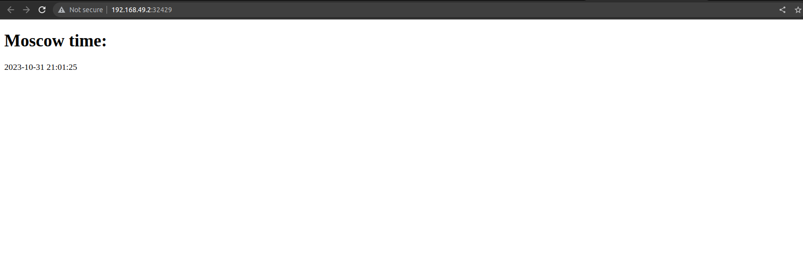

# Kubernetes

## Manual Deployment:
* Running 
```
kubectl get pods, svc
```
outputs:
```
NAME                                    READY   STATUS    RESTARTS   AGE
pod/clock-deployment-5bd7867bfb-7bzkq   1/1     Running   0          7m41s

NAME                       TYPE           CLUSTER-IP      EXTERNAL-IP   PORT(S)          AGE
service/clock-deployment   LoadBalancer   10.106.195.92   <pending>     8000:31294/TCP   3m18s
service/kubernetes         ClusterIP      10.96.0.1       <none>        443/TCP          30m

```

* Running
```
kubectl logs clock-deployment-5bd7867bfb-7bzkq
```
outputs
```
INFO:     Started server process [1]
INFO:     Waiting for application startup.
INFO:     Application startup complete.
INFO:     Uvicorn running on http://0.0.0.0:8000 (Press CTRL+C to quit)
```

## Declarative Kubernetes Manifests

Running 
```
kubectl get pods,svc
```

Outputs:
```
NAME                             READY   STATUS    RESTARTS   AGE
pod/clock-app-6b77d9d747-5qqcz   1/1     Running   0          3m
pod/clock-app-6b77d9d747-lcrfr   1/1     Running   0          3m
pod/clock-app-6b77d9d747-pjcv2   1/1     Running   0          3m

NAME                    TYPE           CLUSTER-IP       EXTERNAL-IP   PORT(S)        AGE
service/clock-service   LoadBalancer   10.108.192.150   <pending>     80:32429/TCP   28s
service/kubernetes      ClusterIP      10.96.0.1        <none>        443/TCP        68m
```
Running:
```
kubectl get pods,svc
```

Ouputs
```
|-----------|---------------|-------------|---------------------------|
| NAMESPACE |     NAME      | TARGET PORT |            URL            |
|-----------|---------------|-------------|---------------------------|
| default   | clock-service |          80 | http://192.168.49.2:32429 |
|-----------|---------------|-------------|---------------------------|
|-----------|------------|-------------|--------------|
| NAMESPACE |    NAME    | TARGET PORT |     URL      |
|-----------|------------|-------------|--------------|
| default   | kubernetes |             | No node port |
|-----------|------------|-------------|--------------|
😿  service default/kubernetes has no node port
🎉  Opening service default/clock-service in default browser...
```
