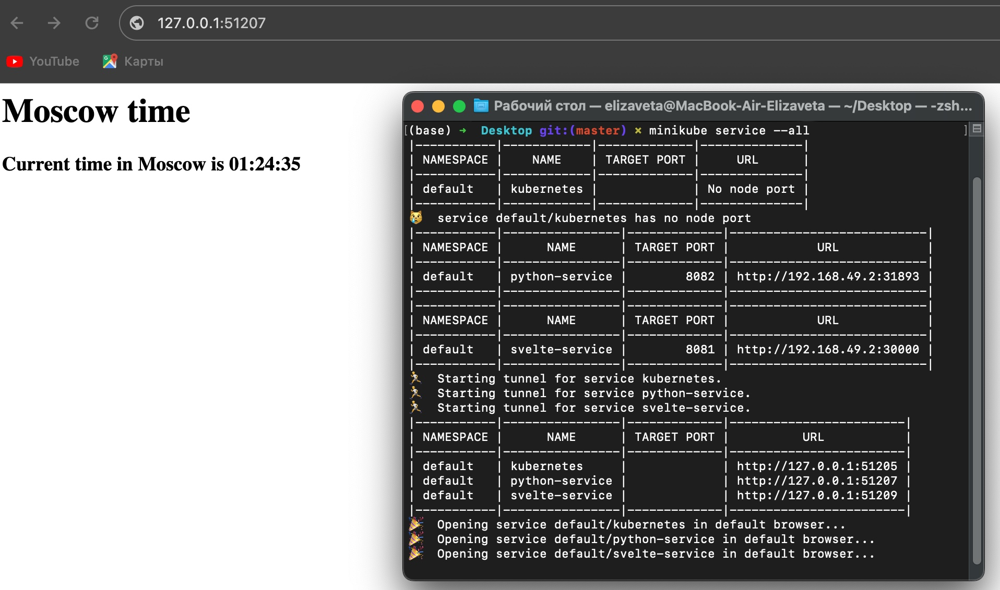
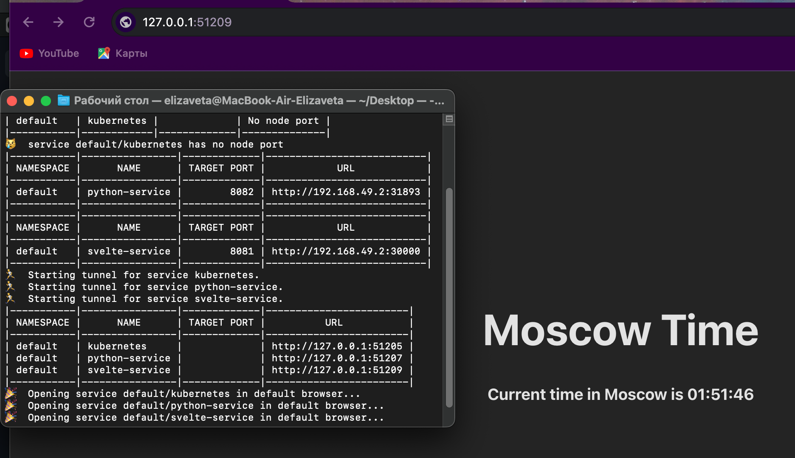

# Kubernetes

## Kubernetes Setup and Basic Deployment

### Install `kubectl` and `minikube`

```shell
$ minikube start --kubernetes-version=v1.27.4
😄  minikube v1.31.2 на Darwin 13.6
✨  Automatically selected the docker driver. Other choices: parallels, ssh
📌  Using Docker Desktop driver with root privileges
👍  Запускается control plane узел minikube в кластере minikube
🚜  Скачивается базовый образ ...
    > gcr.io/k8s-minikube/kicbase...:  447.62 MiB / 447.62 MiB  100.00% 12.31 M
🔥  Creating docker container (CPUs=2, Memory=2200MB) ...
❗  This container is having trouble accessing https://registry.k8s.io
💡  To pull new external images, you may need to configure a proxy: https://minikube.sigs.k8s.io/docs/reference/networking/proxy/
🐳  Подготавливается Kubernetes v1.27.4 на Docker 24.0.4 ...
    ▪ Generating certificates and keys ...
    ▪ Booting up control plane ...
    ▪ Configuring RBAC rules ...
🔗  Configuring bridge CNI (Container Networking Interface) ...
🔎  Компоненты Kubernetes проверяются ...
    ▪ Используется образ gcr.io/k8s-minikube/storage-provisioner:v5
🌟  Включенные дополнения: storage-provisioner, default-storageclass

❗  /usr/local/bin/kubectl is version 1.25.9, which may have incompatibilities with Kubernetes 1.27.4.
    ▪ Want kubectl v1.27.4? Try 'minikube kubectl -- get pods -A'
🏄  Готово! kubectl настроен для использования кластера "minikube" и "default" пространства имён по умолчанию
```

### Create deployments

```shell
$ kubectl create deployment app-py --image=lizavetta/devops-python:latest 
deployment.apps/app-py created
$ kubectl create deployment app-js --image=lizavetta/devops-svelte:latest
deployment.apps/app-js created
```

### Check created deployments

```shell
$ kubectl get deployments
NAME     READY   UP-TO-DATE   AVAILABLE   AGE
app-js   1/1     1            1           7m18s
app-py   1/1     1            1           7m50s
```

### Making apps accessible

```shell
$ kubectl expose deployment app-py --type=LoadBalancer --port=8082 
service/app-py exposed
$ kubectl expose deployment app-js --type=LoadBalancer --port=8081
service/app-js exposed
```

### Check if they're accessible

```shell
$ kubectl get pods,svc
NAME                          READY   STATUS    RESTARTS   AGE
pod/app-js-68876b774d-dg9hl   1/1     Running   0          12m
pod/app-py-64474d558d-xcpn6   1/1     Running   0          13m

NAME                 TYPE           CLUSTER-IP      EXTERNAL-IP   PORT(S)          AGE
service/app-js       LoadBalancer   10.103.71.129   <pending>     8081:30469/TCP   14s
service/app-py       LoadBalancer   10.97.83.229    <pending>     8082:30120/TCP   22s
service/kubernetes   ClusterIP      10.96.0.1       <none>        443/TCP          71m
```

### Delete Deployment and Service
```shell
$ kubectl delete svc app-js app-py
service "app-js" deleted
service "app-py" deleted
$ kubectl delete deployment --all
deployment.apps "app-js" deleted
deployment.apps "app-py" deleted
```

## Declarative Kubernetes Manifests

### Manifest apply

```shell
$ kubectl apply -f app-py/deployment.yml 
deployment.apps/python-deployment created
$ kubectl apply -f app-js/deployment.yml 
deployment.apps/svelte-deploy created
$ kubectl apply -f app-py/service.yml    
service/python-service created
$ kubectl apply -f app-js/service.yml 
service/svelte-service created
```

### Pods and services

```shell
$  kubectl get pods,svc
NAME                                     READY   STATUS    RESTARTS   AGE
pod/python-deployment-7466fb66c8-c22h7   1/1     Running   0          35m
pod/python-deployment-7466fb66c8-gdsjw   1/1     Running   0          35m
pod/python-deployment-7466fb66c8-gmf8c   1/1     Running   0          35m
pod/svelte-deploy-66f4669874-4n2xv       1/1     Running   0          33m
pod/svelte-deploy-66f4669874-gprqd       1/1     Running   0          33m
pod/svelte-deploy-66f4669874-m7jsx       1/1     Running   0          33m

NAME                     TYPE           CLUSTER-IP      EXTERNAL-IP   PORT(S)          AGE
service/kubernetes       ClusterIP      10.96.0.1       <none>        443/TCP          6h17m
service/python-service   LoadBalancer   10.110.80.93    <pending>     8082:31893/TCP   38s
service/svelte-service   LoadBalancer   10.103.246.5    <pending>     8081:30000/TCP   24s
```

### Service avilability

```shell
$ minikube service --all
|-----------|------------|-------------|--------------|
| NAMESPACE |    NAME    | TARGET PORT |     URL      |
|-----------|------------|-------------|--------------|
| default   | kubernetes |             | No node port |
|-----------|------------|-------------|--------------|
😿  service default/kubernetes has no node port
|-----------|----------------|-------------|---------------------------|
| NAMESPACE |      NAME      | TARGET PORT |            URL            |
|-----------|----------------|-------------|---------------------------|
| default   | python-service |        8082 | http://192.168.49.2:31893 |
|-----------|----------------|-------------|---------------------------|
|-----------|----------------|-------------|---------------------------|
| NAMESPACE |      NAME      | TARGET PORT |            URL            |
|-----------|----------------|-------------|---------------------------|
| default   | svelte-service |        8081 | http://192.168.49.2:30000 |
|-----------|----------------|-------------|---------------------------|
🏃  Starting tunnel for service kubernetes.
🏃  Starting tunnel for service python-service.
🏃  Starting tunnel for service svelte-service.
|-----------|----------------|-------------|------------------------|
| NAMESPACE |      NAME      | TARGET PORT |          URL           |
|-----------|----------------|-------------|------------------------|
| default   | kubernetes     |             | http://127.0.0.1:51205 |
| default   | python-service |             | http://127.0.0.1:51207 |
| default   | svelte-service |             | http://127.0.0.1:51209 |
|-----------|----------------|-------------|------------------------|
🎉  Opening service default/kubernetes in default browser...
🎉  Opening service default/python-service in default browser...
🎉  Opening service default/svelte-service in default browser...
```

## Bonus part

> For additional app I already did previous steps 
(check my Javascript application where used Svelte framework).

### Enable Ingress
```shell
$ minikube addons enable ingress
💡  ingress is an addon maintained by Kubernetes. For any concerns contact minikube on GitHub.
You can view the list of minikube maintainers at: https://github.com/kubernetes/minikube/blob/master/OWNERS
💡  After the addon is enabled, please run "minikube tunnel" and your ingress resources would be available at "127.0.0.1"
    ▪ Используется образ registry.k8s.io/ingress-nginx/kube-webhook-certgen:v20230407
    ▪ Используется образ registry.k8s.io/ingress-nginx/kube-webhook-certgen:v20230407
    ▪ Используется образ registry.k8s.io/ingress-nginx/controller:v1.8.1
🔎  Verifying ingress addon...
🌟  The 'ingress' addon is enabled
```

### Apply Ingress

```shell
$ kubectl apply -f app-py/ingress.yml 
ingress.networking.k8s.io/py-ingress created
$ kubectl apply -f app-js/ingress.yml    
ingress.networking.k8s.io/js-ingress created
```

### Get Ingress

```shell
$ kubectl get ingress
NAME         CLASS   HOSTS        ADDRESS        PORTS   AGE
js-ingress   nginx   svelte.app   192.168.49.2   80      42s
py-ingress   nginx   python.app   192.168.49.2   80      61s
```

### Python result




### Javascript result

