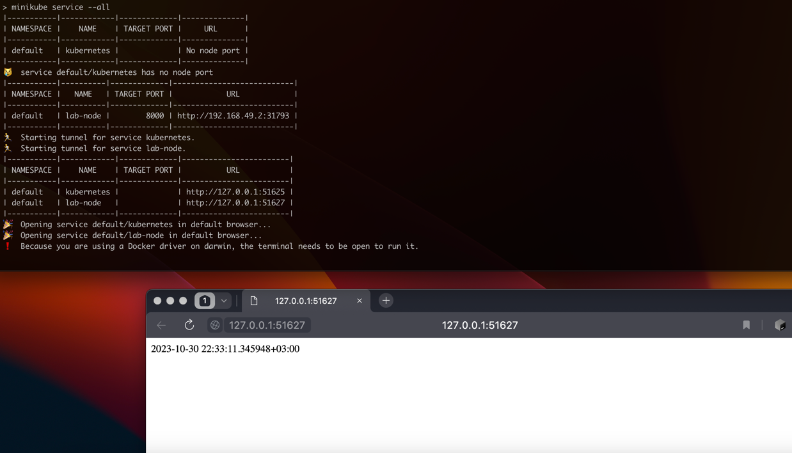
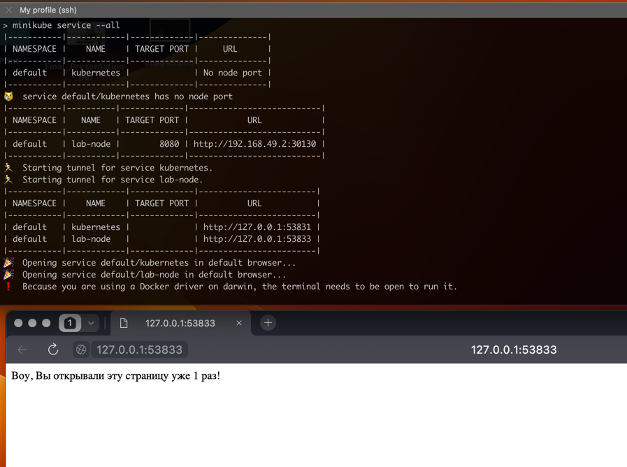

## Running the application on Kubernetes
To run my python application I used the following commands:
```
kubectl create deployment lab-node --image=klemencja/app_python
kubectl expose deployment lab-node --type=LoadBalancer --port=8000
minikube service lab-node
```

After the minkube response:
```
|-----------|----------|-------------|---------------------------|
| NAMESPACE |   NAME   | TARGET PORT |            URL            |
|-----------|----------|-------------|---------------------------|
| default   | lab-node |        8000 | http://192.168.49.2:32617 |
|-----------|----------|-------------|---------------------------|
🏃  Starting tunnel for service lab-node.
|-----------|----------|-------------|------------------------|
| NAMESPACE |   NAME   | TARGET PORT |          URL           |
|-----------|----------|-------------|------------------------|
| default   | lab-node |             | http://127.0.0.1:49801 |
|-----------|----------|-------------|------------------------|
```
The page with running python application was opened:


### Checking pods and services state
```
kubectl get pods,svc
NAME                            READY   STATUS    RESTARTS   AGE
pod/lab-node-576c4646c7-wqshl   1/1     Running   0          3m32s

NAME                 TYPE           CLUSTER-IP      EXTERNAL-IP   PORT(S)          AGE
service/kubernetes   ClusterIP      10.96.0.1       <none>        443/TCP          30h
service/lab-node     LoadBalancer   10.109.131.29   <pending>     8000:32617/TCP   3m6s
```

### Cleanup
After successfull test I cleaned my service and deployment with commands:
```
kubectl delete service lab-node
kubectl delete deployment lab-node
```


## Apply from configuration files
I added configuration files for deployment and service and started them by command:
`kubectl apply -f python_app`
The output is:
```
deployment.apps/lab-node created
service/kubernetes configured
service/lab-node created
```

Getting pods and services `kubectl get pods,svc`:
```
NAME                           READY   STATUS    RESTARTS   AGE
pod/lab-node-f6f6c9c48-jklsv   1/1     Running   0          8m11s
pod/lab-node-f6f6c9c48-k7x88   1/1     Running   0          8m11s
pod/lab-node-f6f6c9c48-mrp58   1/1     Running   0          8m11s

NAME                 TYPE           CLUSTER-IP      EXTERNAL-IP   PORT(S)          AGE
service/kubernetes   ClusterIP      10.96.0.1       <none>        443/TCP          31h
service/lab-node     LoadBalancer   10.105.180.38   <pending>     8000:31793/TCP   8m11s
```

Running the services `minikube service --all`:



## Apply k8s configuration files for Kotlin application


`kubectl apply -f kotlin_app/`
```
deployment.apps/lab-node created
service/kubernetes unchanged
service/lab-node created
```

Getting pods and services `kubectl get pods,svc`:
```
kubectl get pods,svc
NAME                            READY   STATUS    RESTARTS   AGE
pod/lab-node-6d795f4486-8d7r8   1/1     Running   0          42s
pod/lab-node-6d795f4486-fgjkr   1/1     Running   0          42s
pod/lab-node-6d795f4486-jr9ls   1/1     Running   0          42s

NAME                 TYPE           CLUSTER-IP       EXTERNAL-IP   PORT(S)          AGE
service/kubernetes   ClusterIP      10.96.0.1        <none>        443/TCP          2d5h
service/lab-node     LoadBalancer   10.108.150.168   <pending>     8080:30130/TCP   42s
```




## Ingress

I updated my deployment names to different names to `lab-node-python` and `lab-node-kotlin`.

I added configuration for ingress into `ingress.yaml` where I mapped `/python` endpoint to `lab-node-python` service, and `/kotlin` endpoint to `lab-node-kotlin`.

Applied it via `kubectl apply -f ingress.yaml`.

I also added string `192.168.49.2 my-lab9.info` to my `/etc/hosts`

Here is what I achieved:

`kubectl get ingress my-ingress`
```
NAME         CLASS    HOSTS          ADDRESS        PORTS   AGE
my-ingress   <none>   my-lab9.info   192.168.49.2   80      68m
```


`kubectl describe ingress my-ingress`
```
Name:             my-ingress
Labels:           <none>
Namespace:        default
Address:          192.168.49.2
Ingress Class:    <none>
Default backend:  <default>
Rules:
  Host          Path  Backends
  ----          ----  --------
  my-lab9.info
                /kotlin   lab-node-kotlin:8080 (10.244.0.44:8080)
                /python   lab-node-python:8000 (10.244.0.45:8000)
Annotations:    nginx.ingress.kubernetes.io/rewrite-target: /
```

### Checking ingress via curl
Checking python application:
```
$ curl http://my-lab9.info/python
2023-10-31 22:19:12.982984+03:00
```

Checking kotlin application:
```
$ curl http://my-lab9.info/kotlin
Воу, Вы открывали эту страницу уже 6 раз!


$ curl http://my-lab9.info/kotlin/time
22:21:22.000305930+03:00
```

