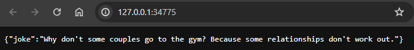
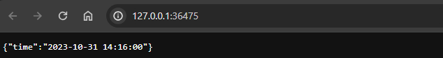

# Services and Deployments

```shell
$ kubectl get pods,svc
NAME                              READY   STATUS    RESTARTS   AGE
pod/app-js-6d4fb9dffc-9678k       1/1     Running   0          32m
pod/app-js-6d4fb9dffc-fr68z       1/1     Running   0          32m
pod/app-js-6d4fb9dffc-nwswg       1/1     Running   0          32m
pod/app-python-7756f8df6f-7zmn8   1/1     Running   0          32m
pod/app-python-7756f8df6f-bln6c   1/1     Running   0          32m
pod/app-python-7756f8df6f-fmw89   1/1     Running   0          32m

NAME                 TYPE        CLUSTER-IP       EXTERNAL-IP   PORT(S)   AGE
service/app-js       ClusterIP   10.110.33.61     <none>        80/TCP    32m
service/app-python   ClusterIP   10.108.230.189   <none>        80/TCP    32m
service/kubernetes   ClusterIP   10.96.0.1        <none>        443/TCP   55m
```

```shell
$ minikube service --all
|-----------|--------|-------------|--------------|
| NAMESPACE |  NAME  | TARGET PORT |     URL      |
|-----------|--------|-------------|--------------|
| default   | app-js |             | No node port |
|-----------|--------|-------------|--------------|
😿  service default/app-js has no node port
|-----------|------------|-------------|--------------|
| NAMESPACE |    NAME    | TARGET PORT |     URL      |
|-----------|------------|-------------|--------------|
| default   | app-python |             | No node port |
|-----------|------------|-------------|--------------|
😿  service default/app-python has no node port
|-----------|------------|-------------|--------------|
| NAMESPACE |    NAME    | TARGET PORT |     URL      |
|-----------|------------|-------------|--------------|
| default   | kubernetes |             | No node port |
|-----------|------------|-------------|--------------|
😿  service default/kubernetes has no node port
🏃  Starting tunnel for service app-js.
🏃  Starting tunnel for service app-python.
🏃  Starting tunnel for service kubernetes.
|-----------|------------|-------------|------------------------|
| NAMESPACE |    NAME    | TARGET PORT |          URL           |
|-----------|------------|-------------|------------------------|
| default   | app-js     |             | http://127.0.0.1:34775 |
| default   | app-python |             | http://127.0.0.1:36475 |
| default   | kubernetes |             | http://127.0.0.1:46215 |
|-----------|------------|-------------|------------------------|
🎉  Opening service default/app-js in default browser...
🎉  Opening service default/app-python in default browser...
🎉  Opening service default/kubernetes in default browser...

```




# Ingress

```shell
$ curl --resolve "apps.info:80:$( minikube ip )" -i http://apps.info/python
{"time":"2023-10-31 14:19:13"}
$ curl --resolve "apps.info:80:$( minikube ip )" -i http://apps.info/js
{"joke":"Why did the bicycle fall over? Because it was two-tired!"}
```