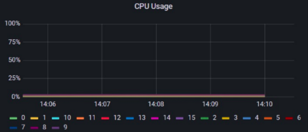
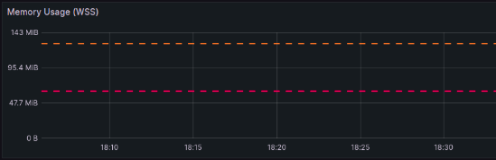

# Code deployment with Kubernetes

## 1st Task
1. Minikube

```bash
pbakharuev@mbp-pbakharuev-OZON-FVFG74Q1Q05N monitoring % minikube start
😄  minikube v1.31.2 на Darwin 13.5 (arm64)
✨  Automatically selected the docker driver
📌  Using Docker Desktop driver with root privileges
👍  Запускается control plane узел minikube в кластере minikube
🚜  Скачивается базовый образ ...
💾  Скачивается Kubernetes v1.27.4 ...
...
Готово! kubectl настроен для использования кластера "minikube" и "default" пространства имён по умолчанию
```

2. Check if cluster is alive
```bash
pbakharuev@mbp-pbakharuev-OZON-FVFG74Q1Q05N monitoring % kubectl get deployment -A
NAMESPACE     NAME         READY   UP-TO-DATE   AVAILABLE   AGE
default       app-python   1/1     1            1           98s
kube-system   coredns      1/1     1            1           3m21s
```
3. Let's create deployment

```bash
pbakharuev@mbp-pbakharuev-OZON-FVFG74Q1Q05N monitoring % kubectl create deployment app-python --image=pavel5609/do_course:latest
deployment.apps/app-python created
pbakharuev@mbp-pbakharuev-OZON-FVFG74Q1Q05N monitoring % kubectl get deployment -A
NAMESPACE     NAME         READY   UP-TO-DATE   AVAILABLE   AGE
default       app-python   1/1     1            1           98s
kube-system   coredns      1/1     1            1           3m21s
```
4. And create Service & run

```bash
pbakharuev@mbp-pbakharuev-OZON-FVFG74Q1Q05N monitoring % kubectl expose deployment app-python --type=LoadBalancer --port=8080
service/app-python exposed

pbakharuev@mbp-pbakharuev-OZON-FVFG74Q1Q05N monitoring % kubectl get svc -A
NAMESPACE     NAME         TYPE           CLUSTER-IP    EXTERNAL-IP   PORT(S)                  AGE
default       app-python   LoadBalancer   10.97.23.25   <pending>     8080:30003/TCP           19s
default       kubernetes   ClusterIP      10.96.0.1     <none>        443/TCP                  3m57s
kube-system   kube-dns     ClusterIP      10.96.0.10    <none>        53/UDP,53/TCP,9153/TCP   3m56s
pbakharuev@mbp-pbakharuev-OZON-FVFG74Q1Q05N monitoring % kubectl get pods,svc -A
NAMESPACE     NAME                                   READY   STATUS    RESTARTS   AGE
default       pod/app-python-bbd4d748d-bh4pd         1/1     Running   0          2m31s
kube-system   pod/coredns-5d78c9869d-m56qx           1/1     Running   0          4m
kube-system   pod/etcd-minikube                      1/1     Running   0          4m14s
kube-system   pod/kube-apiserver-minikube            1/1     Running   0          4m14s
kube-system   pod/kube-controller-manager-minikube   1/1     Running   0          4m14s
kube-system   pod/kube-proxy-s7wcq                   1/1     Running   0          4m1s
kube-system   pod/kube-scheduler-minikube            1/1     Running   0          4m14s
kube-system   pod/storage-provisioner                1/1     Running   0          4m13s

NAMESPACE     NAME                 TYPE           CLUSTER-IP    EXTERNAL-IP   PORT(S)                  AGE
default       service/app-python   LoadBalancer   10.97.23.25   <pending>     8080:30003/TCP           37s
default       service/kubernetes   ClusterIP      10.96.0.1     <none>        443/TCP                  4m15s
kube-system   service/kube-dns     ClusterIP      10.96.0.10    <none>        53/UDP,53/TCP,9153/TCP   4m14s
```
5. See posts and services

```bash
pbakharuev@mbp-pbakharuev-OZON-FVFG74Q1Q05N monitoring % kubectl get pods,svc -A
NAMESPACE     NAME                                   READY   STATUS    RESTARTS   AGE
default       pod/app-python-bbd4d748d-bh4pd         1/1     Running   0          2m31s
kube-system   pod/coredns-5d78c9869d-m56qx           1/1     Running   0          4m
kube-system   pod/etcd-minikube                      1/1     Running   0          4m14s
kube-system   pod/kube-apiserver-minikube            1/1     Running   0          4m14s
kube-system   pod/kube-controller-manager-minikube   1/1     Running   0          4m14s
kube-system   pod/kube-proxy-s7wcq                   1/1     Running   0          4m1s
kube-system   pod/kube-scheduler-minikube            1/1     Running   0          4m14s
kube-system   pod/storage-provisioner                1/1     Running   0          4m13s

NAMESPACE     NAME                 TYPE           CLUSTER-IP    EXTERNAL-IP   PORT(S)                  AGE
default       service/app-python   LoadBalancer   10.97.23.25   <pending>     8080:30003/TCP           37s
default       service/kubernetes   ClusterIP      10.96.0.1     <none>        443/TCP                  4m15s
kube-system   service/kube-dns     ClusterIP      10.96.0.10    <none>        53/UDP,53/TCP,9153/TCP   4m14s
```
## 2nd Task

1. Let's apply manifest

```bash
pbakharuev@mbp-pbakharuev-OZON-FVFG74Q1Q05N python % kubectl apply -f deployment.yaml
deployment.apps/app-python created
pbakharuev@mbp-pbakharuev-OZON-FVFG74Q1Q05N python % kubectl apply -f service.yaml 
service/app-python-svc created
```

2. Let's see pods and services

```bash
pbakharuev@mbp-pbakharuev-OZON-FVFG74Q1Q05N python % kubectl get pods,svc -A
NAMESPACE     NAME                                   READY   STATUS    RESTARTS   AGE
default       pod/app-python-bbd4d748d-bh4pd         1/1     Running   0          74m
kube-system   pod/coredns-5d78c9869d-m56qx           1/1     Running   0          75m
kube-system   pod/etcd-minikube                      1/1     Running   0          76m
kube-system   pod/kube-apiserver-minikube            1/1     Running   0          76m
kube-system   pod/kube-controller-manager-minikube   1/1     Running   0          76m
kube-system   pod/kube-proxy-s7wcq                   1/1     Running   0          75m
kube-system   pod/kube-scheduler-minikube            1/1     Running   0          76m
kube-system   pod/storage-provisioner                1/1     Running   0          76m

NAMESPACE     NAME                     TYPE           CLUSTER-IP     EXTERNAL-IP   PORT(S)                  AGE
default       service/app-python       LoadBalancer   10.97.23.25    <pending>     8080:30003/TCP           72m
default       service/app-python-svc   LoadBalancer   10.109.40.10   <pending>     8080:30653/TCP           4m23s
default       service/kubernetes       ClusterIP      10.96.0.1      <none>        443/TCP                  76m
kube-system   service/kube-dns         ClusterIP      10.96.0.10     <none>        53/UDP,53/TCP,9153/TCP   76m
```

3. Minikube service

```bash
pbakharuev@mbp-pbakharuev-OZON-FVFG74Q1Q05N python % minikube service --all
|-----------|------------|-------------|---------------------------|
| NAMESPACE |    NAME    | TARGET PORT |            URL            |
|-----------|------------|-------------|---------------------------|
| default   | app-python |        8080 | http://192.168.49.2:30003 |
|-----------|------------|-------------|---------------------------|
|-----------|----------------|-------------|---------------------------|
| NAMESPACE |      NAME      | TARGET PORT |            URL            |
|-----------|----------------|-------------|---------------------------|
| default   | app-python-svc |        8080 | http://192.168.49.2:30653 |
|-----------|----------------|-------------|---------------------------|
|-----------|------------|-------------|--------------|
| NAMESPACE |    NAME    | TARGET PORT |     URL      |
|-----------|------------|-------------|--------------|
| default   | kubernetes |             | No node port |
|-----------|------------|-------------|--------------|
😿  service default/kubernetes has no node port
🎉  Opening service default/app-python-svc in default browser...
```



## 3rd Task

1. Enable ingress

```bash
pbakharuev@mbp-pbakharuev-OZON-FVFG74Q1Q05N python % minikube addons enable ingress
💡  ingress is an addon maintained by Kubernetes. For any concerns contact minikube on GitHub.
You can view the list of minikube maintainers at: https://github.com/kubernetes/minikube/blob/master/OWNERS
💡  After the addon is enabled, please run "minikube tunnel" and your ingress resources would be available at "127.0.0.1"
    ▪ Используется образ registry.k8s.io/ingress-nginx/kube-webhook-certgen:v20230407
    ▪ Используется образ registry.k8s.io/ingress-nginx/kube-webhook-certgen:v20230407
    ▪ Используется образ registry.k8s.io/ingress-nginx/controller:v1.8.1
🔎  Verifying ingress addon...
🌟  The 'ingress' addon is enabled
```
2. Apply manifest

```bash
pbakharuev@mbp-pbakharuev-OZON-FVFG74Q1Q05N python % kubectl apply -f ingress.yaml 
ingress.networking.k8s.io/python-ingress created
pbakharuev@mbp-pbakharuev-OZON-FVFG74Q1Q05N python % kubectl get ingress -A
NAMESPACE   NAME             CLASS   HOSTS        ADDRESS        PORTS   AGE
default     python-ingress   nginx   python.app   192.168.49.2   80      5s
```
3. Check
```bash
pbakharuev@mbp-pbakharuev-OZON-FVFG74Q1Q05N python curl -H "Host: python.app" http://192.168.49.2
2023-11-01T09:15:23.186752+03:00 pbakharuev@mbp-pbakharuev-OZON-FVFG74Q1Q05N
```