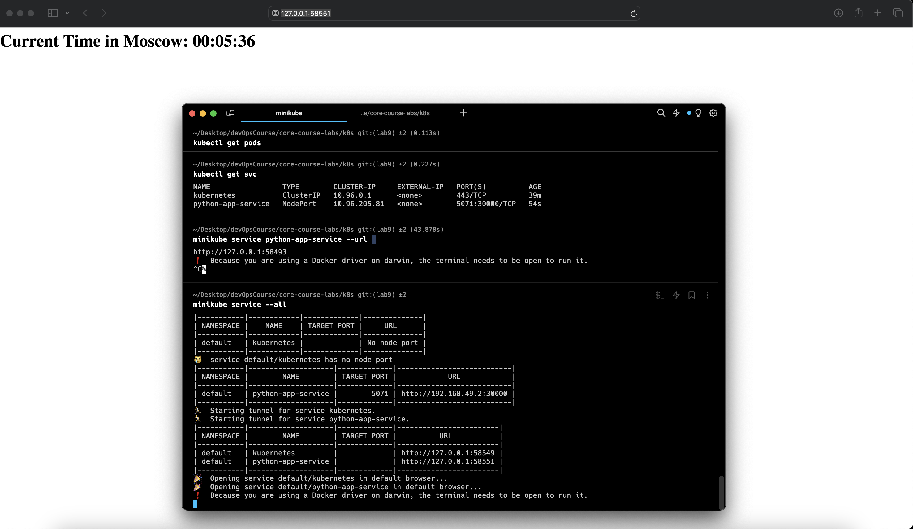

## Task 1

```bash
kubectl get pods
NAME                                     READY   STATUS    RESTARTS   AGE
python-app-deployment-8596c99544-pnhdn   1/1     Running   0          7m37s
```

```bash
kubectl get svc
NAME                 TYPE        CLUSTER-IP      EXTERNAL-IP   PORT(S)          AGE
kubernetes           ClusterIP   10.96.0.1       <none>        443/TCP          35m
python-app-service   NodePort    10.111.35.240   <none>        5071:30000/TCP   27m
```

## Task 2

```bash
kubectl get pods
NAME                                     READY   STATUS         RESTARTS   AGE
python-app-deployment-6cff96cd75-fbzl5   0/1     ErrImagePull   0          25s
python-app-deployment-6cff96cd75-fckfr   1/1     Running        0          25s
python-app-deployment-6cff96cd75-q8zb9   1/1     Running        0          25s
```

```bash
kubectl get svc
NAME                 TYPE        CLUSTER-IP     EXTERNAL-IP   PORT(S)          AGE
kubernetes           ClusterIP   10.96.0.1      <none>        443/TCP          39m
python-app-service   NodePort    10.96.205.81   <none>        5071:30000/TCP   54s
```


```bash
minikube service -all
```

