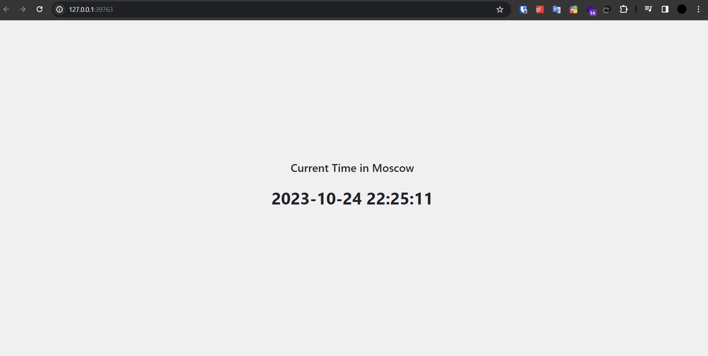

# Kubernetes

## Basic Deployment:

- ### Deploying Applications:
  ```
    kubectl create deployment python-app --image=rametago/my-first-repo:latest
    kubectl create deployment typescript-app --image=rametago/my-first-repo:svelte
    kubectl get deployments
  ```
  ```
    NAME             READY   UP-TO-DATE   AVAILABLE   AGE
    python-app       1/1     1            1           41s
    typescript-app   1/1     1            1           26s

  ```

- ### Exposing pods using `kubectl expose`
    ```
    >>> kubectl get pods,svc

    NAME                                 READY   STATUS              RESTARTS   AGE
    pod/python-app-64f6d579cc-chmqn      1/1     Running             0          44s
    pod/typescript-app-fdbbbcdfb-tztp7   0/1     ContainerCreating   0          21s

    NAME                     TYPE           CLUSTER-IP      EXTERNAL-IP   PORT(S)          AGE
    service/kubernetes       ClusterIP      10.96.0.1       <none>        443/TCP          2m45s
    service/python-app       LoadBalancer   10.104.86.250   <pending>     8000:32068/TCP   8s
    service/typescript-app   LoadBalancer   10.100.8.41     <pending>     5173:30111/TCP   3s
    ```

    ```
    >>> minikube service --all

    |-----------|------------|-------------|--------------|
    | NAMESPACE |    NAME    | TARGET PORT |     URL      |
    |-----------|------------|-------------|--------------|
    | default   | kubernetes |             | No node port |
    |-----------|------------|-------------|--------------|
    😿  service default/kubernetes has no node port
    |-----------|------------|-------------|---------------------------|
    | NAMESPACE |    NAME    | TARGET PORT |            URL            |
    |-----------|------------|-------------|---------------------------|
    | default   | python-app |        8000 | http://192.168.58.2:32068 |
    |-----------|------------|-------------|---------------------------|
    |-----------|----------------|-------------|---------------------------|
    | NAMESPACE |      NAME      | TARGET PORT |            URL            |
    |-----------|----------------|-------------|---------------------------|
    | default   | typescript-app |        5173 | http://192.168.58.2:30111 |
    |-----------|----------------|-------------|---------------------------|
    🏃  Starting tunnel for service kubernetes.
    🏃  Starting tunnel for service python-app.
    🏃  Starting tunnel for service typescript-app.
    |-----------|----------------|-------------|------------------------|
    | NAMESPACE |      NAME      | TARGET PORT |          URL           |
    |-----------|----------------|-------------|------------------------|
    | default   | kubernetes     |             | http://127.0.0.1:36211 |
    | default   | python-app     |             | http://127.0.0.1:33959 |
    | default   | typescript-app |             | http://127.0.0.1:44105 |
    |-----------|----------------|-------------|------------------------|
    ```



- ### Cleanup:
  ```
  >>> kubectl delete svc python-app typescript-app
  service "python-app" deleted
  service "typescript-app" deleted

  >>> kubectl delete deployment --all
  deployment.apps "python-app" deleted
  deployment.apps "typescript-app" deleted
  ```


## Task 2 Declarative Kubernetes Manifests

- ### Apply Manifest:
  ```
  >>> kubectl apply -f python_app/deployment.yaml
  deployment.apps/python-app created
  >>> kubectl apply -f python_app/service.yaml
  service/python-app-svc created


  >>> kubectl apply -f typescript_app/deployment.yaml
  deployment.apps/typescript-app created
  >>> kubectl apply -f typescript_app/service.yaml
  service/typescript-app-svc created
  ```

- ### Showing running pods and services:
  ```
  >>> kubectl get pods,svc
    NAME                                 READY   STATUS    RESTARTS   AGE
    pod/python-app-5946bc9c94-hcld8      1/1     Running   0          9m32s
    pod/python-app-5946bc9c94-hxzwh      1/1     Running   0          9m32s
    pod/python-app-5946bc9c94-ps9bv      1/1     Running   0          9m32s
    pod/typescript-app-b9f54dd98-69zx7   1/1     Running   0          2m22s
    pod/typescript-app-b9f54dd98-fdljx   1/1     Running   0          2m22s
    pod/typescript-app-b9f54dd98-jnp7v   1/1     Running   0          2m22s

    NAME                         TYPE           CLUSTER-IP       EXTERNAL-IP   PORT(S)          AGE
    service/kubernetes           ClusterIP      10.96.0.1        <none>        443/TCP          58m
    service/python-app-svc       LoadBalancer   10.103.88.64     <pending>     8000:32447/TCP   8m10s
    service/typescript-app-svc   LoadBalancer   10.107.246.169   <pending>     5173:31182/TCP   30s
  ```

- ### Show availability:
    ```
    >>> minikube service --all
    |-----------|------------|-------------|--------------|
    | NAMESPACE |    NAME    | TARGET PORT |     URL      |
    |-----------|------------|-------------|--------------|
    | default   | kubernetes |             | No node port |
    |-----------|------------|-------------|--------------|
    😿  service default/kubernetes has no node port
    |-----------|----------------|-------------|---------------------------|
    | NAMESPACE |      NAME      | TARGET PORT |            URL            |
    |-----------|----------------|-------------|---------------------------|
    | default   | python-app-svc |        8000 | http://192.168.58.2:32447 |
    |-----------|----------------|-------------|---------------------------|
    |-----------|--------------------|-------------|---------------------------|
    | NAMESPACE |        NAME        | TARGET PORT |            URL            |
    |-----------|--------------------|-------------|---------------------------|
    | default   | typescript-app-svc |        5173 | http://192.168.58.2:31182 |
    |-----------|--------------------|-------------|---------------------------|
    🏃  Starting tunnel for service kubernetes.
    🏃  Starting tunnel for service python-app-svc.
    🏃  Starting tunnel for service typescript-app-svc.
    |-----------|--------------------|-------------|------------------------|
    | NAMESPACE |        NAME        | TARGET PORT |          URL           |
    |-----------|--------------------|-------------|------------------------|
    | default   | kubernetes         |             | http://127.0.0.1:40521 |
    | default   | python-app-svc     |             | http://127.0.0.1:43245 |
    | default   | typescript-app-svc |             | http://127.0.0.1:38659 |
    |-----------|--------------------|-------------|------------------------|
    ```

## Ingress

- ### Ingress initialization
    ```
    >>> minikube addons enable ingress
    The 'ingress' addon is enabled

    >>> kubectl apply -f python_app/ingress.yaml
    ingress.networking.k8s.io/python-ingress created

    >>> kubectl apply -f typescript_app/ingress.yaml
    ingress.networking.k8s.io/typescript-ingress created
    ```
- ### Show ingress
    ```
    >>> kubectl get ingress
    NAME                 CLASS   HOSTS            ADDRESS        PORTS   AGE
    python-ingress       nginx   python.app       192.168.58.2   80      83s
    typescript-ingress   nginx   typescript.app   192.168.58.2   80      34s
    ```

- ### Check applications:
    Python app
    ```
    >>> curl -i http://python.app
    HTTP/1.1 200 OK
    Date: Tue, 24 Oct 2023 20:22:43 GMT
    Connection: keep-alive
    Cache-Control: max-age=3600
    Expires: Tue, 24 Oct 2023 21:22:43 GMT
    Location: https://python.app/
    Report-To: {"endpoints":[{"url":"https:\/\/a.nel.cloudflare.com\/report\/v3?s=jksUytD8biDvl850KewcpvD5Tixj7ohWX8yYgu1vcUTJwuKHrRPlAWxy4jASTfsMiGPRCkbqH7fUQ1BfrFn3LkIg9VBRJm%2BaxPtCiD7JkXMXCNCEEq8TmDgZMYI7"}],"group":"cf-nel","max_age":604800}
    NEL: {"success_fraction":0,"report_to":"cf-nel","max_age":604800}
    Server: cloudflare
    CF-RAY: 81b4eefcedd7349d-WAW
    alt-svc: h3=":443"; ma=86400
    ```

    Typescript app
    ```
    >>> curl -I http://typescript.app
    HTTP/1.1 200 OK
    Content-Type: text/html; charset=utf-8
    Location: https://typescript.app/
    Date: Tue, 24 Oct 2023 20:23:29 GMT
    Via: 1.1 google
    Transfer-Encoding: chunked
    ```
