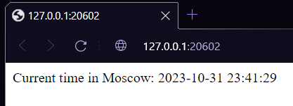

# Task 1

```
D:\study\core-course-labs> kubectl create deployment python-app --image=relisqu/python-app:latest
deployment.apps/python-app created

D:\study\core-course-labs> kubectl get deployments
NAME         READY   UP-TO-DATE   AVAILABLE   AGE
python-app   1/1     1            1           4m28s

D:\study\core-course-labs> kubectl get pods
NAME                          READY   STATUS    RESTARTS   AGE
python-app-7f9bbbc4d4-48j4p   1/1     Running   0          6m2s

D:\study\core-course-labs> kubectl get svc
NAME         TYPE           CLUSTER-IP     EXTERNAL-IP   PORT(S)          AGE
kubernetes   ClusterIP      10.96.0.1      <none>        443/TCP          3h3m
python-app   LoadBalancer   10.98.90.123   <pending>     5000:31281/TCP   2s
```

# Task 2 and bonus

As bonus task is just task 2 but with second app, I've decided to join these parts together

```
D:\study\core-course-labs> kubectl get pods
NAME                          READY   STATUS             RESTARTS       AGE
app-svelte-6c6fdc4cc-99qrp    0/1     CrashLoopBackOff   5 (108s ago)   5m18s
app-svelte-6c6fdc4cc-snhgl    0/1     CrashLoopBackOff   5 (111s ago)   5m18s
app-svelte-6c6fdc4cc-zxqd2    0/1     CrashLoopBackOff   5 (102s ago)   5m18s
python-app-849894d4f8-jt8sw   1/1     Running            0              5m35s
python-app-849894d4f8-m4zrb   1/1     Running            0              5m35s
python-app-849894d4f8-pm9tw   1/1     Running            0              5m35s

D:\study\core-course-labs> kubectl get svc
NAME         TYPE        CLUSTER-IP      EXTERNAL-IP   PORT(S)          AGE
app-svelte   NodePort    10.102.18.167   <none>        8080:31112/TCP   8m21s
kubernetes   ClusterIP   10.96.0.1       <none>        443/TCP          12m
python-app   NodePort    10.101.229.91   <none>        80:31111/TCP     8m27s


PS D:\study\core-course-labs> minikube service --all
|-----------|------------|-------------|---------------------------|
| NAMESPACE |    NAME    | TARGET PORT |            URL            |
|-----------|------------|-------------|---------------------------|
| default   | app-svelte |        8080 | http://192.168.49.2:31112 |
|-----------|------------|-------------|---------------------------|
|-----------|------------|-------------|---------------------------|
| NAMESPACE |    NAME    | TARGET PORT |            URL            |
|-----------|------------|-------------|---------------------------|
| default   | python-app |          80 | http://192.168.49.2:31111 |
|-----------|------------|-------------|---------------------------|
* Starting tunnel for service app-svelte.
* Starting tunnel for service python-app.
|-----------|------------|-------------|------------------------|
| NAMESPACE |    NAME    | TARGET PORT |          URL           |
|-----------|------------|-------------|------------------------|
| default   | app-svelte |             | http://127.0.0.1:27374 |
| default   | python-app |             | http://127.0.0.1:27378 |
|-----------|------------|-------------|------------------------|
* Opening service default/app-svelte in default browser...
* Opening service default/python-app in default browser...
! Because you are using a Docker driver on windows, the terminal needs to be open to run it.
```

# Python app



# Svelte app

Somehow program inside container have broked and I don't know what is the problem with it. Thats why we get error response here.


