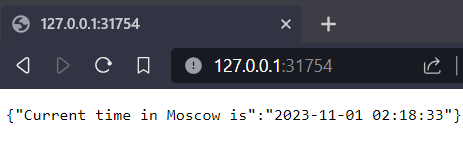
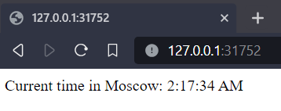

# Task 1

```
purfreak@Tashas-MBP:/git/core-course-labs$ kubectl create deployment app-py --image=purfreak/lab2_devops:latest
deployment.apps/app-py created

purfreak@Tashas-MBP:/git/core-course-labs$ kubectl get deployments
NAME         READY   UP-TO-DATE   AVAILABLE   AGE
python-app   1/1     1            1           4m28s

purfreak@Tashas-MBP:/git/core-course-labs$ kubectl get pods
NAME                      READY   STATUS    RESTARTS   AGE
app-py-67c779df89-2tmcx   1/1     Running   0          59s

purfreak@Tashas-MBP:/git/core-course-labs$ kubectl get svc
NAME         TYPE        CLUSTER-IP       EXTERNAL-IP   PORT(S)    AGE
app-py       ClusterIP   10.105.117.130   <none>        8000/TCP   20s
```

# Task 2 and bonus

```
purfreak@Tashas-MBP:/git/core-course-labs$ kubectl get pods
NAME                          READY   STATUS    RESTARTS   AGE
app-js-69b8c749c6-ct765       1/1     Running   0          5m13s
app-js-69b8c749c6-r2qmt       1/1     Running   0          5m13s
app-js-69b8c749c6-xslgw       1/1     Running   0          5m13s
app-python-5f77bccf84-kwhjc   1/1     Running   0          5m12s
app-python-5f77bccf84-t2vsq   1/1     Running   0          5m12s
app-python-5f77bccf84-zx4nk   1/1     Running   0          5m12s

purfreak@Tashas-MBP:/git/core-course-labs$ kubectl get svc
NAME         TYPE        CLUSTER-IP       EXTERNAL-IP   PORT(S)          AGE
app-js       NodePort    10.107.173.58    <none>        8080:30002/TCP   5m32s
app-python   NodePort    10.100.116.225   <none>        80:30001/TCP     5m31s
kubernetes   ClusterIP   10.96.0.1        <none>        443/TCP          5m36s

purfreak@Tashas-MBP:/git/core-course-labs$ minikube service --all
|-----------|--------|-------------|---------------------------|
| NAMESPACE |  NAME  | TARGET PORT |            URL            |
|-----------|--------|-------------|---------------------------|
| default   | app-js |        8080 | http://192.168.49.2:30002 |
|-----------|--------|-------------|---------------------------|
|-----------|------------|-------------|---------------------------|
| NAMESPACE |    NAME    | TARGET PORT |            URL            |
|-----------|------------|-------------|---------------------------|
| default   | app-python |          80 | http://192.168.49.2:30001 |
|-----------|------------|-------------|---------------------------|
* Starting tunnel for service app-js.
* Starting tunnel for service app-python.
|-----------|------------|-------------|------------------------|
| NAMESPACE |    NAME    | TARGET PORT |          URL           |
|-----------|------------|-------------|------------------------|
| default   | app-js     |             | http://127.0.0.1:31752 |
| default   | app-python |             | http://127.0.0.1:31754 |
|-----------|------------|-------------|------------------------|
```

# Python app



# JS app


