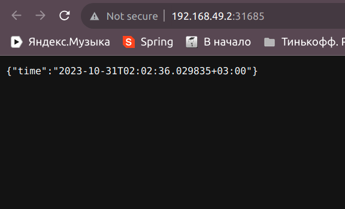

# Kubernetes
 ## Lab 9
 Commands:
 ```
 ~k-tyulebaeva$ kubectl get deployments
 NAME         READY   UP-TO-DATE   AVAILABLE   AGE
 app-python   1/1     1            1           24m 
 ```

 ```
 ~k-tyulebaeva$ kubectl get pods
 NAME                          READY   STATUS    RESTARTS      AGE
 app-python-6f5d9cfdcf-sx47n   1/1     Running   1 (13m ago)   25m
 ```

 ```
 ~k-tyulebaeva$ kubectl get events
 LAST SEEN   TYPE      REASON                    OBJECT                             MESSAGE
 26m         Normal    Scheduled                 pod/app-python-6f5d9cfdcf-sx47n    Successfully assigned default/app-python-6f5d9cfdcf-sx47n to minikube
 13m         Normal    Pulling                   pod/app-python-6f5d9cfdcf-sx47n    Pulling image "k-tyulebaeva/moscow-time-app:latest"
 26m         Normal    Pulled                    pod/app-python-6f5d9cfdcf-sx47n    Successfully pulled image "k-tyulebaeva/moscow-time-app:latest" in 2.757616384s (6.347523891s including waiting)
 13m         Normal    Created                   pod/app-python-6f5d9cfdcf-sx47n    Created container moscow-time-app
 13m         Normal    Started                   pod/app-python-6f5d9cfdcf-sx47n    Started container moscow-time-app
 13m         Normal    SandboxChanged            pod/app-python-6f5d9cfdcf-sx47n    Pod sandbox changed, it will be killed and re-created.
 13m         Normal    Pulled                    pod/app-python-6f5d9cfdcf-sx47n    Successfully pulled image "k-tyulebaeva/moscow-time-app:latest" in 4.206597058s (4.206620755s including waiting)
 26m         Normal    SuccessfulCreate          replicaset/app-python-6f5d9cfdcf   Created pod: app-python-6f5d9cfdcf-sx47n
 26m         Normal    ScalingReplicaSet         deployment/app-python              Scaled up replica set app-python-6f5d9cfdcf to 1
 27m         Normal    Scheduled                 pod/app.python-5968db7cd6-fnq45    Successfully assigned default/app.python-5968db7cd6-fnq45 to minikube
 26m         Normal    Pulling                   pod/app.python-5968db7cd6-fnq45    Pulling image "k-tyulebaeva/moscow-time-app:latest"
 27m         Warning   Failed                    pod/app.python-5968db7cd6-fnq45    Failed to pull image "k-tyulebaeva/moscow-time-app:latest": rpc error: code = Unknown desc = Error response from daemon: Head "https://registry-1.docker.io/v2/k-tyulebaeva/moscow-time-app/manifests/latest": net/http: TLS handshake timeout
 27m         Warning   Failed                    pod/app.python-5968db7cd6-fnq45    Error: ErrImagePull
 27m         Normal    BackOff                   pod/app.python-5968db7cd6-fnq45    Back-off pulling image "k-tyulebaeva/moscow-time-app:latest"
 27m         Warning   Failed                    pod/app.python-5968db7cd6-fnq45    Error: ImagePullBackOff
 26m         Normal    Pulled                    pod/app.python-5968db7cd6-fnq45    Successfully pulled image "k-tyulebaeva/moscow-time-app:latest" in 33.460950753s (33.46103158s including waiting)
 26m         Normal    Created                   pod/app.python-5968db7cd6-fnq45    Created container moscow-time-app
 26m         Normal    Started                   pod/app.python-5968db7cd6-fnq45    Started container moscow-time-app
 26m         Normal    Killing                   pod/app.python-5968db7cd6-fnq45    Stopping container moscow-time-app
 27m         Normal    SuccessfulCreate          replicaset/app.python-5968db7cd6   Created pod: app.python-5968db7cd6-fnq45
 27m         Normal    ScalingReplicaSet         deployment/app.python              Scaled up replica set app.python-5968db7cd6 to 1
 34m         Normal    NodeHasSufficientMemory   node/minikube                      Node minikube status is now: NodeHasSufficientMemory
 34m         Normal    NodeHasNoDiskPressure     node/minikube                      Node minikube status is now: NodeHasNoDiskPressure
 34m         Normal    NodeHasSufficientPID      node/minikube                      Node minikube status is now: NodeHasSufficientPID
 34m         Normal    NodeAllocatableEnforced   node/minikube                      Updated Node Allocatable limit across pods
 34m         Normal    Starting                  node/minikube                      Starting kubelet.
 34m         Normal    NodeAllocatableEnforced   node/minikube                      Updated Node Allocatable limit across pods
 34m         Normal    NodeHasSufficientMemory   node/minikube                      Node minikube status is now: NodeHasSufficientMemory
 34m         Normal    NodeHasNoDiskPressure     node/minikube                      Node minikube status is now: NodeHasNoDiskPressure
 34m         Normal    NodeHasSufficientPID      node/minikube                      Node minikube status is now: NodeHasSufficientPID
 34m         Normal    RegisteredNode            node/minikube                      Node minikube event: Registered Node minikube in Controller
 34m         Normal    Starting                  node/minikube                      
 13m         Normal    Starting                  node/minikube                      
 13m         Normal    RegisteredNode            node/minikube                      Node minikube event: Registered Node minikube in Controller
 ```

 ```angular2html
 ~k-tyulebaeva$ kubectl config view
 apiVersion: v1
 clusters:
 - cluster:
     certificate-authority: /home/k-tyulebaeva/.minikube/ca.crt
     extensions:
     - extension:
         last-update: Mon, 30 Oct 2023 18:40:32 MSK
         provider: minikube.sigs.k8s.io
         version: v1.31.2
       name: cluster_info
     server: https://192.168.49.2:8443
   name: minikube
 contexts:
 - context:
     cluster: minikube
     extensions:
     - extension:
         last-update: Mon, 30 Oct 2023 18:40:32 MSK
         provider: minikube.sigs.k8s.io
         version: v1.31.2
       name: context_info
     namespace: default
     user: minikube
   name: minikube
 current-context: minikube
 kind: Config
 preferences: {}
 users:
 - name: minikube
   user:
     client-certificate: /home/k-tyulebaeva/.minikube/profiles/minikube/client.crt
     client-key: /home/k-tyulebaeva/.minikube/profiles/minikube/client.key
 ```

 ```
 ~k-tyulebaeva$ kubectl logs app-python-6f5d9cfdcf-sx47n
 INFO:     Started server process [1]
 INFO:     Waiting for application startup.
 INFO:     Application startup complete.
 INFO:     Uvicorn running on http://0.0.0.0:80 (Press CTRL+C to quit)
 INFO:     10.244.0.1:28644 - "GET / HTTP/1.1" 200 OK
 INFO:     10.244.0.1:28644 - "GET /favicon.ico HTTP/1.1" 404 Not Found
 ```

 ```
 ~k-tyulebaeva$ kubectl get svc
 NAME         TYPE           CLUSTER-IP     EXTERNAL-IP   PORT(S)        AGE
 app-python   LoadBalancer   10.108.85.31   <pending>     80:30241/TCP   7m48s
 kubernetes   ClusterIP      10.96.0.1      <none>        443/TCP        36m
 ```


 ### Task 2

 ```
 k-tyulebaevadeployments
 NAME         READY   UP-TO-DATE   AVAILABLE   AGE
 app-python   3/3     3            3           13m
 ```

 ```
 k-tyulebaevapods
 NAME                          READY   STATUS    RESTARTS   AGE
 app-python-544fbf74c6-c6kx4   1/1     Running   0          14m
 app-python-544fbf74c6-cc2pb   1/1     Running   0          14m
 app-python-544fbf74c6-rhbgk   1/1     Running   0          14m
 ```


 ```
 k-tyulebaevaevents
 LAST SEEN   TYPE      REASON                    OBJECT                                        MESSAGE
 14m         Normal    Scheduled                 pod/app-python-544fbf74c6-c6kx4               Successfully assigned default/app-python-544fbf74c6-c6kx4 to minikube
 14m         Normal    Pulling                   pod/app-python-544fbf74c6-c6kx4               Pulling image "edikgoose/moscow-time-app:latest"
 14m         Normal    Pulled                    pod/app-python-544fbf74c6-c6kx4               Successfully pulled image "edikgoose/moscow-time-app:latest" in 2.867409119s (2.867480019s including waiting)
 14m         Normal    Created                   pod/app-python-544fbf74c6-c6kx4               Created container moscow-time-app
 14m         Normal    Started                   pod/app-python-544fbf74c6-c6kx4               Started container moscow-time-app
 14m         Normal    Scheduled                 pod/app-python-544fbf74c6-cc2pb               Successfully assigned default/app-python-544fbf74c6-cc2pb to minikube
 14m         Normal    Pulling                   pod/app-python-544fbf74c6-cc2pb               Pulling image "edikgoose/moscow-time-app:latest"
 14m         Normal    Pulled                    pod/app-python-544fbf74c6-cc2pb               Successfully pulled image "edikgoose/moscow-time-app:latest" in 2.649060598s (7.974404668s including waiting)
 14m         Normal    Created                   pod/app-python-544fbf74c6-cc2pb               Created container moscow-time-app
 14m         Normal    Started                   pod/app-python-544fbf74c6-cc2pb               Started container moscow-time-app
 14m         Normal    Scheduled                 pod/app-python-544fbf74c6-rhbgk               Successfully assigned default/app-python-544fbf74c6-rhbgk to minikube
 14m         Normal    Pulling                   pod/app-python-544fbf74c6-rhbgk               Pulling image "edikgoose/moscow-time-app:latest"
 14m         Normal    Pulled                    pod/app-python-544fbf74c6-rhbgk               Successfully pulled image "edikgoose/moscow-time-app:latest" in 2.478793667s (5.329184917s including waiting)
 14m         Normal    Created                   pod/app-python-544fbf74c6-rhbgk               Created container moscow-time-app
 14m         Normal    Started                   pod/app-python-544fbf74c6-rhbgk               Started container moscow-time-app
 14m         Normal    SuccessfulCreate          replicaset/app-python-544fbf74c6              Created pod: app-python-544fbf74c6-rhbgk
 14m         Normal    SuccessfulCreate          replicaset/app-python-544fbf74c6              Created pod: app-python-544fbf74c6-cc2pb
 14m         Normal    SuccessfulCreate          replicaset/app-python-544fbf74c6              Created pod: app-python-544fbf74c6-c6kx4
 7h          Normal    Scheduled                 pod/app-python-6f5d9cfdcf-sx47n               Successfully assigned default/app-python-6f5d9cfdcf-sx47n to minikube
 6h47m       Normal    Pulling                   pod/app-python-6f5d9cfdcf-sx47n               Pulling image "edikgoose/moscow-time-app:latest"
 7h          Normal    Pulled                    pod/app-python-6f5d9cfdcf-sx47n               Successfully pulled image "edikgoose/moscow-time-app:latest" in 2.757616384s (6.347523891s including waiting)
 6h47m       Normal    Created                   pod/app-python-6f5d9cfdcf-sx47n               Created container moscow-time-app
 6h47m       Normal    Started                   pod/app-python-6f5d9cfdcf-sx47n               Started container moscow-time-app
 6h47m       Normal    SandboxChanged            pod/app-python-6f5d9cfdcf-sx47n               Pod sandbox changed, it will be killed and re-created.
 6h47m       Normal    Pulled                    pod/app-python-6f5d9cfdcf-sx47n               Successfully pulled image "edikgoose/moscow-time-app:latest" in 4.206597058s (4.206620755s including waiting)
 37m         Normal    Killing                   pod/app-python-6f5d9cfdcf-sx47n               Stopping container moscow-time-app
 7h          Normal    SuccessfulCreate          replicaset/app-python-6f5d9cfdcf              Created pod: app-python-6f5d9cfdcf-sx47n
 26m         Normal    Scheduled                 pod/app-python-deployment-544fbf74c6-62fjz    Successfully assigned default/app-python-deployment-544fbf74c6-62fjz to minikube
 26m         Normal    Pulling                   pod/app-python-deployment-544fbf74c6-62fjz    Pulling image "edikgoose/moscow-time-app:latest"
 26m         Normal    Pulled                    pod/app-python-deployment-544fbf74c6-62fjz    Successfully pulled image "edikgoose/moscow-time-app:latest" in 2.217582431s (22.467334134s including waiting)
 26m         Normal    Created                   pod/app-python-deployment-544fbf74c6-62fjz    Created container moscow-time-app
 26m         Normal    Started                   pod/app-python-deployment-544fbf74c6-62fjz    Started container moscow-time-app
 12m         Normal    Killing                   pod/app-python-deployment-544fbf74c6-62fjz    Stopping container moscow-time-app
 26m         Normal    Scheduled                 pod/app-python-deployment-544fbf74c6-kfg2p    Successfully assigned default/app-python-deployment-544fbf74c6-kfg2p to minikube
 26m         Normal    Pulling                   pod/app-python-deployment-544fbf74c6-kfg2p    Pulling image "edikgoose/moscow-time-app:latest"
 26m         Warning   Failed                    pod/app-python-deployment-544fbf74c6-kfg2p    Failed to pull image "edikgoose/moscow-time-app:latest": rpc error: code = Unknown desc = Error response from daemon: Get "https://registry-1.docker.io/v2/": net/http: TLS handshake timeout
 26m         Warning   Failed                    pod/app-python-deployment-544fbf74c6-kfg2p    Error: ErrImagePull
 26m         Normal    BackOff                   pod/app-python-deployment-544fbf74c6-kfg2p    Back-off pulling image "edikgoose/moscow-time-app:latest"
 26m         Warning   Failed                    pod/app-python-deployment-544fbf74c6-kfg2p    Error: ImagePullBackOff
 26m         Normal    Pulled                    pod/app-python-deployment-544fbf74c6-kfg2p    Successfully pulled image "edikgoose/moscow-time-app:latest" in 2.067560856s (2.1822775s including waiting)
 26m         Normal    Created                   pod/app-python-deployment-544fbf74c6-kfg2p    Created container moscow-time-app
 26m         Normal    Started                   pod/app-python-deployment-544fbf74c6-kfg2p    Started container moscow-time-app
 12m         Normal    Killing                   pod/app-python-deployment-544fbf74c6-kfg2p    Stopping container moscow-time-app
 26m         Normal    Scheduled                 pod/app-python-deployment-544fbf74c6-rrxfd    Successfully assigned default/app-python-deployment-544fbf74c6-rrxfd to minikube
 26m         Normal    Pulling                   pod/app-python-deployment-544fbf74c6-rrxfd    Pulling image "edikgoose/moscow-time-app:latest"
 26m         Warning   Failed                    pod/app-python-deployment-544fbf74c6-rrxfd    Failed to pull image "edikgoose/moscow-time-app:latest": rpc error: code = Unknown desc = Error response from daemon: Get "https://registry-1.docker.io/v2/": net/http: TLS handshake timeout
 26m         Warning   Failed                    pod/app-python-deployment-544fbf74c6-rrxfd    Error: ErrImagePull
 26m         Normal    BackOff                   pod/app-python-deployment-544fbf74c6-rrxfd    Back-off pulling image "edikgoose/moscow-time-app:latest"
 26m         Warning   Failed                    pod/app-python-deployment-544fbf74c6-rrxfd    Error: ImagePullBackOff
 26m         Normal    Pulled                    pod/app-python-deployment-544fbf74c6-rrxfd    Successfully pulled image "edikgoose/moscow-time-app:latest" in 1.904101069s (1.904119374s including waiting)
 26m         Normal    Created                   pod/app-python-deployment-544fbf74c6-rrxfd    Created container moscow-time-app
 26m         Normal    Started                   pod/app-python-deployment-544fbf74c6-rrxfd    Started container moscow-time-app
 12m         Normal    Killing                   pod/app-python-deployment-544fbf74c6-rrxfd    Stopping container moscow-time-app
 26m         Normal    SuccessfulCreate          replicaset/app-python-deployment-544fbf74c6   Created pod: app-python-deployment-544fbf74c6-rrxfd
 26m         Normal    SuccessfulCreate          replicaset/app-python-deployment-544fbf74c6   Created pod: app-python-deployment-544fbf74c6-62fjz
 26m         Normal    SuccessfulCreate          replicaset/app-python-deployment-544fbf74c6   Created pod: app-python-deployment-544fbf74c6-kfg2p
 26m         Normal    ScalingReplicaSet         deployment/app-python-deployment              Scaled up replica set app-python-deployment-544fbf74c6 to 3
 7h          Normal    ScalingReplicaSet         deployment/app-python                         Scaled up replica set app-python-6f5d9cfdcf to 1
 14m         Normal    ScalingReplicaSet         deployment/app-python                         Scaled up replica set app-python-544fbf74c6 to 3
 7h1m        Normal    Scheduled                 pod/app.python-5968db7cd6-fnq45               Successfully assigned default/app.python-5968db7cd6-fnq45 to minikube
 7h1m        Normal    Pulling                   pod/app.python-5968db7cd6-fnq45               Pulling image "edikgoose/moscow-time-app:latest"
 7h1m        Warning   Failed                    pod/app.python-5968db7cd6-fnq45               Failed to pull image "edikgoose/moscow-time-app:latest": rpc error: code = Unknown desc = Error response from daemon: Head "https://registry-1.docker.io/v2/edikgoose/moscow-time-app/manifests/latest": net/http: TLS handshake timeout
 7h1m        Warning   Failed                    pod/app.python-5968db7cd6-fnq45               Error: ErrImagePull
 7h1m        Normal    BackOff                   pod/app.python-5968db7cd6-fnq45               Back-off pulling image "edikgoose/moscow-time-app:latest"
 7h1m        Warning   Failed                    pod/app.python-5968db7cd6-fnq45               Error: ImagePullBackOff
 7h          Normal    Pulled                    pod/app.python-5968db7cd6-fnq45               Successfully pulled image "edikgoose/moscow-time-app:latest" in 33.460950753s (33.46103158s including waiting)
 7h          Normal    Created                   pod/app.python-5968db7cd6-fnq45               Created container moscow-time-app
 7h          Normal    Started                   pod/app.python-5968db7cd6-fnq45               Started container moscow-time-app
 7h          Normal    Killing                   pod/app.python-5968db7cd6-fnq45               Stopping container moscow-time-app
 7h1m        Normal    SuccessfulCreate          replicaset/app.python-5968db7cd6              Created pod: app.python-5968db7cd6-fnq45
 7h1m        Normal    ScalingReplicaSet         deployment/app.python                         Scaled up replica set app.python-5968db7cd6 to 1
 7h9m        Normal    NodeHasSufficientMemory   node/minikube                                 Node minikube status is now: NodeHasSufficientMemory
 7h9m        Normal    NodeHasNoDiskPressure     node/minikube                                 Node minikube status is now: NodeHasNoDiskPressure
 7h9m        Normal    NodeHasSufficientPID      node/minikube                                 Node minikube status is now: NodeHasSufficientPID
 7h9m        Normal    NodeAllocatableEnforced   node/minikube                                 Updated Node Allocatable limit across pods
 7h9m        Normal    Starting                  node/minikube                                 Starting kubelet.
 7h9m        Normal    NodeAllocatableEnforced   node/minikube                                 Updated Node Allocatable limit across pods
 7h9m        Normal    NodeHasSufficientMemory   node/minikube                                 Node minikube status is now: NodeHasSufficientMemory
 7h9m        Normal    NodeHasNoDiskPressure     node/minikube                                 Node minikube status is now: NodeHasNoDiskPressure
 7h9m        Normal    NodeHasSufficientPID      node/minikube                                 Node minikube status is now: NodeHasSufficientPID
 7h8m        Normal    RegisteredNode            node/minikube                                 Node minikube event: Registered Node minikube in Controller
 7h8m        Normal    Starting                  node/minikube                                 
 6h47m       Normal    Starting                  node/minikube                                 
 6h47m       Normal    RegisteredNode            node/minikube                                 Node minikube event: Registered Node minikube in Controller
 ```


 ```
 k-tyulebaevasvc
 NAME         TYPE        CLUSTER-IP       EXTERNAL-IP   PORT(S)        AGE
 app-python   NodePort    10.108.136.132   <none>        80:30452/TCP   3m44s
 kubernetes   ClusterIP   10.96.0.1        <none>        443/TCP        7h10m
 ```

 ```
 k-tyulebaeva app-python-544fbf74c6-c6kx4
 INFO:     Started server process [1]
 INFO:     Waiting for application startup.
 INFO:     Application startup complete.
 INFO:     Uvicorn running on http://0.0.0.0:80 (Press CTRL+C to quit)
 ```

 ```
 k-tyulebaeva$ minikube service app-python
 |-----------|------------|-------------|---------------------------|
 | NAMESPACE |    NAME    | TARGET PORT |            URL            |
 |-----------|------------|-------------|---------------------------|
 | default   | app-python |          80 | http://192.168.49.2:31685 |
 |-----------|------------|-------------|---------------------------|
 🎉  Opening service default/app-python in default browser...
 ```

 

 ### Bonus Task

 ```
 k-tyulebaeva$ kubectl get deploy
 NAME         READY   UP-TO-DATE   AVAILABLE   AGE
 app-python   3/3     3            3           52m
 ```


 ```
 k-tyulebaeva$ kubectl get pods
 NAME                          READY   STATUS    RESTARTS   AGE
 app-python-544fbf74c6-cc2pb   1/1     Running   0          53m
 app-python-544fbf74c6-rhbgk   1/1     Running   0          53m
 ```

 ```
 k-tyulebaeva$ minikube service list
 |----------------------|---------------------------|--------------|---------------------------|
 |      NAMESPACE       |           NAME            | TARGET PORT  |            URL            |
 |----------------------|---------------------------|--------------|---------------------------|
 | default              | app-python                |           80 | http://192.168.49.2:31685 |
 | default              | kubernetes                | No node port |                           |
 | kube-system          | kube-dns                  | No node port |                           |
 | kubernetes-dashboard | dashboard-metrics-scraper | No node port |                           |
 | kubernetes-dashboard | kubernetes-dashboard      | No node port |                           |
 |----------------------|---------------------------|--------------|---------------------------|
 ```


 ```
 k-tyulebaeva$ kubectl get ingress
 NAME          CLASS    HOSTS                        ADDRESS        PORTS   AGE
 app-ingress   <none>   moscow.time,base.converter   192.168.49.2   80      9m15s
 ```

 ```
  curl --resolve "moscow.time:80:$( minikube ip )" -i http://moscow.time
 HTTP/1.1 200 OK
 Date: Mon, 30 Oct 2023 23:32:14 GMT
 Content-Type: application/json
 Content-Length: 43
 Connection: keep-alive
 {"time":"2023-10-31T02:32:14.159264+03:00"}
 ```

 ```
 k-tyulebaeva$ curl --resolve "base.converter:80:$( minikube ip )" -i http://base.converter
 HTTP/1.1 404 
 Date: Mon, 30 Oct 2023 23:43:41 GMT
 Content-Type: application/json
 Transfer-Encoding: chunked
 Connection: keep-alive
 Vary: Origin
 Vary: Access-Control-Request-Method
 Vary: Access-Control-Request-Headers
 {"timestamp":"2023-10-30T23:43:41.690+00:00","status":404,"error":"Not Found","path":"/"}
 ```

 K8s service 
 - [basic tutorial](https://kubernetes.io/docs/tutorials/kubernetes-basics/expose/expose-intro/)
 - [for minikube](https://minikube.sigs.k8s.io/docs/start/)