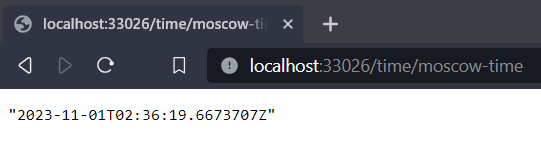

# Task 1

```
dmpru@dmpru:/mnt/g/git/core-course-labs$ kubectl create deployment app-py --image=purfreak/lab2_devops:latest
deployment.apps/app-py created

dmpru@dmpru:/mnt/g/git/core-course-labs$ kubectl get deployments
NAME         READY   UP-TO-DATE   AVAILABLE   AGE
app-python   1/1     1            1           69s

dmpru@dmpru:/mnt/g/git/core-course-labs$ kubectl get pods
NAME                          READY   STATUS    RESTARTS   AGE
app-python-5cb856768b-wwj49   1/1     Running   0          77s

dmpru@dmpru:/mnt/g/git/core-course-labs$ kubectl get svc
NAME         TYPE        CLUSTER-IP    EXTERNAL-IP   PORT(S)    AGE
app-python   ClusterIP   10.97.80.71   <none>        8000/TCP   60s
```

# Task 2 and bonus

```
dmpru@dmpru:/mnt/g/git/core-course-labs$ kubectl get pods
NAME                         READY   STATUS    RESTARTS   AGE
app-csharp-cb76c6dd8-g4nss   1/1     Running   0          75s
app-csharp-cb76c6dd8-ws4sq   1/1     Running   0          75s
app-csharp-cb76c6dd8-z64z5   1/1     Running   0          75s
app-python-d65d6ff9d-2vvsz   1/1     Running   0          74s
app-python-d65d6ff9d-gnp9b   1/1     Running   0          74s
app-python-d65d6ff9d-ss76w   1/1     Running   0          74s

dmpru@dmpru:/mnt/g/git/core-course-labs$ kubectl get svc
NAME         TYPE        CLUSTER-IP       EXTERNAL-IP   PORT(S)          AGE
app-csharp   NodePort    10.102.100.208   <none>        8080:30001/TCP   85s
app-python   NodePort    10.100.110.81    <none>        80:30000/TCP     84s

dmpru@dmpru:/mnt/g/git/core-course-labs$ minikube service --all
|-----------|------------|-------------|---------------------------|
| NAMESPACE |    NAME    | TARGET PORT |            URL            |
|-----------|------------|-------------|---------------------------|
| default   | app-csharp |        8080 | http://192.168.49.2:30001 |
|-----------|------------|-------------|---------------------------|
|-----------|------------|-------------|---------------------------|
| NAMESPACE |    NAME    | TARGET PORT |            URL            |
|-----------|------------|-------------|---------------------------|
| default   | app-python |          80 | http://192.168.49.2:30000 |
|-----------|------------|-------------|---------------------------|
* Starting tunnel for service app-csharp.
* Starting tunnel for service app-python.
|-----------|------------|-------------|------------------------|
| NAMESPACE |    NAME    | TARGET PORT |          URL           |
|-----------|------------|-------------|------------------------|
| default   | app-csharp |             | http://127.0.0.1:33026 |
| default   | app-python |             | http://127.0.0.1:33028 |
|-----------|------------|-------------|------------------------|
* Opening service default/app-csharp in default browser...
* Opening service default/app-python in default browser...
```

# Python app


# C# app


