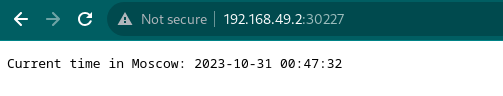
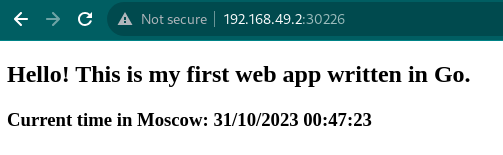
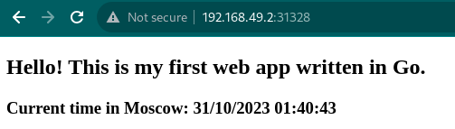
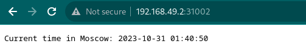

### Installing kubectl
Installing kubectl using the following [guide](https://kubernetes.io/docs/tasks/tools/install-kubectl-linux/).
```
vladislav5ik@AsusTuf:~$ kubectl version --client
Client Version: v1.28.3
Kustomize Version: v5.0.4-0.20230601165947-6ce0bf390ce3
```

### Installing minicube
Installing minicube with docker driver using the following [guide](https://minikube.sigs.k8s.io/docs/start/).
```
vladislav5ik@AsusTuf:~$ minikube start --driver=docker --disk-size 50000mb
😄  minikube v1.31.2 on Debian 12.2
✨  Using the docker driver based on existing profile
❗  You cannot change the disk size for an existing minikube cluster. Please first delete the cluster.
👍  Starting control plane node minikube in cluster minikube
🚜  Pulling base image ...
🏃  Updating the running docker "minikube" container ...
🐳  Preparing Kubernetes v1.27.4 on Docker 24.0.4 ...
    ▪ Generating certificates and keys ...
    ▪ Booting up control plane ...
    ▪ Configuring RBAC rules ...
🔗  Configuring bridge CNI (Container Networking Interface) ...
    ▪ Using image gcr.io/k8s-minikube/storage-provisioner:v5
🔎  Verifying Kubernetes components...
🌟  Enabled addons: storage-provisioner, default-storageclass
🏄  Done! kubectl is now configured to use "minikube" cluster and "default" namespace by default

```

### Deploying apps
Deploying python and golang applications within the Minikube cluster using the `kubectl create` command. And making applications accessible from outside the Kubernetes virtual network using `kubectl expose` command.
```
vladislav5ik@AsusTuf:~$ kubectl create deployment python-app --image=vladspigin/timeapp:latest
deployment.apps/python-app created
vladislav5ik@AsusTuf:~$ kubectl create deployment golang-app --image=vladspigin/timeapp-go:latest
deployment.apps/golang-app created
vladislav5ik@AsusTuf:~$ kubectl expose deployment python-app --type=LoadBalancer --port=8080
service/python-app exposed
vladislav5ik@AsusTuf:~$ kubectl expose deployment golang-app --type=LoadBalancer --port=8080
service/golang-app exposed
```
Apps are running and accessible:
```
vladislav5ik@AsusTuf:~$ minicube kubectl -- get pods,svc -A
NAMESPACE              NAME                                             READY   STATUS    RESTARTS      AGE
default                pod/golang-app-6bc9d98b8b-s4hrd                  1/1     Running   0             3m40s
default                pod/python-app-6c797b8bd-qsczc                   1/1     Running   0             3m50s
kube-system            pod/coredns-5d78c9869d-lm6cr                     1/1     Running   2 (47m ago)   74m
kube-system            pod/etcd-minikube                                1/1     Running   2 (47m ago)   74m
kube-system            pod/kube-apiserver-minikube                      1/1     Running   2 (47m ago)   74m
kube-system            pod/kube-controller-manager-minikube             1/1     Running   2 (47m ago)   74m
kube-system            pod/kube-proxy-wrwtx                             1/1     Running   2 (47m ago)   74m
kube-system            pod/kube-scheduler-minikube                      1/1     Running   2 (47m ago)   74m
kube-system            pod/metrics-server-7746886d4f-6dgqz              1/1     Running   0             50m
kube-system            pod/storage-provisioner                          1/1     Running   4 (47m ago)   74m
kubernetes-dashboard   pod/dashboard-metrics-scraper-5dd9cbfd69-gt94c   1/1     Running   9 (47m ago)   63m
kubernetes-dashboard   pod/kubernetes-dashboard-5c5cfc8747-x5zzz        1/1     Running   9 (47m ago)   63m

NAMESPACE              NAME                                TYPE           CLUSTER-IP       EXTERNAL-IP   PORT(S)                  AGE
default                service/golang-app                  LoadBalancer   10.107.102.59    <pending>     8080:30226/TCP           2m22s
default                service/kubernetes                  ClusterIP      10.96.0.1        <none>        443/TCP                  74m
default                service/python-app                  LoadBalancer   10.99.16.103     <pending>     8080:30227/TCP           2m33s
kube-system            service/kube-dns                    ClusterIP      10.96.0.10       <none>        53/UDP,53/TCP,9153/TCP   74m
kube-system            service/metrics-server              ClusterIP      10.106.205.254   <none>        443/TCP                  50m
kubernetes-dashboard   service/dashboard-metrics-scraper   ClusterIP      10.96.234.19     <none>        8000/TCP                 63m
kubernetes-dashboard   service/kubernetes-dashboard        ClusterIP      10.102.18.27     <none>        80/TCP                   63m
```
Opening up a browser window using `kubectl service` command.
```
vladislav5ik@AsusTuf:~$ minikube service python-app
|-----------|------------|-------------|---------------------------|
| NAMESPACE |    NAME    | TARGET PORT |            URL            |
|-----------|------------|-------------|---------------------------|
| default   | python-app |        8080 | http://192.168.49.2:30227 |
|-----------|------------|-------------|---------------------------|
🎉  Opening service default/python-app in default browser...
vladislav5ik@AsusTuf:~$ minikube service golang-app
|-----------|------------|-------------|---------------------------|
| NAMESPACE |    NAME    | TARGET PORT |            URL            |
|-----------|------------|-------------|---------------------------|
| default   | golang-app |        8080 | http://192.168.49.2:30226 |
|-----------|------------|-------------|---------------------------|
🎉  Opening service default/golang-app in default browser...
```



### Cleanup apps
Removing the *deployment* and *service* resources.
```
vladislav5ik@AsusTuf:~$ kubectl delete service python-app
service "python-app" deleted
vladislav5ik@AsusTuf:~$ kubectl delete service golang-app
service "golang-app" deleted
vladislav5ik@AsusTuf:~$ kubectl delete deployment python-app
deployment.apps "python-app" deleted
vladislav5ik@AsusTuf:~$ kubectl delete deployment golang-app
deployment.apps "golang-app" deleted
```

### Creating deployment and service manifests
Creating a `deployment.yml` manifest file for python and golang apps, with 3 replicas. Using suggested [example](https://kubernetes.io/docs/concepts/workloads/controllers/deployment/) manifest for python app (and golang app by analogy).
```yaml
apiVersion: apps/v1
kind: Deployment
metadata:
  name: python-app-deployment
  labels:
    app: python
spec:
  replicas: 3
  selector:
    matchLabels:
      app: python
  template:
    metadata:
      labels:
        app: python
    spec:
      containers:
      - name: python-app-container
        image: vladspigin/timeapp:latest
        ports:
        - containerPort: 8080
```
Using [example](https://kubernetes.io/docs/concepts/services-networking/service/), creating `service.yml` manifest for both apps:
```yaml
apiVersion: v1
kind: Service
metadata:
  name: python-app-service
spec:
  selector:
    app.kubernetes.io/name: python
  type: LoadBalancer
  ports:
    - protocol: TCP
      port: 80
      targetPort: 8080
```

### Applying manifests
```
vladislav5ik@AsusTuf:~/code-iu/core-course-labs/k8s$ kubectl apply -f app_python/deployment.yml
deployment.apps/python-app-deployment created
vladislav5ik@AsusTuf:~/code-iu/core-course-labs/k8s$ kubectl apply -f app_python/service.yml
service/python-app-service created
vladislav5ik@AsusTuf:~/code-iu/core-course-labs/k8s$ kubectl apply -f app_golang/deployment.yml
deployment.apps/golang-app-deployment created
vladislav5ik@AsusTuf:~/code-iu/core-course-labs/k8s$ kubectl apply -f app_golang/service.yml
service/golang-app-service created
```
Output of `minikube kubectl -- get pods,svc -A`.
```
vladislav5ik@AsusTuf:~$
NAMESPACE              NAME                                             READY   STATUS    RESTARTS       AGE
default                pod/golang-app-deployment-5b4c4974b4-mcxjb       1/1     Running   0              18m
default                pod/golang-app-deployment-5b4c4974b4-npnmk       1/1     Running   0              18m
default                pod/golang-app-deployment-5b4c4974b4-rt8sp       1/1     Running   0              18m
default                pod/python-app-deployment-784699fb77-cct66       1/1     Running   0              38m
default                pod/python-app-deployment-784699fb77-hbz6p       1/1     Running   0              38m
default                pod/python-app-deployment-784699fb77-hqh47       1/1     Running   0              38m
kube-system            pod/coredns-5d78c9869d-lm6cr                     1/1     Running   2 (118m ago)   146m
kube-system            pod/etcd-minikube                                1/1     Running   2 (118m ago)   146m
kube-system            pod/kube-apiserver-minikube                      1/1     Running   2 (118m ago)   146m
kube-system            pod/kube-controller-manager-minikube             1/1     Running   2 (118m ago)   146m
kube-system            pod/kube-proxy-wrwtx                             1/1     Running   2 (118m ago)   146m
kube-system            pod/kube-scheduler-minikube                      1/1     Running   2 (118m ago)   146m
kube-system            pod/metrics-server-7746886d4f-6dgqz              1/1     Running   0              122m
kube-system            pod/storage-provisioner                          1/1     Running   4 (118m ago)   146m
kubernetes-dashboard   pod/dashboard-metrics-scraper-5dd9cbfd69-gt94c   1/1     Running   9 (118m ago)   134m
kubernetes-dashboard   pod/kubernetes-dashboard-5c5cfc8747-x5zzz        1/1     Running   9 (118m ago)   134m

NAMESPACE              NAME                                TYPE           CLUSTER-IP       EXTERNAL-IP   PORT(S)                  AGE
default                service/golang-app-service          LoadBalancer   10.96.143.149    <pending>     80:31328/TCP             18m
default                service/kubernetes                  ClusterIP      10.96.0.1        <none>        443/TCP                  146m
default                service/python-app-service          LoadBalancer   10.111.9.178     <pending>     80:31002/TCP             38m
kube-system            service/kube-dns                    ClusterIP      10.96.0.10       <none>        53/UDP,53/TCP,9153/TCP   146m
kube-system            service/metrics-server              ClusterIP      10.106.205.254   <none>        443/TCP                  122m
kubernetes-dashboard   service/dashboard-metrics-scraper   ClusterIP      10.96.234.19     <none>        8000/TCP                 134m
kubernetes-dashboard   service/kubernetes-dashboard        ClusterIP      10.102.18.27     <none>        80/TCP                   134m
```
Output of `minikube service --all`.
```
vladislav5ik@AsusTuf:~/code-iu/core-course-labs/k8s$ minikube service --all
|-----------|--------------------|-------------|---------------------------|
| NAMESPACE |        NAME        | TARGET PORT |            URL            |
|-----------|--------------------|-------------|---------------------------|
| default   | golang-app-service |          80 | http://192.168.49.2:31328 |
|-----------|--------------------|-------------|---------------------------|
|-----------|------------|-------------|--------------|
| NAMESPACE |    NAME    | TARGET PORT |     URL      |
|-----------|------------|-------------|--------------|
| default   | kubernetes |             | No node port |
|-----------|------------|-------------|--------------|
😿  service default/kubernetes has no node port
|-----------|--------------------|-------------|---------------------------|
| NAMESPACE |        NAME        | TARGET PORT |            URL            |
|-----------|--------------------|-------------|---------------------------|
| default   | python-app-service |          80 | http://192.168.49.2:31002 |
|-----------|--------------------|-------------|---------------------------|
🎉  Opening service default/golang-app-service in default browser...
🎉  Opening service default/python-app-service in default browser...
```



### Creating ingress manifest
Using [example](https://kubernetes.io/docs/tasks/access-application-cluster/ingress-minikube/), creating `ingress.yml` manifest for both apps:
```
apiVersion: networking.k8s.io/v1
kind: Ingress
metadata:
  name: python-app-ingress
  annotations:
    nginx.ingress.kubernetes.io/rewrite-target: /$1
spec:
  rules:
    - host: python.innopolis
      http:
        paths:
          - path: /
            pathType: Prefix
            backend:
              service:
                name: python-app-service
                port:
                  number: 80
```
Final pods, services and ingresses status:
```
vladislav5ik@AsusTuf:~$ minikube kubectl -- get pods,svc,ingress -A
NAMESPACE              NAME                                             READY   STATUS      RESTARTS      AGE
default                pod/golang-app-deployment-5b4c4974b4-dj4rp       1/1     Running     0             7m36s
default                pod/golang-app-deployment-5b4c4974b4-hqrjc       1/1     Running     0             7m36s
default                pod/golang-app-deployment-5b4c4974b4-jzjn5       1/1     Running     0             7m36s
default                pod/python-app-deployment-784699fb77-4q8dt       1/1     Running     0             2m36s
default                pod/python-app-deployment-784699fb77-78d7h       1/1     Running     0             2m36s
default                pod/python-app-deployment-784699fb77-bdr2t       1/1     Running     0             2m36s
ingress-nginx          pod/ingress-nginx-admission-create-6rkkn         0/1     Completed   0             57m
ingress-nginx          pod/ingress-nginx-admission-patch-kfj28          0/1     Completed   1             57m
ingress-nginx          pod/ingress-nginx-controller-7799c6795f-w2rt4    1/1     Running     14            57m
kube-system            pod/coredns-5d78c9869d-lm6cr                     1/1     Running     3             3h30m
kube-system            pod/etcd-minikube                                1/1     Running     3             3h31m
kube-system            pod/kube-apiserver-minikube                      1/1     Running     3             3h31m
kube-system            pod/kube-controller-manager-minikube             1/1     Running     3             3h31m
kube-system            pod/kube-proxy-wrwtx                             1/1     Running     3             3h30m
kube-system            pod/kube-scheduler-minikube                      1/1     Running     3             3h31m
kube-system            pod/metrics-server-7746886d4f-6dgqz              1/1     Running     1             3h7m
kube-system            pod/storage-provisioner                          1/1     Running     6 (15m ago)   3h31m
kubernetes-dashboard   pod/dashboard-metrics-scraper-5dd9cbfd69-gt94c   1/1     Running     10            3h19m
kubernetes-dashboard   pod/kubernetes-dashboard-5c5cfc8747-x5zzz        1/1     Running     20            3h19m

NAMESPACE              NAME                                         TYPE           CLUSTER-IP       EXTERNAL-IP   PORT(S)                      AGE
default                service/golang-app-service                   LoadBalancer   10.109.112.61    <pending>     80:32049/TCP                 7m32s
default                service/kubernetes                           ClusterIP      10.96.0.1        <none>        443/TCP                      3h31m
default                service/python-app-service                   LoadBalancer   10.99.160.10     <pending>     80:31512/TCP                 2m31s
ingress-nginx          service/ingress-nginx-controller             NodePort       10.107.217.249   <none>        80:32218/TCP,443:31489/TCP   57m
ingress-nginx          service/ingress-nginx-controller-admission   ClusterIP      10.99.125.236    <none>        443/TCP                      57m
kube-system            service/kube-dns                             ClusterIP      10.96.0.10       <none>        53/UDP,53/TCP,9153/TCP       3h31m
kube-system            service/metrics-server                       ClusterIP      10.106.205.254   <none>        443/TCP                      3h7m
kubernetes-dashboard   service/dashboard-metrics-scraper            ClusterIP      10.96.234.19     <none>        8000/TCP                     3h19m
kubernetes-dashboard   service/kubernetes-dashboard                 ClusterIP      10.102.18.27     <none>        80/TCP                       3h19m

NAMESPACE   NAME                                           CLASS   HOSTS              ADDRESS        PORTS   AGE
default     ingress.networking.k8s.io/golang-app-ingress   nginx   golang.innopolis   192.168.49.2   80      7m29s
default     ingress.networking.k8s.io/python-app-ingress   nginx   python.innopolis   192.168.49.2   80      2m27s
```
### Curl testing
```
vladislav5ik@AsusTuf:~/code-iu/core-course-labs/k8s$ curl --resolve "golang.innopolis:80:$( minikube ip )" -i http://golang.innopolis
HTTP/1.1 200 OK
Date: Mon, 30 Oct 2023 23:59:18 GMT
Content-Type: text/html; charset=utf-8
Content-Length: 227
Connection: keep-alive


<!DOCTYPE html>
<html>
<head>
    <title>Moscow Time</title>
</head>
<body>
    <h2>Hello! This is my first web app written in Go.<h1>
    <h3>Current time in Moscow: <strong>31/10/2023 02:59:18</strong></h3>
</body>
</html>
vladislav5ik@AsusTuf:~/code-iu/core-course-labs/k8s$
vladislav5ik@AsusTuf:~/code-iu/core-course-labs/k8s$ curl --resolve "python.innopolis:80:$( minikube ip )" -i http://python.innopolis
HTTP/1.1 200 OK
Date: Mon, 30 Oct 2023 23:59:21 GMT
Content-Type: text/plain; charset=utf-8
Content-Length: 43
Connection: keep-alive

Current time in Moscow: 2023-10-31 02:59:21
```
