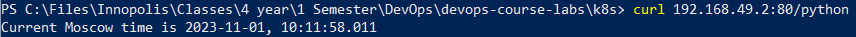

# Kubernetes

Kubernetes is an open-source container orchestration platform that helps automate the deployment, 
scaling, and management of containerized applications. It provides a highly scalable and resilient 
infrastructure for running containers across a cluster of machines. Kubernetes abstracts the underlying 
infrastructure and allows developers to focus on writing and deploying applications without worrying 
about the details of the underlying infrastructure. It offers features like automatic scaling, load 
balancing, and self-healing, making it easier to build and operate modern, cloud-native applications.

## Task 1

`$ kubectl get pods,svc`

```
NAME                             READY   STATUS    RESTARTS   AGE
pod/app-python-995b7485c-qvvk2   1/1     Running   0          51s

NAME                 TYPE           CLUSTER-IP    EXTERNAL-IP   PORT(S)          AGE
service/app-python   LoadBalancer   10.97.64.57   <pending>     8080:32598/TCP   11s
service/kubernetes   ClusterIP      10.96.0.1     <none>        443/TCP          8m51s
```

## Task 2

`$ kubectl get pods,svc`

```
NAME                              READY   STATUS    RESTARTS   AGE
pod/app-python-6c64b5648d-cbmq2   1/1     Running   0          54s
pod/app-python-6c64b5648d-kwt4z   1/1     Running   0          54s
pod/app-python-6c64b5648d-s6m4k   1/1     Running   0          54s

NAME                         TYPE           CLUSTER-IP       EXTERNAL-IP   PORT(S)          AGE
service/app-python-service   LoadBalancer   10.102.234.186   <pending>     8080:32463/TCP   2s
service/kubernetes           ClusterIP      10.96.0.1        <none>        443/TCP          3m13s
```

`minikube service --all`


## Bonus

### Ingress

`$ kubectl get ingress`

```
NAME      CLASS    HOSTS        ADDRESS        PORTS   AGE
ingress   nginx    app.python   192.168.49.2   80      5m9s
```

### Health check

