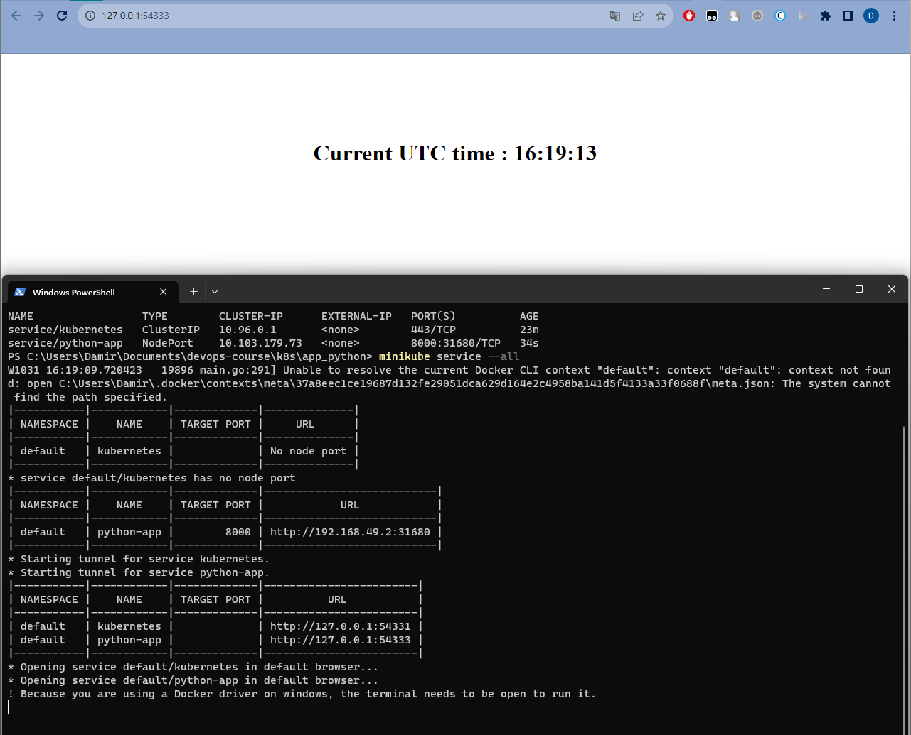
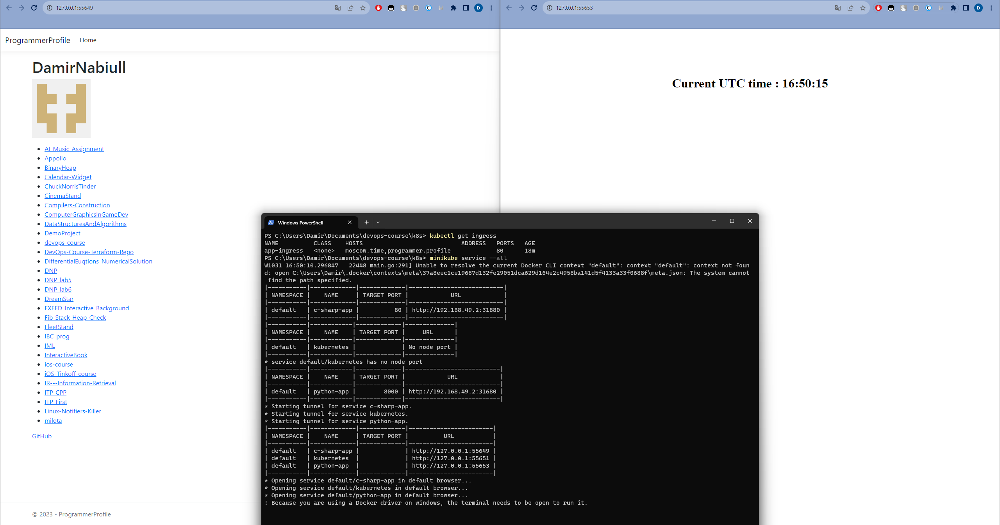

# K8S

## Task 1

`kubectl get pods,svc`

```bash
PS C:\Users\Damir\Documents\devops-course> kubectl get pods,svc
NAME                              READY   STATUS    RESTARTS   AGE
pod/python-app-6dbf94d6d4-fskr9   1/1     Running   0          3m32s

NAME                 TYPE           CLUSTER-IP      EXTERNAL-IP   PORT(S)          AGE
service/kubernetes   ClusterIP      10.96.0.1       <none>        443/TCP          8m23s
service/python-app   LoadBalancer   10.101.93.142   <pending>     8000:30136/TCP   2m31s
```

## Task 2

`kubectl get pods,svc`

```bash
PS C:\Users\Damir\Documents\devops-course\k8s\app_python> kubectl get pods,svc
NAME                             READY   STATUS    RESTARTS   AGE
pod/python-app-7d674fd95-jt9zk   1/1     Running   0          50s
pod/python-app-7d674fd95-knrz6   1/1     Running   0          50s
pod/python-app-7d674fd95-r9hln   1/1     Running   0          50s

NAME                 TYPE        CLUSTER-IP      EXTERNAL-IP   PORT(S)          AGE
service/kubernetes   ClusterIP   10.96.0.1       <none>        443/TCP          23m
service/python-app   NodePort    10.103.179.73   <none>        8000:31680/TCP   34s
```

`minikube service --all`



## Bonus

`kubectl get pods,svc`

```bash
PS C:\Users\Damir\Documents\devops-course\k8s> kubectl get pods,svc
NAME                               READY   STATUS    RESTARTS   AGE
pod/c-sharp-app-7cf987d7f6-5q9zj   1/1     Running   0          84s
pod/c-sharp-app-7cf987d7f6-jgbkg   1/1     Running   0          84s
pod/c-sharp-app-7cf987d7f6-lfq5b   1/1     Running   0          84s
pod/python-app-7d674fd95-jt9zk     1/1     Running   0          14m
pod/python-app-7d674fd95-knrz6     1/1     Running   0          14m
pod/python-app-7d674fd95-r9hln     1/1     Running   0          14m

NAME                  TYPE        CLUSTER-IP       EXTERNAL-IP   PORT(S)          AGE
service/c-sharp-app   NodePort    10.100.124.164   <none>        80:31880/TCP     80s
service/kubernetes    ClusterIP   10.96.0.1        <none>        443/TCP          36m
service/python-app    NodePort    10.103.179.73    <none>        8000:31680/TCP   14m
```

`kubectl get pods -n ingress-nginx`

```bash
PS C:\Users\Damir> kubectl get pods,svc
NAME                               READY   STATUS    RESTARTS      AGE
pod/c-sharp-app-7cf987d7f6-5q9zj   1/1     Running   1 (56m ago)   101m
pod/c-sharp-app-7cf987d7f6-jgbkg   1/1     Running   1 (56m ago)   101m
pod/c-sharp-app-7cf987d7f6-lfq5b   1/1     Running   1 (56m ago)   101m
pod/python-app-7d674fd95-jt9zk     1/1     Running   1 (56m ago)   114m
pod/python-app-7d674fd95-knrz6     1/1     Running   1 (56m ago)   114m
pod/python-app-7d674fd95-r9hln     1/1     Running   1 (56m ago)   114m

NAME                  TYPE        CLUSTER-IP       EXTERNAL-IP   PORT(S)          AGE
service/c-sharp-app   NodePort    10.100.124.164   <none>        80:31880/TCP     101m
service/kubernetes    ClusterIP   10.96.0.1        <none>        443/TCP          137m
service/python-app    NodePort    10.103.179.73    <none>        8000:31680/TCP   114m
PS C:\Users\Damir> kubectl get pods -n ingress-nginx
NAME                                        READY   STATUS      RESTARTS   AGE
ingress-nginx-admission-create-sxrww        0/1     Completed   0          55m
ingress-nginx-admission-patch-tx885         0/1     Completed   1          55m
ingress-nginx-controller-7799c6795f-cd8k8   1/1     Running     0          55m
```

`minikube service --all`



`curl --resolve "moscow.time:80:$( minikube ip )" -i http://moscow.time`

```
HTTP/1.1 200 OK
Content-Length: 233
Content-Type: text/html; charset=utf-8
Date: Tue, 31 Oct 2023 15:14:36 GMT

<!DOCTYPE html>
<html lang="en">
<head>
    <meta charset="UTF-8"...
```

`curl --resolve "programmer.profile:80:192.168.49.2" -i http://programmer.profile`

```
HTTP/1.1 200 OK
Date: Tue, 31 Oct 2023 18:43:55 GMT
Content-Type: text/html; charset=utf-8
Transfer-Encoding: chunked
Connection: keep-alive

<!DOCTYPE html>
<html lang="en">
<head>
    <meta charset="utf-8"/>
    <meta name="viewport" content="width=device-width, initial-scale=1.0"/>
    <title> - ProgrammerProfile</title>
    <link rel="stylesheet" href="/lib/bootstrap/dist/css/bootstrap.min.css" />
    <link rel="stylesheet" href="/css/site.css?v=ZJg29BfKMfPQ1nmIkdqg6iWhTGRNJx2HnD4FfdtVCcU" />
    <link rel="stylesheet" href="/ProgrammerProfile.styles.css?v=CeTaHjIVI07JrJRGnL88ZdnxCTnwUWoq7F6IWgE8N1Y" />
</head>
<body>
<header>
    <nav b-l6lxwr0uvr class="navbar navbar-expand-sm navbar-toggleable-sm navbar-light bg-white border-bottom box-shadow mb-3">
        <div b-l6lxwr0uvr class="container-fluid">
            <a class="navbar-brand" href="/">ProgrammerProfile</a>
            <button b-l6lxwr0uvr class="navbar-toggler" type="button" data-bs-toggle="collapse" data-bs-target=".navbar-collapse" aria-controls="navbarSupportedContent"
                    aria-expanded="false" aria-label="Toggle navigation">
                <span b-l6lxwr0uvr class="navbar-toggler-icon"></span>
            </button>
            <div b-l6lxwr0uvr class="navbar-collapse collapse d-sm-inline-flex justify-content-between">
                <ul b-l6lxwr0uvr class="navbar-nav flex-grow-1">
                    <li b-l6lxwr0uvr class="nav-item">
                        <a class="nav-link text-dark" href="/">Home</a>
                    </li>
                </ul>
            </div>
        </div>
    </nav>
</header>
<div b-l6lxwr0uvr class="container">
    <main b-l6lxwr0uvr role="main" class="pb-3">
        
<!DOCTYPE html>
<html>
<head>
    <title>Programmer Profile</title>
</head>
<body>
<h1>DamirNabiull</h1>

<p></p>
<ul>
        <li>
            <a href="https://api.github.com/repos/DamirNabiull/AI_Music_Assignment" target="_blank">AI_Music_Assignment</a>
        </li>
        <li>
            <a href="https://api.github.com/repos/DamirNabiull/Appollo" target="_blank">Appollo</a>
        </li>
        <li>
            <a href="https://api.github.com/repos/DamirNabiull/BinaryHeap" target="_blank">BinaryHeap</a>
        </li>
        <li>
            <a href="https://api.github.com/repos/DamirNabiull/Calendar-Widget" target="_blank">Calendar-Widget</a>
        </li>
        <li>
            <a href="https://api.github.com/repos/DamirNabiull/ChuckNorrisTinder" target="_blank">ChuckNorrisTinder</a>
        </li>
        <li>
            <a href="https://api.github.com/repos/DamirNabiull/CinemaStand" target="_blank">CinemaStand</a>
        </li>
        <li>
            <a href="https://api.github.com/repos/DamirNabiull/Compilers-Construction" target="_blank">Compilers-Construction</a>
        </li>
        <li>
            <a href="https://api.github.com/repos/DamirNabiull/ComputerGraphicsInGameDev" target="_blank">ComputerGraphicsInGameDev</a>
        </li>
        <li>
            <a href="https://api.github.com/repos/DamirNabiull/DataStructuresAndAlgorithms" target="_blank">DataStructuresAndAlgorithms</a>
        </li>
        <li>
            <a href="https://api.github.com/repos/DamirNabiull/DemoProject" target="_blank">DemoProject</a>
        </li>
        <li>
            <a href="https://api.github.com/repos/DamirNabiull/devops-course" target="_blank">devops-course</a>
        </li>
        <li>
            <a href="https://api.github.com/repos/DamirNabiull/DevOps-Course-Terraform-Repo" target="_blank">DevOps-Course-Terraform-Repo</a>
        </li>
        <li>
            <a href="https://api.github.com/repos/DamirNabiull/DifferentialEuqtions_NumericalSolution" target="_blank">DifferentialEuqtions_NumericalSolution</a>
        </li>
        <li>
            <a href="https://api.github.com/repos/DamirNabiull/DNP" target="_blank">DNP</a>
        </li>
        <li>
            <a href="https://api.github.com/repos/DamirNabiull/DNP_lab5" target="_blank">DNP_lab5</a>
        </li>
        <li>
            <a href="https://api.github.com/repos/DamirNabiull/DNP_lab6" target="_blank">DNP_lab6</a>
        </li>
        <li>
            <a href="https://api.github.com/repos/DamirNabiull/DreamStar" target="_blank">DreamStar</a>
        </li>
        <li>
            <a href="https://api.github.com/repos/DamirNabiull/EXEED_Interactive_Background" target="_blank">EXEED_Interactive_Background</a>
        </li>
        <li>
            <a href="https://api.github.com/repos/DamirNabiull/Fib-Stack-Heap-Check" target="_blank">Fib-Stack-Heap-Check</a>
        </li>
        <li>
            <a href="https://api.github.com/repos/DamirNabiull/FleetStand" target="_blank">FleetStand</a>
        </li>
        <li>
            <a href="https://api.github.com/repos/DamirNabiull/IBC_prog" target="_blank">IBC_prog</a>
        </li>
        <li>
            <a href="https://api.github.com/repos/DamirNabiull/IML" target="_blank">IML</a>
        </li>
        <li>
            <a href="https://api.github.com/repos/DamirNabiull/InteractiveBook" target="_blank">InteractiveBook</a>
        </li>
        <li>
            <a href="https://api.github.com/repos/DamirNabiull/ios-course" target="_blank">ios-course</a>
        </li>
        <li>
            <a href="https://api.github.com/repos/DamirNabiull/iOS-Tinkoff-course" target="_blank">iOS-Tinkoff-course</a>
        </li>
        <li>
            <a href="https://api.github.com/repos/DamirNabiull/IR---Information-Retrieval" target="_blank">IR---Information-Retrieval</a>
        </li>
        <li>
            <a href="https://api.github.com/repos/DamirNabiull/ITP_CPP" target="_blank">ITP_CPP</a>
        </li>
        <li>
            <a href="https://api.github.com/repos/DamirNabiull/ITP_First" target="_blank">ITP_First</a>
        </li>
        <li>
            <a href="https://api.github.com/repos/DamirNabiull/Linux-Notifiers-Killer" target="_blank">Linux-Notifiers-Killer</a>
        </li>
        <li>
            <a href="https://api.github.com/repos/DamirNabiull/milota" target="_blank">milota</a>
        </li>
</ul>
<div>
    <a href="https://github.com/DamirNabiull" target="_blank">GitHub</a>
</div>
</body>
</html>
    </main>
</div>

<footer b-l6lxwr0uvr class="border-top footer text-muted">
    <div b-l6lxwr0uvr class="container">
        &copy; 2023 - ProgrammerProfile
    </div>
</footer>
<script src="/lib/jquery/dist/jquery.min.js"></script>
<script src="/lib/bootstrap/dist/js/bootstrap.bundle.min.js"></script>
<script src="/js/site.js?v=BxFAw9RUJ1E4NycpKEjCNDeoSvr4RPHixdBq5wDnkeY"></script>

</body>
</html>
```

`curl --resolve "moscow.time:80:192.168.49.2" -i http://moscow.time`

```
HTTP/1.1 200 OK
Date: Tue, 31 Oct 2023 18:49:36 GMT
Content-Type: text/html; charset=utf-8
Content-Length: 233
Connection: keep-alive

<!DOCTYPE html>
<html lang="en">
<head>
    <meta charset="UTF-8">
    <title>Lab1</title>
    <link rel="stylesheet" href="/static/style.css">
</head>
<body>
    <h1 class="time-text">Current UTC time : 21:49:36</h1>
</body>
</html>
```