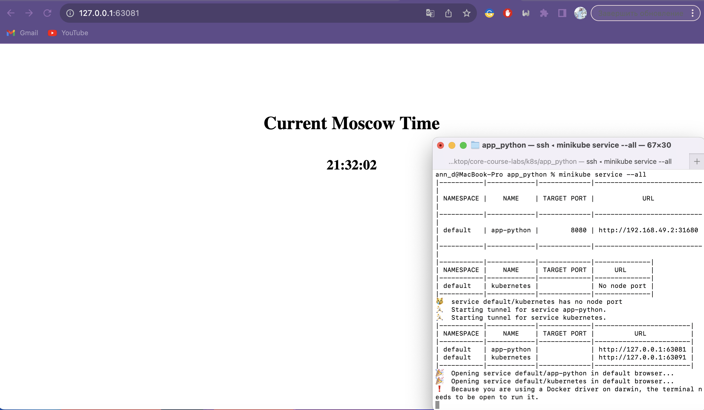
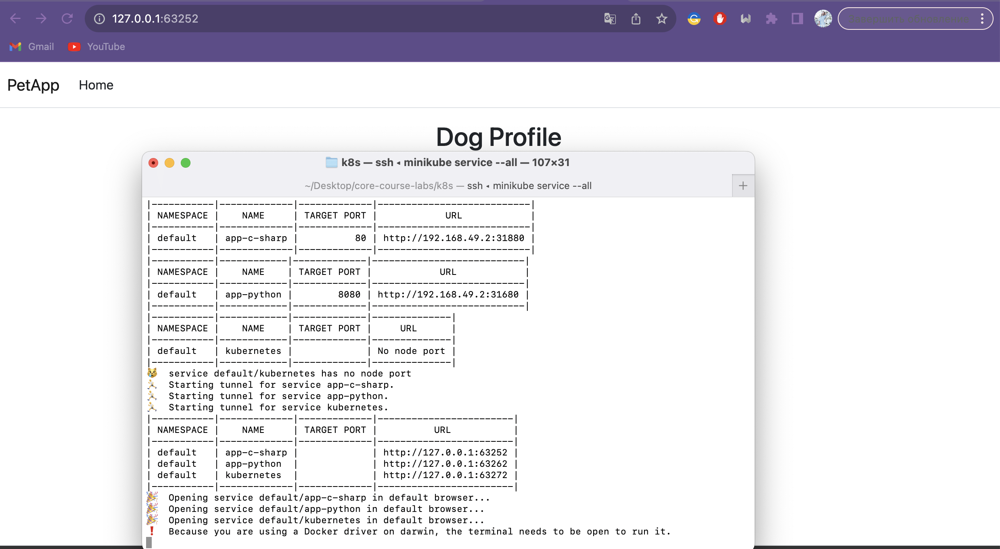

# K8S

## Task 1

`kubectl get pods,svc`

```
NAME                              READY   STATUS    RESTARTS   AGE
pod/app-python-696cbcddf8-48pzv   1/1     Running   0          4m31s

NAME                 TYPE           CLUSTER-IP     EXTERNAL-IP   PORT(S)        AGE
service/app-python   LoadBalancer   10.107.141.1   <pending>     80:31514/TCP   7m54s
service/kubernetes   ClusterIP      10.96.0.1      <none>        443/TCP        3h42m
```

## Task 2

`kubectl get pods,svc`

```
NAME                              READY   STATUS    RESTARTS   AGE
pod/app-python-79b9985c48-5whlt   1/1     Running   0          16s
pod/app-python-79b9985c48-hxhcx   1/1     Running   0          16s
pod/app-python-79b9985c48-rv76f   1/1     Running   0          16s

NAME                 TYPE        CLUSTER-IP      EXTERNAL-IP   PORT(S)          AGE
service/app-python   NodePort    10.100.15.167   <none>        8080:31680/TCP   4s
service/kubernetes   ClusterIP   10.96.0.1       <none>        443/TCP          3h56m
```

`minikube service --all`

- 


## Bonus task

`kubectl get pods,svc`

```
NAME                              READY   STATUS              RESTARTS   AGE
pod/app-c-sharp-b95d6b4b8-4bs88   0/1     ContainerCreating   0          12s
pod/app-c-sharp-b95d6b4b8-cml4r   0/1     ContainerCreating   0          12s
pod/app-c-sharp-b95d6b4b8-pldvs   0/1     ContainerCreating   0          12s
pod/app-python-79b9985c48-5whlt   1/1     Running             0          3m15s
pod/app-python-79b9985c48-hxhcx   1/1     Running             0          3m15s
pod/app-python-79b9985c48-rv76f   1/1     Running             0          3m15s

NAME                  TYPE        CLUSTER-IP      EXTERNAL-IP   PORT(S)          AGE
service/app-c-sharp   NodePort    10.98.195.174   <none>        80:31880/TCP     8s
service/app-python    NodePort    10.100.15.167   <none>        8080:31680/TCP   3m3s
service/kubernetes    ClusterIP   10.96.0.1       <none>        443/TCP          3h59m
```

`kubectl get pods -n ingress-nginx`

```
NAME                                        READY   STATUS    RESTARTS   AGE
ingress-nginx-controller-7799c6795f-dgzjm   1/1     Running   0          23m
```

`minikube service --all`

- 


`curl --resolve "pet.app:80:192.168.49.2" -i http://pet.app`

```
HTTP/1.1 200 OK
Date: Tue, 31 Oct 2023 18:39:45 GMT
Content-Type: text/html; charset=utf-8
Transfer-Encoding: chunked
Connection: keep-alive
Cache-Control: no-cache, no-store
Pragma: no-cache
Set-Cookie: .AspNetCore.Antiforgery.-nclmMr-HGQ=CfDJ8I68itXNw3BHnGFBXSR8TuSKRYwLbSldIRI8aLZ6cT9Ctboz2IqCaRzcDx-ubEiXBIEdgvasSwNXizEcb53kDH9-Ith7fYNL51iaMCTazjnssboOd6g07Oi7egYWhnXg_ykH8QNUnr9q4a5suTUpeec; path=/; samesite=strict; httponly
X-Frame-Options: SAMEORIGIN

<!DOCTYPE html>
<html lang="en">
<head>
    <meta charset="utf-8"/>
    <meta name="viewport" content="width=device-width, initial-scale=1.0"/>
    <title> - PetApp</title>
    <link rel="stylesheet" href="/lib/bootstrap/dist/css/bootstrap.min.css" />
    <link rel="stylesheet" href="/css/site.css?v=HF8XZxPfg3TOgYf2Bs5ykZW7MAQGMDPyrv0f5-wAcWE" />
</head>
<body>
<header>
    <nav b-engalc2m2p class="navbar navbar-expand-sm navbar-toggleable-sm navbar-light bg-white border-bottom box-shadow mb-3">
        <div b-engalc2m2p class="container-fluid">
            <a class="navbar-brand" href="/">PetApp</a>
            <button b-engalc2m2p class="navbar-toggler" type="button" data-bs-toggle="collapse" data-bs-target=".navbar-collapse" aria-controls="navbarSupportedContent"
                    aria-expanded="false" aria-label="Toggle navigation">
                <span b-engalc2m2p class="navbar-toggler-icon"></span>
            </button>
            <div b-engalc2m2p class="navbar-collapse collapse d-sm-inline-flex justify-content-between">
                <ul b-engalc2m2p class="navbar-nav flex-grow-1">
                    <li b-engalc2m2p class="nav-item">
                        <a class="nav-link text-dark" href="/">Home</a>
                    </li>
                </ul>
            </div>
        </div>
    </nav>
</header>
<div b-engalc2m2p class="container">
    <main b-engalc2m2p role="main" class="pb-3">
        
<div style="text-align: center;">
    <h2>Dog Profile</h2>
</div>

<div class="form-container">
    <form method="post" action="/Dog/ConvertAge">
        <div class="form-group">
            <label>Dog Name:</label>
            <input class="form-control" type="text" data-val="true" data-val-required="The dog&#x27;s name is required." id="DogName" name="DogName" value="" />
            <span class="text-danger field-validation-valid" data-valmsg-for="DogName" data-valmsg-replace="true"></span>
        </div>
        <div class="form-group">
            <label>Date of Birth:</label>
            <input type="date" class="form-control" value="2000-01-01" data-val="true" data-val-required="The DateOfBirth field is required." id="DateOfBirth" name="DateOfBirth" />
        </div>
        <div class="form-group">
            <label>Owner:</label>
            <input class="form-control" type="text" id="Owner" name="Owner" value="" />
        </div>
        <div class="form-group">
            <label>Address:</label>
            <input class="form-control" type="text" id="Address" name="Address" value="" />
        </div>
        <div class="form-group">
            <label>Owner Phone Number:</label>
            <input class="form-control" type="text" id="OwnerPhoneNumber" name="OwnerPhoneNumber" value="" />
        </div>

        <div class="dog-form-submit-button">
            <button type="submit" class="btn btn-primary">Convert Age</button>
        </div>
    <input name="__RequestVerificationToken" type="hidden" value="CfDJ8I68itXNw3BHnGFBXSR8TuQeaSgQzfPomeUmZGN_YunQQ3Ab7xp62ZfVTo4xMRZuuObYnPFX0Knh4OmrMtF5-sFHhV2Von9UJxEqmdMMWEk-XTp-alcYL6yzJNw9Jqj5pSkCrRXh0nA4Ra-4hKR4ees" /></form>
</div>


    </main>
</div>

<footer b-engalc2m2p class="border-top footer text-muted">
    <div b-engalc2m2p class="container">
        &copy; 2023 - PetApp
    </div>
</footer>
<script src="/lib/jquery/dist/jquery.min.js"></script>
<script src="/lib/bootstrap/dist/js/bootstrap.bundle.min.js"></script>
<script src="/js/site.js?v=4q1jwFhaPaZgr8WAUSrux6hAuh0XDg9kPS3xIVq36I0"></script>

</body>
</html>
```

`curl --resolve "python.moscow.time:80:192.168.49.2" -i http://python.moscow.time`

```       
HTTP/1.1 200 OK
Date: Tue, 31 Oct 2023 18:50:16 GMT
Content-Type: text/html; charset=utf-8
Content-Length: 289
Connection: keep-alive

<!doctype html>
<html lang="en">
<head>
    <meta charset="UTF-8">
    <title>Current Moscow Time</title>
    <link rel="stylesheet" href="/static/style.css">
</head>
<body>
    <h1 class="description-style">Current Moscow Time</h1>
    <h2 class="time-style">21:50:16</h2>
</body>
</html>
```
