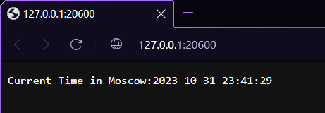

# Task 1

```
PS D:\git\core-course-labs> kubectl create deployment app-python --image=dyllasdek/app_python:latest
deployment.apps/app-python created

PS D:\git\core-course-labs> kubectl get deployments
NAME         READY   UP-TO-DATE   AVAILABLE   AGE
app-python   1/1     1            1           85s

PS D:\git\core-course-labs> kubectl get pods
NAME                          READY   STATUS    RESTARTS   AGE
app-python-684c5c469c-9bpld   1/1     Running   0          3m25s

PS D:\git\core-course-labs> kubectl logs app-python-684c5c469c-9bpld
 * Serving Flask app 'app'
 * Debug mode: off
WARNING: This is a development server. Do not use it in a production deployment. Use a production WSGI server instead.
 * Running on all addresses (0.0.0.0)
 * Running on http://127.0.0.1:5000
 * Running on http://10.244.0.5:5000
Press CTRL+C to quit

PS D:\git\core-course-labs> kubectl get svc
NAME         TYPE           CLUSTER-IP   EXTERNAL-IP   PORT(S)          AGE
app-python   LoadBalancer   10.98.29.4   <pending>     5000:31225/TCP   7s
kubernetes   ClusterIP      10.96.0.1    <none>        443/TCP          114m
```

# Task 2 + bonus

```
PS D:\git\core-course-labs\k8s> kubectl get pods
NAME                          READY   STATUS    RESTARTS   AGE
app-kotlin-f48745cdc-5hmrz    1/1     Running   0          2m38s
app-kotlin-f48745cdc-srjdk    1/1     Running   0          2m38s
app-kotlin-f48745cdc-tzv96    1/1     Running   0          2m38s
app-python-67f4df6784-5srk7   1/1     Running   0          48s
app-python-67f4df6784-9tl97   1/1     Running   0          48s
app-python-67f4df6784-dkfdb   1/1     Running   0          48s

PS D:\git\core-course-labs\k8s> kubectl get svc
NAME         TYPE        CLUSTER-IP      EXTERNAL-IP   PORT(S)          AGE
app-kotlin   NodePort    10.110.27.249   <none>        8080:30001/TCP   3m21s
app-python   NodePort    10.99.64.117    <none>        80:30000/TCP     3m13s
kubernetes   ClusterIP   10.96.0.1       <none>        443/TCP          131m


PS C:\Users\MSI-PC> minikube service --all
|-----------|------------|-------------|---------------------------|
| NAMESPACE |    NAME    | TARGET PORT |            URL            |
|-----------|------------|-------------|---------------------------|
| default   | app-kotlin |        8080 | http://192.168.49.2:30001 |
|-----------|------------|-------------|---------------------------|
|-----------|------------|-------------|---------------------------|
| NAMESPACE |    NAME    | TARGET PORT |            URL            |
|-----------|------------|-------------|---------------------------|
| default   | app-python |          80 | http://192.168.49.2:30000 |
|-----------|------------|-------------|---------------------------|
|-----------|------------|-------------|--------------|
| NAMESPACE |    NAME    | TARGET PORT |     URL      |
|-----------|------------|-------------|--------------|
| default   | kubernetes |             | No node port |
|-----------|------------|-------------|--------------|
* service default/kubernetes has no node port
* Starting tunnel for service app-kotlin.
* Starting tunnel for service app-python.
* Starting tunnel for service kubernetes.
|-----------|------------|-------------|------------------------|
| NAMESPACE |    NAME    | TARGET PORT |          URL           |
|-----------|------------|-------------|------------------------|
| default   | app-kotlin |             | http://127.0.0.1:20600 |
| default   | app-python |             | http://127.0.0.1:20602 |
| default   | kubernetes |             | http://127.0.0.1:20604 |
|-----------|------------|-------------|------------------------|
* Opening service default/app-kotlin in default browser...
* Opening service default/app-python in default browser...
* Opening service default/kubernetes in default browser...
! Because you are using a Docker driver on windows, the terminal needs to be open to run it.
```

## Python app


## Kotlin app


