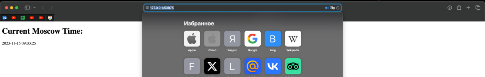

### **Pods:**
```
$ kubectl get pods, svc
NAME                                READY   STATUS      RESTARTS    AGE
pod/app-python-3f56a81v64-vfv3n     1/1     Running     0           78s

NAME                  TYPE           CLUSTER-IP       EXTERNAL-IP    PORT(S)           AGE
service/app-python    LoadBalancer   10.96.10.153     <pending>      5000:31241/TCP    6s
service/kubernetes    ClusterIP      10.96.0.1        <none>         443/TCP           11m
```

### **Output of the minikube service --all:**
```
$ minikube service --all
|-----------|------------|-------------|---------------------------|
| NAMESPACE |    NAME    | TARGET PORT |            URL            |
|-----------|------------|-------------|---------------------------|
| default   | app-python |        5000 | http://192.168.49.2:31241 |
|-----------|------------|-------------|---------------------------|
|-----------|------------|-------------|--------------|
| NAMESPACE |    NAME    | TARGET PORT |     URL      |
|-----------|------------|-------------|--------------|
| default   | kubernetes |             | No node part |
|-----------|------------|-------------|--------------|
😿  service default/kubernetes has no node port.
🏃  Starting tunnel for service app-python.
🏃  Starting tunnel for service kubernetes.
|-----------|------------|-------------|------------------------|
| NAMESPACE |    NAME    | TARGET PORT |          URL           |
|-----------|------------|-------------|------------------------|
| default   | app-python |             | http://127.0.0.1:53075 |
| default   | kubernetes |             | http://127.0.0.1:54087 |
|-----------|------------|-------------|------------------------|
```

## Python App:
