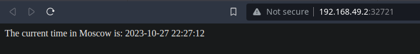
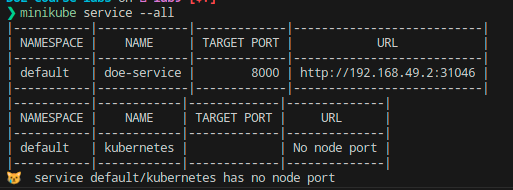
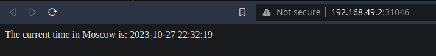

# Task 1

Installed and researched the tools.

Deployed the application and exposed it to network using a Service:

```bash
kubectl create deployment doe-node --image=nzgeg3s0/doe-lab2
kubectl expose deployment doe-node --type=LoadBalancer --port=8000
```

Running `kubectl get pods,svc`:

```bash
NAME                            READY   STATUS    RESTARTS   AGE
pod/doe-node-5bddcdc876-5bjht   1/1     Running   0          3m34s

NAME                 TYPE           CLUSTER-IP       EXTERNAL-IP   PORT(S)          AGE
service/doe-node     LoadBalancer   10.109.174.184   <pending>     8080:31851/TCP   2m21s
service/kubernetes   ClusterIP      10.96.0.1        <none>        443/TCP          2d7h
```

Check that it works:

```bash
minikube service doe-node
```



Removing Deployment and Service:

```bash
kubectl delete service doe-node
kubectl delete deployment doe-node
```

# Task 2

Created deployment and service files based on kubertnetes documentation.

Result of `kubectl get pods,svc`:

```bash
NAME                                READY   STATUS    RESTARTS   AGE
pod/doe-deployment-fb987674-4bjhx   1/1     Running   0          12s
pod/doe-deployment-fb987674-dqblb   1/1     Running   0          12s
pod/doe-deployment-fb987674-z2dkk   1/1     Running   0          12s

NAME                  TYPE           CLUSTER-IP     EXTERNAL-IP   PORT(S)          AGE
service/doe-service   LoadBalancer   10.108.70.60   <pending>     8000:31046/TCP   16s
service/kubernetes    ClusterIP      10.96.0.1      <none>        443/TCP          2d8h
```

Check that it works:



