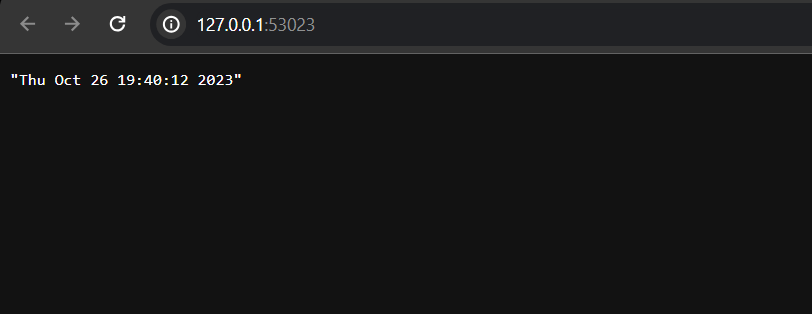

# K8s

## Task 1

### Minikube start

```bash
[user@fedora ~]$ minikube start --driver=docker
😄  minikube v1.31.2 on Fedora 38
✨  Using the docker driver based on user configuration
📌  Using Docker driver with root privileges
👍  Starting control plane node minikube in cluster minikube
🚜  Pulling base image ...
💾  Downloading Kubernetes v1.27.4 preload ...
    > preloaded-images-k8s-v18-v1...:  393.21 MiB / 393.21 MiB  100.00% 18.45 M
    > gcr.io/k8s-minikube/kicbase...:  447.61 MiB / 447.62 MiB  100.00% 14.71 M
🔥  Creating docker container (CPUs=2, Memory=2900MB) ...
🐳  Preparing Kubernetes v1.27.4 on Docker 24.0.4 ...
    ▪ Generating certificates and keys ...
    ▪ Booting up control plane ...
    ▪ Configuring RBAC rules ...
🔗  Configuring bridge CNI (Container Networking Interface) ...
    ▪ Using image gcr.io/k8s-minikube/storage-provisioner:v5
🔎  Verifying Kubernetes components...
🌟  Enabled addons: storage-provisioner, default-storageclass
🏄  Done! kubectl is now configured to use "minikube" cluster and "default" namespace by default
```

Cluster is alive:

```bash
[user@fedora ~]$ kubectl get pods -A
NAMESPACE     NAME                               READY   STATUS    RESTARTS       AGE
kube-system   coredns-5d78c9869d-rsh9w           1/1     Running   0              86s
kube-system   etcd-minikube                      1/1     Running   0              105s
kube-system   kube-apiserver-minikube            1/1     Running   0              105s
kube-system   kube-controller-manager-minikube   1/1     Running   1 (2m4s ago)   2m2s
kube-system   kube-proxy-55h59                   1/1     Running   0              86s
kube-system   kube-scheduler-minikube            1/1     Running   0              105s
kube-system   storage-provisioner                1/1     Running   1 (56s ago)    88s
```

### Deployment creation

```bash
[user@fedora ~]$ kubectl create deployment app-python --image=dvechtomova/python_app:latest
deployment.apps/app-python created
[user@fedora ~]$ kubectl create deployment app-rust --image=dvechtomova/rust_app:latest
deployment.apps/app-rust created
[user@fedora ~]$ kubectl get deployment -A
NAMESPACE     NAME         READY   UP-TO-DATE   AVAILABLE   AGE
default       app-python   1/1     1            1           4m31s
default       app-rust     1/1     1            1           4m20s
kube-system   coredns      1/1     1            1           28m
```

### Service creation

```bash
[user@fedora ~]$ kubectl expose deployment app-python --type=LoadBalancer --port=8080
service/app-python exposed
[user@fedora ~]$ kubectl expose deployment app-rust --type=LoadBalancer --port=8080
```

Working:

```bash
[user@fedora ~]$ kubectl get svc -A
NAMESPACE     NAME         TYPE           CLUSTER-IP       EXTERNAL-IP   PORT(S)                  AGE
default       app-python   LoadBalancer   10.107.160.131   <pending>     8080:30159/TCP           3m
default       app-rust     LoadBalancer   10.109.187.87    <pending>     8080:32073/TCP           2m59s
default       kubernetes   ClusterIP      10.96.0.1        <none>        443/TCP                  36m
kube-system   kube-dns     ClusterIP      10.96.0.10       <none>        53/UDP,53/TCP,9153/TCP   36m
[user@fedora ~]$ curl http://192.168.49.2:30159
2023-10-17T12:09:04.294693+03:00[user@fedora ~]$ 
[user@fedora ~]$ curl http://192.168.49.2:32073
2023-10-17T12:09:07.850255089+03:00[user@fedora ~]$
```

### Pods and services

```bash
[user@fedora ~]$ kubectl get pods,svc -A
NAMESPACE     NAME                                   READY   STATUS    RESTARTS      AGE
default       pod/app-python-d94b8949-n7xzl          1/1     Running   0             15m
default       pod/app-rust-576cf46cf6-cp2k9          1/1     Running   0             14m
kube-system   pod/coredns-5d78c9869d-rsh9w           1/1     Running   0             39m
kube-system   pod/etcd-minikube                      1/1     Running   0             39m
kube-system   pod/kube-apiserver-minikube            1/1     Running   0             39m
kube-system   pod/kube-controller-manager-minikube   1/1     Running   1 (39m ago)   39m
kube-system   pod/kube-proxy-55h59                   1/1     Running   0             39m
kube-system   pod/kube-scheduler-minikube            1/1     Running   0             39m
kube-system   pod/storage-provisioner                1/1     Running   2 (11m ago)   39m

NAMESPACE     NAME                 TYPE           CLUSTER-IP       EXTERNAL-IP   PORT(S)                  AGE
default       service/app-python   LoadBalancer   10.107.160.131   <pending>     8080:30159/TCP           5m36s
default       service/app-rust     LoadBalancer   10.109.187.87    <pending>     8080:32073/TCP           5m35s
default       service/kubernetes   ClusterIP      10.96.0.1        <none>        443/TCP                  39m
kube-system   service/kube-dns     ClusterIP      10.96.0.10       <none>        53/UDP,53/TCP,9153/TCP   39m
```

## Task 2

### Manifest apply

```bash
[user@fedora python]$ kubectl apply -f deployment.yaml 
deployment.apps/app-python created
[user@fedora python]$ kubectl apply -f service.yaml 
service/app-python-svc created
[user@fedora python]$ cd ../rust/
[user@fedora rust]$ kubectl apply -f deployment.yaml 
deployment.apps/app-rust created
[user@fedora rust]$ kubectl apply -f service.yaml 
service/app-rust-svc created
```

### Pods and services

```bash
[user@fedora ~]$ kubectl get pods,svc -A
NAMESPACE     NAME                                   READY   STATUS    RESTARTS      AGE
default       pod/app-python-6bc487846-cbn8m         1/1     Running   0             3m9s
default       pod/app-python-6bc487846-cn9q9         1/1     Running   0             3m9s
default       pod/app-python-6bc487846-ffvkk         1/1     Running   0             3m9s
default       pod/app-rust-6b95c665bb-6v842          1/1     Running   0             2m54s
default       pod/app-rust-6b95c665bb-8f2lj          1/1     Running   0             2m54s
default       pod/app-rust-6b95c665bb-tmd8d          1/1     Running   0             2m54s
kube-system   pod/coredns-5d78c9869d-rsh9w           1/1     Running   0             45m
kube-system   pod/etcd-minikube                      1/1     Running   0             46m
kube-system   pod/kube-apiserver-minikube            1/1     Running   0             46m
kube-system   pod/kube-controller-manager-minikube   1/1     Running   1 (46m ago)   46m
kube-system   pod/kube-proxy-55h59                   1/1     Running   0             45m
kube-system   pod/kube-scheduler-minikube            1/1     Running   0             46m
kube-system   pod/storage-provisioner                1/1     Running   2 (18m ago)   45m

NAMESPACE     NAME                     TYPE           CLUSTER-IP       EXTERNAL-IP   PORT(S)                  AGE
default       service/app-python-svc   LoadBalancer   10.106.206.232   <pending>     8080:31299/TCP           3m4s
default       service/app-rust-svc     LoadBalancer   10.105.130.84    <pending>     8080:30456/TCP           2m39s
default       service/kubernetes       ClusterIP      10.96.0.1        <none>        443/TCP                  46m
kube-system   service/kube-dns         ClusterIP      10.96.0.10       <none>        53/UDP,53/TCP,9153/TCP   46m

[user@fedora ~]$ curl http://192.168.49.2:31299
2023-10-17T12:17:14.716107+03:00[user@fedora ~]$ 
[user@fedora ~]$ curl http://192.168.49.2:30456
2023-10-17T12:17:18.685099392+03:00
```

### Minikube service

```bash
[user@fedora ~]$ minikube service --all
|-----------|----------------|-------------|---------------------------|
| NAMESPACE |      NAME      | TARGET PORT |            URL            |
|-----------|----------------|-------------|---------------------------|
| default   | app-python-svc |        8080 | http://192.168.49.2:31299 |
|-----------|----------------|-------------|---------------------------|
|-----------|--------------|-------------|---------------------------|
| NAMESPACE |     NAME     | TARGET PORT |            URL            |
|-----------|--------------|-------------|---------------------------|
| default   | app-rust-svc |        8080 | http://192.168.49.2:30456 |
|-----------|--------------|-------------|---------------------------|
|-----------|------------|-------------|--------------|
| NAMESPACE |    NAME    | TARGET PORT |     URL      |
|-----------|------------|-------------|--------------|
| default   | kubernetes |             | No node port |
|-----------|------------|-------------|--------------|
😿  service default/kubernetes has no node port
🎉  Opening service default/app-python-svc in default browser...
```

Working:


