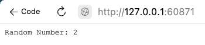

# Lab 9: Introduction to Kubernetes

This README.md file provides an overview of the tasks to be completed in Lab 9, which is focused on introduction to Kubernetes.

## Task 1: Kubernetes Setup and Basic Deployment

I learned about Kubernetes and installed all the necessary tools. Also I created a k8s folder where I put all the information about every single app in a separate folder, `app-python` and `app-node`. 

In order to apply all YAML files I ran the following commands : 

```sh
kubectl apply -f app-node/
kubectl apply -f app-python/
```

After that, in order to check that the commands I ran were succesfull I checked the deployments : 

```sh
❯ kubectl get deployments
NAME              READY   UP-TO-DATE   AVAILABLE   AGE
app-node-random   4/4     4            4           20m
app-python-time   4/4     4            4           20m
```

I have four pods at total for every single app, it's visible when using the following commands : 

```sh
❯ kubectl get pods
NAME                              READY   STATUS    RESTARTS      AGE
app-node-random-9896c4944-24b4f   1/1     Running   0             5m23s
app-node-random-9896c4944-bclb2   1/1     Running   0             5m26s
app-node-random-9896c4944-pqwmm   1/1     Running   0             5m50s
app-node-random-9896c4944-x7svp   1/1     Running   0             5m50s
app-python-time-7c5695b94-hkt4b   1/1     Running   2 (12m ago)   20m
app-python-time-7c5695b94-jwdrv   1/1     Running   2 (12m ago)   20m
app-python-time-7c5695b94-lhs5n   1/1     Running   2 (12m ago)   20m
app-python-time-7c5695b94-zk79k   1/1     Running   2 (12m ago)   20m
```


The output of the `minikube service --all` command and the results from my browser demonstrating that the IP matches the output of the command : 

```sh
❯ minikube service --all
|-----------|-------------------------|-------------|---------------------------|
| NAMESPACE |          NAME           | TARGET PORT |            URL            |
|-----------|-------------------------|-------------|---------------------------|
| default   | app-node-random-service |        3000 | http://192.168.49.2:30001 |
|-----------|-------------------------|-------------|---------------------------|
|-----------|-------------------------|-------------|---------------------------|
| NAMESPACE |          NAME           | TARGET PORT |            URL            |
|-----------|-------------------------|-------------|---------------------------|
| default   | app-python-time-service |        8080 | http://192.168.49.2:30000 |
|-----------|-------------------------|-------------|---------------------------|
|-----------|------------|-------------|--------------|
| NAMESPACE |    NAME    | TARGET PORT |     URL      |
|-----------|------------|-------------|--------------|
| default   | kubernetes |             | No node port |
|-----------|------------|-------------|--------------|
😿  service default/kubernetes has no node port
🏃  Starting tunnel for service app-node-random-service.
🏃  Starting tunnel for service app-python-time-service.
🏃  Starting tunnel for service kubernetes.
|-----------|-------------------------|-------------|------------------------|
| NAMESPACE |          NAME           | TARGET PORT |          URL           |
|-----------|-------------------------|-------------|------------------------|
| default   | app-node-random-service |             | http://127.0.0.1:60871 |
| default   | app-python-time-service |             | http://127.0.0.1:60873 |
| default   | kubernetes              |             | http://127.0.0.1:60875 |
|-----------|-------------------------|-------------|------------------------|
🎉  Opening service default/app-node-random-service in default browser...
🎉  Opening service default/app-python-time-service in default browser...
🎉  Opening service default/kubernetes in default browser...
❗  Because you are using a Docker driver on darwin, the terminal needs to be open to run it.
```
## Task 2: Kubernetes Setup for both apps and ingress

Image of the Node app 




Image of the Python app 


    
#### Output of the Curl Command verifiying the availability of application : 

```sh
❯ curl http://127.0.0.1:60873
<!DOCTYPE html>
<html>
<head>
    <title>Current Time in Moscow</title>
</head>
<body>
    <h1>Current Time in Moscow:</h1>
    <p>2023-11-01 10:13:29</p>
    <p>Refresh the page to update the time.</p>
</body>
```