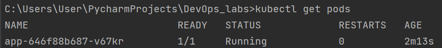
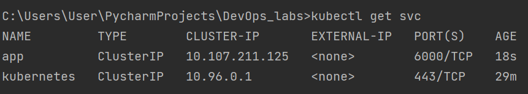
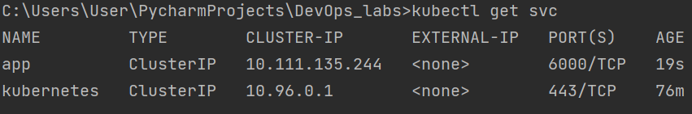
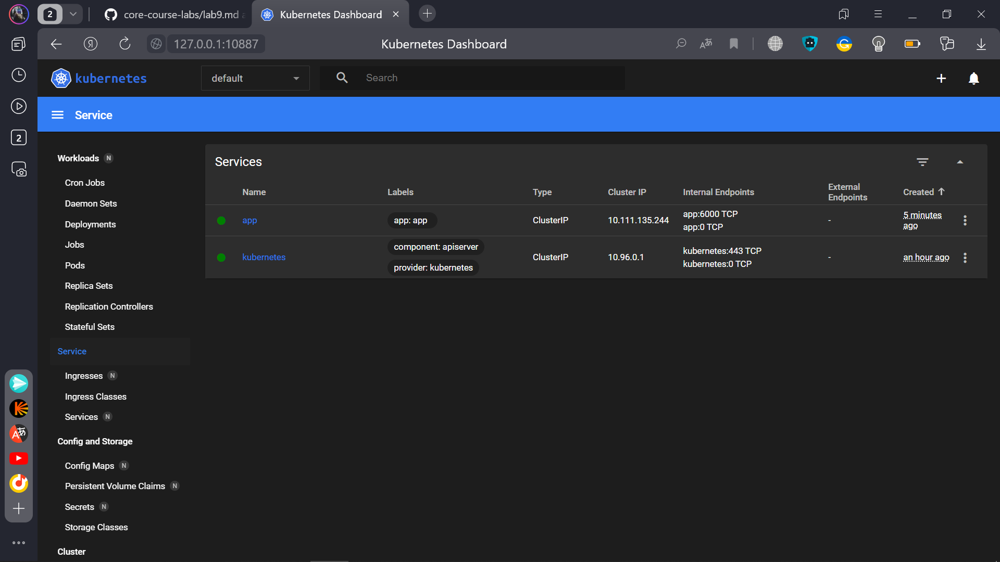

## Deployment of Application
The result of command:
```
kubectl get pods
```
Task 1

Task 2

## Creating of a service
The result of command:
```
kubectl get svc
```
Task 1

Task 2


Screenshot of the browser


Service and deployment are based on this article: 
https://proglib.io/p/pervoe-znakomstvo-s-kubernetes-sozdaem-pervoe-prilozhenie-dlya-razvertyvaniya-v-klastere-2021-08-04