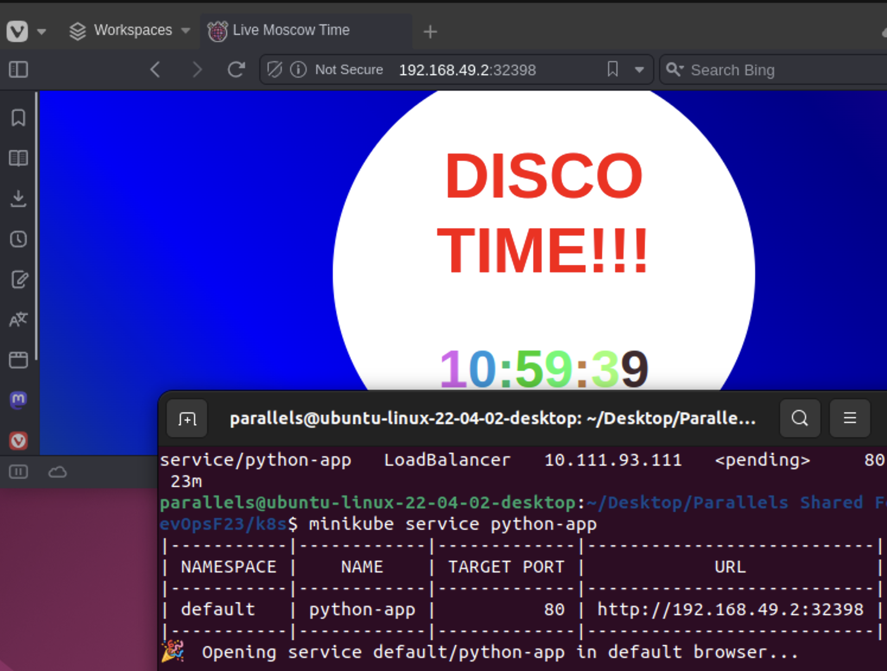

# Kubernetes overview

## Task 1

Installed, configured and tested minikube and kubectl.

### Commands

Create deployment and service:
    
```bash
    minikube kubectl -- create deployment python-app --image=max3k/app_python:latest
deployment.apps/python-app created
```

 ```bash
    minikube kubectl -- expose deployment python-app --type=NodePort --port=80
service/python-app exposed
```

Get pods and services:

```bash
    minikube kubectl -- get pods,svc
    NAME                              READY   STATUS    RESTARTS      AGE
pod/python-app-67b5999998-8vrx4   1/1     Running   1 (11m ago)   38m

NAME                 TYPE           CLUSTER-IP      EXTERNAL-IP   PORT(S)        AGE
service/kubernetes   ClusterIP      10.96.0.1       <none>        443/TCP        43m
service/python-app   LoadBalancer   10.111.93.111   <pending>     80:32398/TCP   23m
```



## Task 2

Created deployment and service manifests for python app.

```bash
    minikube kubectl -- apply -f service.yaml
    service/python-app-svc created
```

Get pods and services:

```bash
    minikube kubectl -- get pods,svc -A
    NAMESPACE     NAME                                   READY   STATUS             RESTARTS        AGE
default       pod/python-app-7bd9b6b896-cmzkt        0/1     ImagePullBackOff   0               2m10s
default       pod/python-app-7bd9b6b896-nmjdb        0/1     ImagePullBackOff   0               2m10s
default       pod/python-app-7bd9b6b896-xzftg        0/1     ImagePullBackOff   0               2m10s
kube-system   pod/coredns-5d78c9869d-9kf2x           1/1     Running            0               3m14s
kube-system   pod/etcd-minikube                      1/1     Running            0               3m27s
kube-system   pod/kube-apiserver-minikube            1/1     Running            0               3m27s
kube-system   pod/kube-controller-manager-minikube   1/1     Running            0               3m27s
kube-system   pod/kube-proxy-g772h                   1/1     Running            0               3m14s
kube-system   pod/kube-scheduler-minikube            1/1     Running            0               3m27s
kube-system   pod/storage-provisioner                1/1     Running            1 (2m44s ago)   3m27s

NAMESPACE     NAME                     TYPE           CLUSTER-IP       EXTERNAL-IP   PORT(S)                  AGE
default       service/kubernetes       ClusterIP      10.96.0.1        <none>        443/TCP                  3m29s
default       service/python-app-svc   LoadBalancer   10.106.205.232   <pending>     80:31563/TCP             108s
kube-system   service/kube-dns         ClusterIP      10.96.0.10       <none>        53/UDP,53/TCP,9153/TCP   3m28s
```

Get services:

```
minikube service --all
|-----------|------------|-------------|--------------|
| NAMESPACE |    NAME    | TARGET PORT |     URL      |
|-----------|------------|-------------|--------------|
| default   | kubernetes |             | No node port |
|-----------|------------|-------------|--------------|
😿  service default/kubernetes has no node port
|-----------|----------------|-------------|---------------------------|
| NAMESPACE |      NAME      | TARGET PORT |            URL            |
|-----------|----------------|-------------|---------------------------|
| default   | python-app-svc |          80 | http://192.168.49.2:31563 |
|-----------|----------------|-------------|---------------------------|
```

## Task 3

Add ingress manifest for python app.

```bash
    minikube addons enable ingress
    minikube kubectl -- apply -f ingress.yaml
```

Get current ingress data:
```bash
 minikube kubectl -- get ingress -A
NAMESPACE   NAME         CLASS   HOSTS                  ADDRESS   PORTS   AGE
default     python-app   nginx   python-app.localhost             80      2s
```