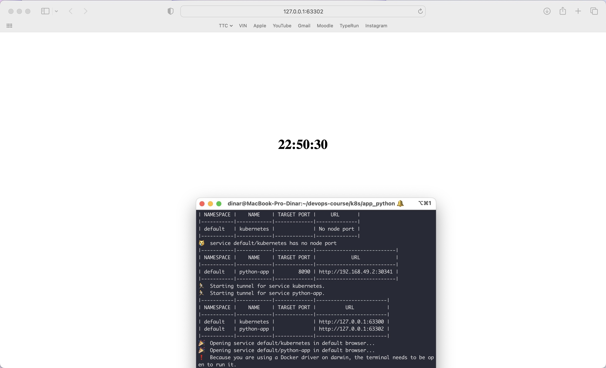

# K8S

## Task 1

Output of command `kubectl get pods,svc`:

```bash
NAME                      READY   STATUS    RESTARTS   AGE
pod/app-669fb746c-crpln   1/1     Running   0          4m36s

NAME                 TYPE           CLUSTER-IP     EXTERNAL-IP   PORT(S)          AGE
service/app          LoadBalancer   10.98.165.28   <pending>     8080:30341/TCP   2m6s
service/kubernetes   ClusterIP      10.96.0.1      <none>        443/TCP          10m
```

## Task 2

Output of command `kubectl get pods,svc`:

```bash
NAME                             READY   STATUS    RESTARTS   AGE
pod/python-app-5699b8b9f-559x9   1/1     Running   0          5m40s
pod/python-app-5699b8b9f-q8f4b   1/1     Running   0          5m43s
pod/python-app-5699b8b9f-qkvwl   1/1     Running   0          5m36s

NAME                 TYPE        CLUSTER-IP    EXTERNAL-IP   PORT(S)          AGE
service/kubernetes   ClusterIP   10.96.0.1     <none>        443/TCP          29m
service/python-app   NodePort    10.96.59.58   <none>        8090:30341/TCP   9m59s
```

Result of command `minikube service --all`:


