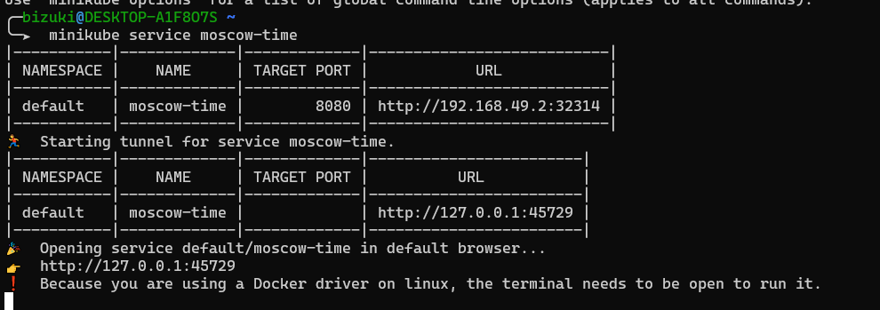
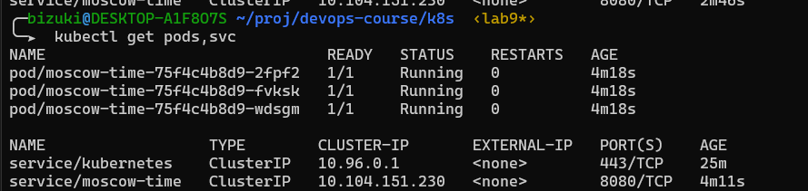
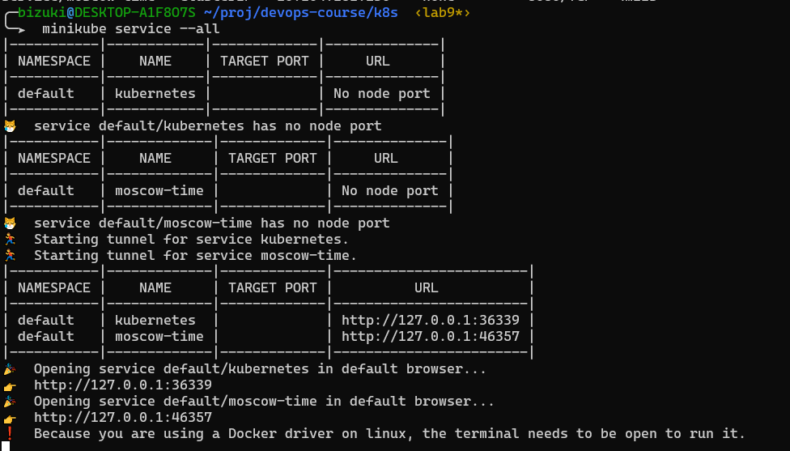
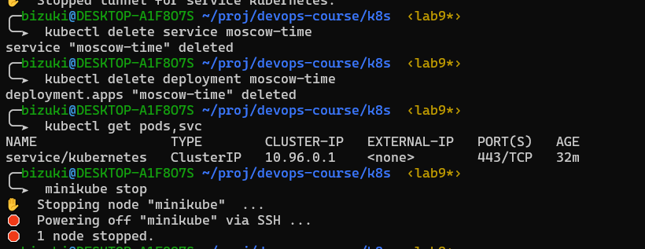

# No configuration files
## Initialization
First we will start our minkube cluster
```bash
minikube start
```
Then deploy and expose our application
```bash
kubectl create deployment moscow-time --images/image=bizuki/moscow-time:latest
kubectl expose deployment moscow-time --type=LoadBalancer --port=8080
```
## Check our cluster

### Info from `kubectl get pods,svc`


### Minikube tunnel to service


## Clen up


# With configuration files

## Initialization
First we will start our minkube cluster
```bash
minikube start
```

Then deploy and expose our application
```bash
kubectl apply -f deployment.yml
kubectl apply -f service.yml
```
## Checking cluster

### Info from `kubectl get pods,svc`


### Minikube tunnel to service

Result from browser. Ip is the same as in result of minikube command


## Clean up
