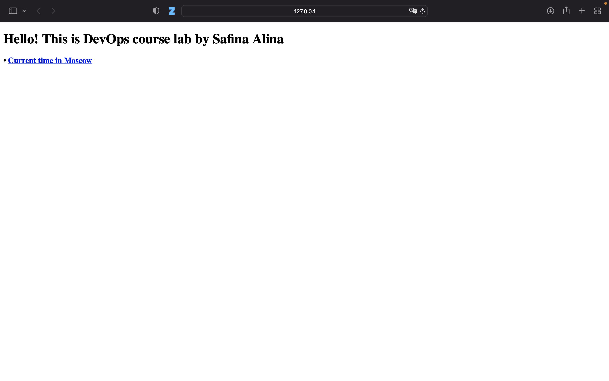
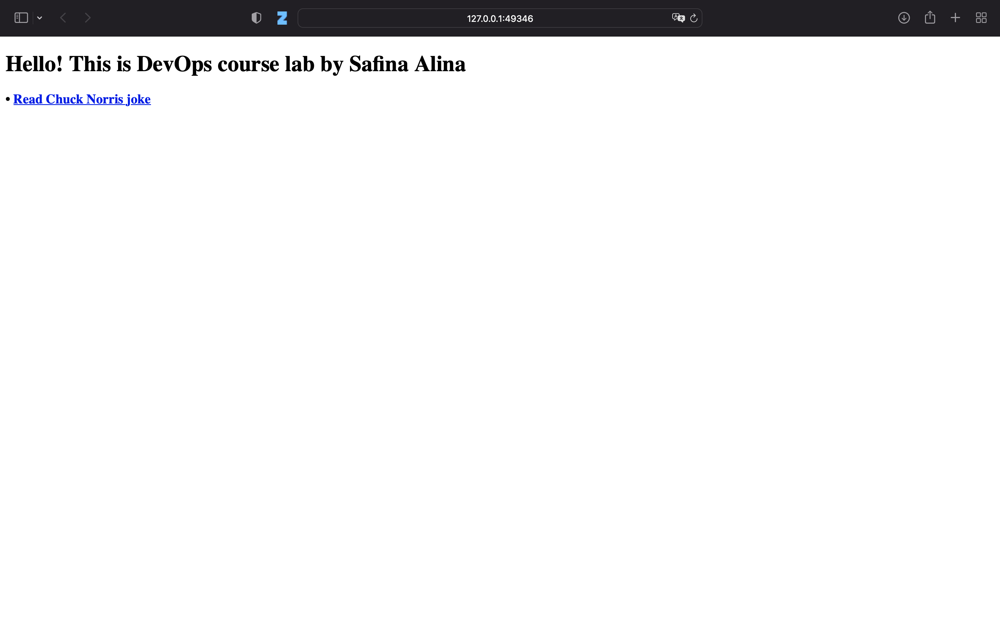

# Lab 9 with bonus 
## Task 1 
### Deploying apps
Python app:
```
kubectl create deployment python-app --image=lnsfna/app_python:latest
```
Output:
```
deployment.apps/python-app created
```
Go app:
```
kubectl create deployment go-app --image=lnsfna/app_go:latest   
```
Output:
```
deployment.apps/go-app created
```
### Checking 
```
kubectl get deployments
```
Output:
```
NAME         READY   UP-TO-DATE   AVAILABLE   AGE
go-app       0/1     1            0           11s
python-app   1/1     1            1           39s
```

### Making apps accessible
Python app:
```
kubectl expose deployment python-app --port 8080
```
Output:
```
service/python-app exposed
```
Go app:
```
kubectl expose deployment go-app --port 8081
```
Output:
```
service/go-app exposed
```

### Checking:
```
kubectl get pods,svc
```
Output:
```
NAME                             READY   STATUS    RESTARTS   AGE
pod/go-app-6b87d4667-jdf84       1/1     Running   0          2m28s
pod/python-app-664d976df-lgfkp   1/1     Running   0          2m56s

NAME                 TYPE        CLUSTER-IP       EXTERNAL-IP   PORT(S)    AGE
service/go-app       ClusterIP   10.105.223.196   <none>        8081/TCP   74s
service/kubernetes   ClusterIP   10.96.0.1        <none>        443/TCP    7m8s
service/python-app   ClusterIP   10.106.127.149   <none>        8080/TCP   105s
```

### Starting services:
```
alinasafina@MacBook-Pro-3 ~ % minikube service --all

|-----------|--------|-------------|--------------|
| NAMESPACE |  NAME  | TARGET PORT |     URL      |
|-----------|--------|-------------|--------------|
| default   | go-app |             | No node port |
|-----------|--------|-------------|--------------|
😿  service default/go-app has no node port
|-----------|------------|-------------|--------------|
| NAMESPACE |    NAME    | TARGET PORT |     URL      |
|-----------|------------|-------------|--------------|
| default   | kubernetes |             | No node port |
|-----------|------------|-------------|--------------|
😿  service default/kubernetes has no node port
|-----------|------------|-------------|--------------|
| NAMESPACE |    NAME    | TARGET PORT |     URL      |
|-----------|------------|-------------|--------------|
| default   | python-app |             | No node port |
|-----------|------------|-------------|--------------|
😿  service default/python-app has no node port
🏃  Starting tunnel for service go-app.
🏃  Starting tunnel for service kubernetes.
🏃  Starting tunnel for service python-app.
|-----------|------------|-------------|------------------------|
| NAMESPACE |    NAME    | TARGET PORT |          URL           |
|-----------|------------|-------------|------------------------|
| default   | go-app     |             | http://127.0.0.1:60638 |
| default   | kubernetes |             | http://127.0.0.1:60644 |
| default   | python-app |             | http://127.0.0.1:60650 |
|-----------|------------|-------------|------------------------|
🎉  Opening service default/go-app in default browser...
🎉  Opening service default/kubernetes in default browser...
🎉  Opening service default/python-app in default browser...
❗  Because you are using a Docker driver on darwin, the terminal needs to be open to run it.
```
### Python app:


### Go app:


### Cleaning up:
Deleting services:
```
kubectl delete svc python-app go-app  
```
Output:
```
service "python-app" deleted
service "go-app" deleted
```
Deleting deployments:
```
kubectl delete deployment --all
```
Output:
```
deployment.apps "go-app" deleted
deployment.apps "python-app" deleted
```

## Task 2
### Applying manifests
#### Deployment
Python:
```
kubectl apply -f python/deployment.yml
```
Output: 
```
deployment.apps/python-app created
```
Go:
``` 
kubectl apply -f go/deployment.yml
```
Output:
```
deployment.apps/go-app created
```
#### Service 

Python:
```
kubectl apply -f python/service.yml 
```
Output: 
```
service/python-service created
```
Go:
``` 
kubectl apply -f go/service.yml
```
Output:
```
service/go-service created
```

### Checking
```
kubectl get pods,svc
```
Output:
```
NAME                              READY   STATUS    RESTARTS   AGE
pod/go-app-784f4d988b-lrkr4       1/1     Running   0          21s
pod/go-app-784f4d988b-r4vqm       1/1     Running   0          21s
pod/go-app-784f4d988b-zgjxv       1/1     Running   0          21s
pod/python-app-6f5945fdfd-6ld9c   1/1     Running   0          27s
pod/python-app-6f5945fdfd-hqtmk   1/1     Running   0          27s
pod/python-app-6f5945fdfd-p4krj   1/1     Running   0          27s

NAME                 TYPE           CLUSTER-IP       EXTERNAL-IP   PORT(S)          AGE
service/go-app       LoadBalancer   10.109.146.115   <pending>     8081:31930/TCP   5s
service/kubernetes   ClusterIP      10.96.0.1        <none>        443/TCP          5h43m
service/python-app   LoadBalancer   10.107.206.68    <pending>     8080:31804/TCP   10s
```
### Starting services:
```
minikube service --all  
```
Output:
```

|-----------|--------|-------------|---------------------------|
| NAMESPACE |  NAME  | TARGET PORT |            URL            |
|-----------|--------|-------------|---------------------------|
| default   | go-app |        8081 | http://192.168.49.2:31930 |
|-----------|--------|-------------|---------------------------|
|-----------|------------|-------------|--------------|
| NAMESPACE |    NAME    | TARGET PORT |     URL      |
|-----------|------------|-------------|--------------|
| default   | kubernetes |             | No node port |
|-----------|------------|-------------|--------------|
😿  service default/kubernetes has no node port
|-----------|------------|-------------|---------------------------|
| NAMESPACE |    NAME    | TARGET PORT |            URL            |
|-----------|------------|-------------|---------------------------|
| default   | python-app |        8080 | http://192.168.49.2:31804 |
|-----------|------------|-------------|---------------------------|
🏃  Starting tunnel for service go-app.
🏃  Starting tunnel for service kubernetes.
🏃  Starting tunnel for service python-app.
|-----------|------------|-------------|------------------------|
| NAMESPACE |    NAME    | TARGET PORT |          URL           |
|-----------|------------|-------------|------------------------|
| default   | go-app     |             | http://127.0.0.1:49346 |
| default   | kubernetes |             | http://127.0.0.1:49352 |
| default   | python-app |             | http://127.0.0.1:49358 |
|-----------|------------|-------------|------------------------|
🎉  Opening service default/go-app in default browser...
🎉  Opening service default/kubernetes in default browser...
🎉  Opening service default/python-app in default browser...
❗  Because you are using a Docker driver on darwin, the terminal needs to be open to run it.
```
### Checking:
Python

Go


As you can see, ports are matching with output 

## Ingress 
### Enable ingress:
```
minikube addons enable ingress
```
Output:
```
 The 'ingress' addon is enabled
```
### Apply ingress
Python
```
kubectl apply -f python/ingress.yml
```
Output:
```
ingress.networking.k8s.io/python-ingress created
```
Go
```
kubectl apply -f go/ingress.yml
```
Output:
```
ingress.networking.k8s.io/go-ingress created
```
### Checking 
```
kubectl get ingress      
```
Output:
```
NAME             CLASS            HOSTS        ADDRESS   PORTS   AGE
go-ingress       go-ingress       go.app                 80      6s
python-ingress   python-ingress   python.app             80      2s
```
### Curl
```
curl python.app --resolve python.app:80:$(minikube ip)
```
Output:
```
HTTP/1.1 200 OK
date: Tue, 31 Oct 2023 09:16:55 GMT
server: uvicorn
content-length: 244
content-type: text/html; charset=utf-8

<!DOCTYPE html>
<html>
    <head>
        <title>DevOps lab</title>
    </head>
    <body>
        <h1>Hello! This is DevOps course lab by Safina Alina</h1>
        <h3>&#x2022; <a href=/time>Current time in Moscow</a> </h3>
    </body>
</html>%                  
```
```
curl go.app --resolve go.app:80:$(minikube ip)
```
Output:
```
HTTP/1.1 200 OK
Date: Mon, 30 Oct 2023 14:31:16 GMT
Content-Length: 245
Content-Type: text/html; charset=utf-8

<!DOCTYPE html>
<html>
    <head>
        <title>DevOps lab</title>
    </head>
    <body>
        <h1>Hello! This is DevOps course lab by Safina Alina</h1>
        <h3>&#x2022; <a href=/joke>Read Chuck Norris joke</a> </h3>
    </body>
</html>
```