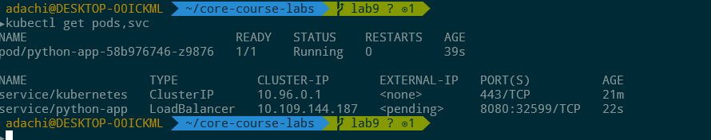
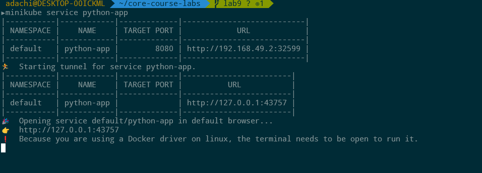
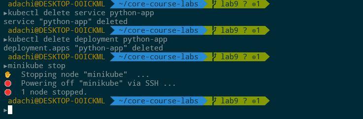
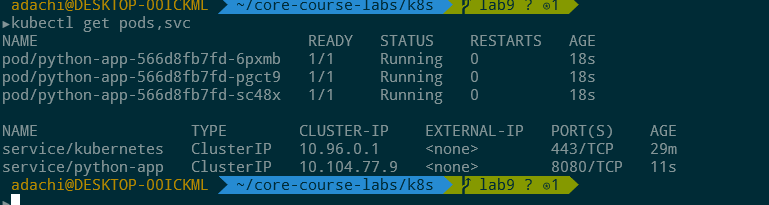
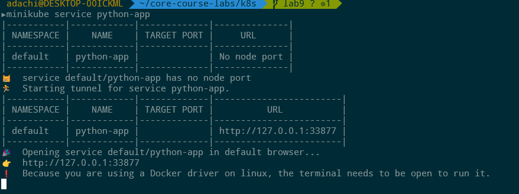
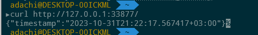

# k8s

## W/out configuration files
### Startup
Start the local cluster
```bash
minikube start
```

Deploy the application
```bash
kubectl create deployment python-app --image=run4w4y/devops-course-python-app:latest
kubectl expose deployment python-app --type=LoadBalancer --port=8080
``` 
### Verify
Run `kubectl get pods,svc` to verify that everything is running


Tunnel to a service


Clean up and stop the cluster


## W/ configuration files
### Startup
Start the local cluster
```bash
minikube start
```

Deploy the application
```bash
kubectl apply -f deployment.yml
kubectl apply -f service.yml
```

### Verify
Run `kubectl get pods,svc` to verify that everything is running


Tunnel to a service


Check the server response


Cleanup is the same as before
