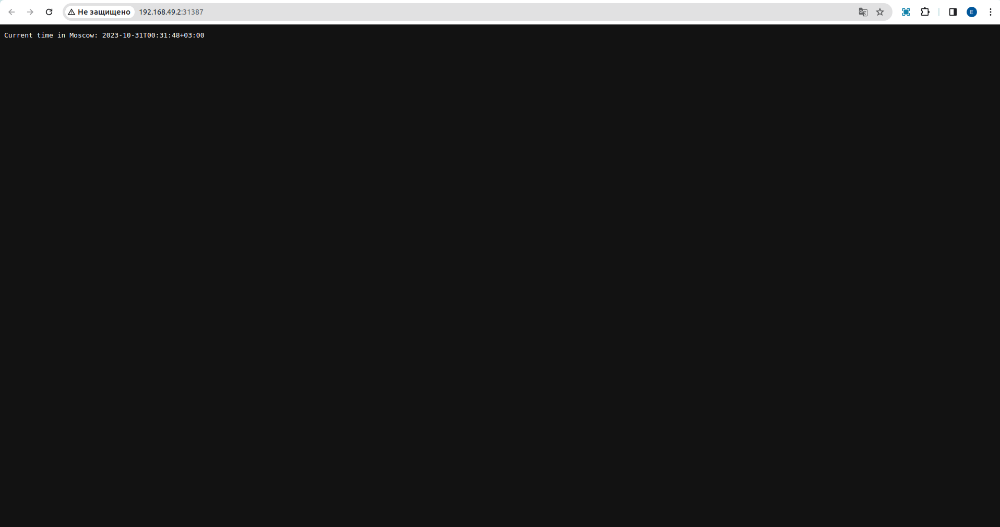
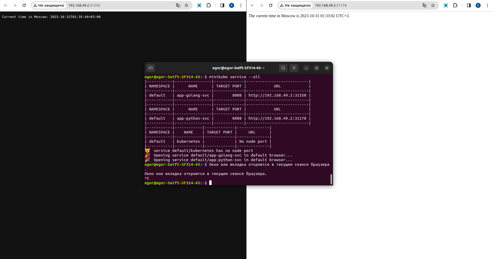

# Kubernetes

## Task 1

### Instalation

```bash 
egor@egor-Swift-SF314-43:~$ minikube config set driver docker

❗  These changes will take effect upon a minikube delete and then a minikube start

egor@egor-Swift-SF314-43:~$ minikube stop
✋  Узел "minikube" останавливается ...
🛑  Выключается "minikube" через SSH ...
🛑  Остановлено узлов: 1.

egor@egor-Swift-SF314-43:~$ minikube addons enable metrics-server
💡  metrics-server is an addon maintained by Kubernetes. For any concerns contact minikube on GitHub.
You can view the list of minikube maintainers at: https://github.com/kubernetes/minikube/blob/master/OWNERS
    ▪ Используется образ registry.k8s.io/metrics-server/metrics-server:v0.6.4
🌟  The 'metrics-server' addon is enabled

egor@egor-Swift-SF314-43:~$ minikube start
😄  minikube v1.31.2 на Ubuntu 22.04
✨  Используется драйвер docker на основе существующего профиля
👍  Запускается control plane узел minikube в кластере minikube
🚜  Скачивается базовый образ ...
🏃  Обновляется работающий docker "minikube" container ...
🐳  Подготавливается Kubernetes v1.27.4 на Docker 24.0.4 ...
🔎  Компоненты Kubernetes проверяются ...
    ▪ Используется образ gcr.io/k8s-minikube/storage-provisioner:v5
    ▪ Используется образ registry.k8s.io/metrics-server/metrics-server:v0.6.4
    ▪ Используется образ docker.io/kubernetesui/dashboard:v2.7.0
    ▪ Используется образ docker.io/kubernetesui/metrics-scraper:v1.0.8
💡  Some dashboard features require the metrics-server addon. To enable all features please run:

	minikube addons enable metrics-server	


🌟  Включенные дополнения: storage-provisioner, default-storageclass, metrics-server, dashboard
🏄  Готово! kubectl настроен для использования кластера "minikube" и "default" пространства имён по умолчанию

```

Clusters are alive:

```bash 
egor@egor-Swift-SF314-43:~$ minikube kubectl -- get po -A
    > kubectl.sha256:  64 B / 64 B [-------------------------] 100.00% ? p/s 0s
    > kubectl:  46.98 MiB / 46.98 MiB [-------------] 100.00% 9.80 MiB p/s 5.0s
NAMESPACE     NAME                               READY   STATUS    RESTARTS      AGE
kube-system   coredns-5d78c9869d-r7blj           1/1     Running   0             91s
kube-system   etcd-minikube                      1/1     Running   0             104s
kube-system   kube-apiserver-minikube            1/1     Running   0             107s
kube-system   kube-controller-manager-minikube   1/1     Running   0             107s
kube-system   kube-proxy-82mq5                   1/1     Running   0             91s
kube-system   kube-scheduler-minikube            1/1     Running   0             104s
kube-system   storage-provisioner                1/1     Running   1 (60s ago)   103s

```


### Deployments creation


```bash 
egor@egor-Swift-SF314-43:~$ minikube kubectl -- create deployment app-python --image=wildqueue/devops-hw:tagname 
deployment.apps/app-python created

egor@egor-Swift-SF314-43:~$ minikube kubectl -- create deployment app-golang --image=wildqueue/devops-hw-golang:tagname
deployment.apps/app-golang created

```


### Services creation

```bash
egor@egor-Swift-SF314-43:~$ minikube kubectl -- expose deployment app-python --type=LoadBalancer --port=8008
service/app-python exposed
```

```bash

egor@egor-Swift-SF314-43:~$ minikube kubectl -- expose deployment app-golang --type=LoadBalancer --port=8008
service/app-golang exposed

```

Clusters are alive:

```bash 
egor@egor-Swift-SF314-43:~$ minikube kubectl -- get svc -A
NAMESPACE              NAME                        TYPE           CLUSTER-IP     EXTERNAL-IP   PORT(S)                  AGE
default                app-golang                  LoadBalancer   10.99.1.190    <pending>     8080:30141/TCP           27s
default                app-python                  LoadBalancer   10.111.46.96   <pending>     8080:32023/TCP           56s
default                kubernetes                  ClusterIP      10.96.0.1      <none>        443/TCP                  64m
kube-system            kube-dns                    ClusterIP      10.96.0.10     <none>        53/UDP,53/TCP,9153/TCP   63m
kube-system            metrics-server              ClusterIP      10.99.84.223   <none>        443/TCP                  48m
kubernetes-dashboard   dashboard-metrics-scraper   ClusterIP      10.106.54.33   <none>        8000/TCP                 59m
kubernetes-dashboard   kubernetes-dashboard        ClusterIP      10.96.83.44    <none>        80/TCP                   59m

```

### Services:

```bash 
egor@egor-Swift-SF314-43:~$ minikube service --all
|-----------|------------|-------------|---------------------------|
| NAMESPACE |    NAME    | TARGET PORT |            URL            |
|-----------|------------|-------------|---------------------------|
| default   | app-golang |        8008 | http://192.168.49.2:31387 |
|-----------|------------|-------------|---------------------------|
|-----------|------------|-------------|---------------------------|
| NAMESPACE |    NAME    | TARGET PORT |            URL            |
|-----------|------------|-------------|---------------------------|
| default   | app-python |        8008 | http://192.168.49.2:30853 |
|-----------|------------|-------------|---------------------------|
|-----------|------------|-------------|--------------|
| NAMESPACE |    NAME    | TARGET PORT |     URL      |
|-----------|------------|-------------|--------------|
| default   | kubernetes |             | No node port |
|-----------|------------|-------------|--------------|
😿  service default/kubernetes has no node port
🎉  Opening service default/app-golang in default browser...
🎉  Opening service default/app-python in default browser...
egor@egor-Swift-SF314-43:~$ Окно или вкладка откроются в текущем сеансе браузера.
Окно или вкладка откроются в текущем сеансе браузера.
^C

```





### Pods and services

```bash
egor@egor-Swift-SF314-43:~$ minikube kubectl -- get pods,svc -A
NAMESPACE              NAME                                             READY   STATUS    RESTARTS       AGE
default                pod/app-golang-d764c776-gbg27                    1/1     Running   0              32m
default                pod/app-python-774987b5cd-525vt                  1/1     Running   0              33m
kube-system            pod/coredns-5d78c9869d-r7blj                     1/1     Running   8 (40m ago)    84m
kube-system            pod/etcd-minikube                                1/1     Running   8 (40m ago)    84m
kube-system            pod/kube-apiserver-minikube                      1/1     Running   8 (40m ago)    84m
kube-system            pod/kube-controller-manager-minikube             1/1     Running   8 (40m ago)    84m
kube-system            pod/kube-proxy-82mq5                             1/1     Running   8 (40m ago)    84m
kube-system            pod/kube-scheduler-minikube                      1/1     Running   8 (40m ago)    84m
kube-system            pod/metrics-server-7746886d4f-hf6tq              1/1     Running   11 (40m ago)   68m
kube-system            pod/storage-provisioner                          1/1     Running   13 (40m ago)   84m
kubernetes-dashboard   pod/dashboard-metrics-scraper-5dd9cbfd69-2slwg   1/1     Running   8 (40m ago)    80m
kubernetes-dashboard   pod/kubernetes-dashboard-5c5cfc8747-6zsdd        1/1     Running   11 (40m ago)   80m

NAMESPACE              NAME                                TYPE           CLUSTER-IP      EXTERNAL-IP   PORT(S)                  AGE
default                service/app-golang                  LoadBalancer   10.111.21.117   <pending>     8008:31387/TCP           9m19s
default                service/app-python                  LoadBalancer   10.102.73.89    <pending>     8008:30853/TCP           9m33s
default                service/kubernetes                  ClusterIP      10.96.0.1       <none>        443/TCP                  84m
kube-system            service/kube-dns                    ClusterIP      10.96.0.10      <none>        53/UDP,53/TCP,9153/TCP   84m
kube-system            service/metrics-server              ClusterIP      10.99.84.223    <none>        443/TCP                  68m
kubernetes-dashboard   service/dashboard-metrics-scraper   ClusterIP      10.106.54.33    <none>        8000/TCP                 80m
kubernetes-dashboard   service/kubernetes-dashboard        ClusterIP      10.96.83.44     <none>        80/TCP                   80m
```

### Deletion 

```bash 
egor@egor-Swift-SF314-43:~$ minikube kubectl -- delete service app-golang
service "app-golang" deleted
egor@egor-Swift-SF314-43:~$ minikube kubectl -- delete service app-python
service "app-python" deleted
egor@egor-Swift-SF314-43:~$ minikube kubectl -- delete deployment app-python
deployment.apps "app-python" deleted
egor@egor-Swift-SF314-43:~$ minikube kubectl -- delete deployment app-golang
deployment.apps "app-golang" deleted
```

## Task 2

### Manifest apply

```bash
egor@egor-Swift-SF314-43:~/InnoSubjects/F23/DevOps/devops-core-course-labs/k8s/app-python$ minikube kubectl -- apply -f deployment.yaml
deployment.apps/app-python created
egor@egor-Swift-SF314-43:~/InnoSubjects/F23/DevOps/devops-core-course-labs/k8s/app-python$ minikube kubectl -- apply -f service.yaml
service/app-python-svc created
egor@egor-Swift-SF314-43:~/InnoSubjects/F23/DevOps/devops-core-course-labs/k8s/app-python$ cd ../app-golang/
egor@egor-Swift-SF314-43:~/InnoSubjects/F23/DevOps/devops-core-course-labs/k8s/app-golang$ minikube kubectl -- apply -f deployment.yaml
deployment.apps/app-golang created
egor@egor-Swift-SF314-43:~/InnoSubjects/F23/DevOps/devops-core-course-labs/k8s/app-golang$ minikube kubectl -- apply -f service.yaml
service/app-golang-svc created
```


### Pods and Services

```bash
egor@egor-Swift-SF314-43:~$ minikube kubectl -- get pods,svc -A
NAMESPACE              NAME                                             READY   STATUS    RESTARTS         AGE
default                pod/app-golang-56bd94f79-52t5g                   1/1     Running   0                11s
default                pod/app-golang-56bd94f79-f6t9j                   1/1     Running   0                11s
default                pod/app-golang-56bd94f79-pw2zr                   1/1     Running   0                11s
default                pod/app-python-bb58fff8b-mc8jq                   1/1     Running   0                21s
default                pod/app-python-bb58fff8b-rxm5q                   1/1     Running   0                21s
default                pod/app-python-bb58fff8b-z8ftk                   1/1     Running   0                21s
kube-system            pod/coredns-5d78c9869d-r7blj                     1/1     Running   10 (9m5s ago)    139m
kube-system            pod/etcd-minikube                                1/1     Running   10 (9m10s ago)   139m
kube-system            pod/kube-apiserver-minikube                      1/1     Running   10 (9m9s ago)    139m
kube-system            pod/kube-controller-manager-minikube             1/1     Running   10 (9m9s ago)    139m
kube-system            pod/kube-proxy-82mq5                             1/1     Running   10 (9m10s ago)   139m
kube-system            pod/kube-scheduler-minikube                      1/1     Running   10 (9m10s ago)   139m
kube-system            pod/metrics-server-7746886d4f-hf6tq              1/1     Running   14 (9m9s ago)    123m
kube-system            pod/storage-provisioner                          1/1     Running   17 (7m57s ago)   139m
kubernetes-dashboard   pod/dashboard-metrics-scraper-5dd9cbfd69-2slwg   1/1     Running   10 (9m10s ago)   135m
kubernetes-dashboard   pod/kubernetes-dashboard-5c5cfc8747-6zsdd        1/1     Running   15 (7m57s ago)   135m

NAMESPACE              NAME                                TYPE           CLUSTER-IP       EXTERNAL-IP   PORT(S)                  AGE
default                service/app-golang-svc              LoadBalancer   10.100.218.64    <pending>     8008:31550/TCP           9s
default                service/app-python-svc              LoadBalancer   10.105.255.196   <pending>     8008:31178/TCP           18s
default                service/kubernetes                  ClusterIP      10.96.0.1        <none>        443/TCP                  139m
kube-system            service/kube-dns                    ClusterIP      10.96.0.10       <none>        53/UDP,53/TCP,9153/TCP   139m
kube-system            service/metrics-server              ClusterIP      10.99.84.223     <none>        443/TCP                  123m
kubernetes-dashboard   service/dashboard-metrics-scraper   ClusterIP      10.106.54.33     <none>        8000/TCP                 135m
kubernetes-dashboard   service/kubernetes-dashboard        ClusterIP      10.96.83.44      <none>        80/TCP                   135m
```


### Services

```bash
egor@egor-Swift-SF314-43:~$ minikube service --all
|-----------|----------------|-------------|---------------------------|
| NAMESPACE |      NAME      | TARGET PORT |            URL            |
|-----------|----------------|-------------|---------------------------|
| default   | app-golang-svc |        8008 | http://192.168.49.2:31550 |
|-----------|----------------|-------------|---------------------------|
|-----------|----------------|-------------|---------------------------|
| NAMESPACE |      NAME      | TARGET PORT |            URL            |
|-----------|----------------|-------------|---------------------------|
| default   | app-python-svc |        8008 | http://192.168.49.2:31178 |
|-----------|----------------|-------------|---------------------------|
|-----------|------------|-------------|--------------|
| NAMESPACE |    NAME    | TARGET PORT |     URL      |
|-----------|------------|-------------|--------------|
| default   | kubernetes |             | No node port |
|-----------|------------|-------------|--------------|
😿  service default/kubernetes has no node port
🎉  Opening service default/app-golang-svc in default browser...
🎉  Opening service default/app-python-svc in default browser...
egor@egor-Swift-SF314-43:~$ Окно или вкладка откроются в текущем сеансе браузера.
Окно или вкладка откроются в текущем сеансе браузера.
^C
```




## Bonus

### Addons

```bash
egor@egor-Swift-SF314-43:~$ minikube addons enable ingress
💡  ingress is an addon maintained by Kubernetes. For any concerns contact minikube on GitHub.
You can view the list of minikube maintainers at: https://github.com/kubernetes/minikube/blob/master/OWNERS
    ▪ Используется образ registry.k8s.io/ingress-nginx/controller:v1.8.1
    ▪ Используется образ registry.k8s.io/ingress-nginx/kube-webhook-certgen:v20230407
    ▪ Используется образ registry.k8s.io/ingress-nginx/kube-webhook-certgen:v20230407
🔎  Verifying ingress addon...
🌟  The 'ingress' addon is enabled
```

### Ingress apply

```bash 
egor@egor-Swift-SF314-43:~/InnoSubjects/F23/DevOps/devops-core-course-labs/k8s/app-golang$ minikube kubectl -- apply -f ingress.yaml
ingress.networking.k8s.io/python-ingress created
egor@egor-Swift-SF314-43:~/InnoSubjects/F23/DevOps/devops-core-course-labs/k8s/app-golang$ cd ../app-golang/
egor@egor-Swift-SF314-43:~/InnoSubjects/F23/DevOps/devops-core-course-labs/k8s/app-golang$ minikube kubectl -- apply -f ingress.yaml
ingress.networking.k8s.io/python-ingress unchanged
egor@egor-Swift-SF314-43:~/InnoSubjects/F23/DevOps/devops-core-course-labs/k8s/app-golang$ cd ../app-python/
egor@egor-Swift-SF314-43:~/InnoSubjects/F23/DevOps/devops-core-course-labs/k8s/app-python$ minikube kubectl -- apply -f ingress.yaml
ingress.networking.k8s.io/golang-ingress created
```

```bash 
egor@egor-Swift-SF314-43:~/InnoSubjects/F23/DevOps/devops-core-course-labs/k8s/app-python$ minikube kubectl -- get ingress -A
NAMESPACE   NAME             CLASS   HOSTS       ADDRESS        PORTS   AGE
default     golang-ingress   nginx   golang.wq   192.168.49.2   80      67s
default     python-ingress   nginx   python.wq   192.168.49.2   80      86s
```

### Verification 

```bash
egor@egor-Swift-SF314-43:~/InnoSubjects/F23/DevOps/devops-core-course-labs/k8s/app-python$ curl -H "Host: golang.wq" http://192.168.49.2:80
Current time in Moscow: 2023-10-31T02:00:09+03:00

egor@egor-Swift-SF314-43:~/InnoSubjects/F23/DevOps/devops-core-course-labs/k8s/app-python$ curl -H "Host: python.wq" http://192.168.49.2:80
The current time in Moscow is 2023-10-31 02:00:53 UTC+3.
```

