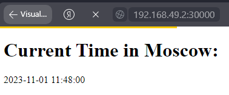

# Kubernetes

Command:
```sh
kubectl get deployments
```

Output:
```sh
NAME         READY   UP-TO-DATE   AVAILABLE   AGE
app-python   0/4     4            0           4s
```


Command:
```sh
kubectl get pods,svc
```

Output:
```sh
NAME                             READY   STATUS    RESTARTS   AGE
pod/app-python-6b4f88f4b-2pl4z   1/1     Running   0          2m4s
pod/app-python-6b4f88f4b-f8rnd   1/1     Running   0          2m4s
pod/app-python-6b4f88f4b-mr25p   1/1     Running   0          2m4s
pod/app-python-6b4f88f4b-vc6v5   1/1     Running   0          2m4s

NAME                         TYPE        CLUSTER-IP       EXTERNAL-IP   PORT(S)          AGE
service/app-python-service   NodePort    10.103.209.201   <none>        8080:30000/TCP   2m4s
service/kubernetes           ClusterIP   10.96.0.1        <none>        443/TCP          3m45s
```

Command
```sh
minikube service --all
```

Output:
```sh
|-----------|--------------------|-------------|---------------------------|
| NAMESPACE |        NAME        | TARGET PORT |            URL            |
|-----------|--------------------|-------------|---------------------------|
| default   | app-python-service |        8080 | http://192.168.49.2:30000 |
|-----------|--------------------|-------------|---------------------------|
|-----------|------------|-------------|--------------|
| NAMESPACE |    NAME    | TARGET PORT |     URL      |
|-----------|------------|-------------|--------------|
| default   | kubernetes |             | No node port |
|-----------|------------|-------------|--------------|
* service default/kubernetes has no node port
* Opening service default/app-python-service in default browser...
  http://192.168.49.2:30000
```

## Browser

### Python app
