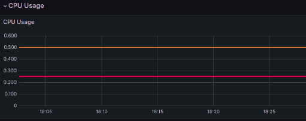

# Kubernetes

## Task 1
``````
kubectl create deployment app-python --image=rinnatova/docker_lab:latest
kubectl expose deployment app-python --type=NodePort --port=8080
``````
Kubectl get pods,svc command

``````NAME                                   READY   STATUS    RESTARTS   AGE
pod/coredns-5d78c9869d-274gs           1/1     Running   0          23m
pod/etcd-minikube                      1/1     Running   0          23m
pod/kube-apiserver-minikube            1/1     Running   0          23m
pod/kube-controller-manager-minikube   1/1     Running   0          23m
pod/kube-proxy-m2cm2                   1/1     Running   0          23m
pod/kube-scheduler-minikube            1/1     Running   0          23m
pod/storage-provisioner                1/1     Running   0          23m

NAME               TYPE        CLUSTER-IP   EXTERNAL-IP   PORT(S)                  AGE
service/kube-dns   ClusterIP   10.96.0.10   <none>        53/UDP,53/TCP,9153/TCP   23m
``````

Clenup
``````
kubectl delete svc app-python
service "app-python" deleted

kubectl delete deployment --all
deployment.apps "app-python" deleted 
``````

## Task 2
minikube service --all
``````
|-----------|--------------------|------------------|---------------------------|
| NAMESPACE |        NAME        |   TARGET PORT    |            URL            |
|-----------|--------------------|------------------|---------------------------|
| default   | app-python-service | http/80          | http://192.168.49.2:30155 |
|           |                    | https/443        | http://192.168.49.2:32041 |
|           |                    | custom-port/8080 | http://192.168.49.2:30427 |
|-----------|--------------------|------------------|---------------------------|
|-----------|------------|-------------|--------------|
| NAMESPACE |    NAME    | TARGET PORT |     URL      |
|-----------|------------|-------------|--------------|
| default   | kubernetes |             | No node port |
|-----------|------------|-------------|--------------|
* service default/kubernetes has no node port
* Starting tunnel for service app-python-service.
docker@127.0.0.1's password: * Starting tunnel for service kubernetes.
docker@127.0.0.1's password: |-----------|--------------------|-------------|------------------------|
| NAMESPACE |        NAME        | TARGET PORT |          URL           |
|-----------|--------------------|-------------|------------------------|
| default   | app-python-service |             | http://127.0.0.1:52050 |
|           |                    |             | http://127.0.0.1:52051 |
|           |                    |             | http://127.0.0.1:52052 |
| default   | kubernetes         |             | http://127.0.0.1:52054 |
|-----------|--------------------|-------------|------------------------|
``````

# Running 

