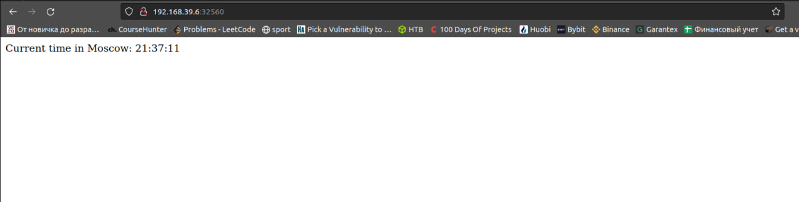

# k8s

## Deploy

### I deployed application with the kubectl create commands

``` bash
kubectl create deployment khays-app-deployment --image=khays/khays-python-app
kubectl expose deployment khays-app-deployment --type=LoadBalancer --port=5000
minikube service khays-app-deployment
```

### Result

``` bash
minikube service khays-app-deployment
|-----------|----------------------|-------------|---------------------------|
| NAMESPACE |         NAME         | TARGET PORT |            URL            |
|-----------|----------------------|-------------|---------------------------|
| default   | khays-app-deployment |        5000 | http://192.168.39.6:30471 |
|-----------|----------------------|-------------|---------------------------|
🎉  Opening service default/khays-app-deployment in default browser...
```

---

## Output of kubectl get pods, services

```bash
kubectl get pods
kubectl get services
NAME                                    READY   STATUS    RESTARTS   AGE
khays-app-deployment-5f644d9c78-g4std   1/1     Running   0          3m43s
NAME                   TYPE           CLUSTER-IP      EXTERNAL-IP   PORT(S)          AGE
khays-app-deployment   LoadBalancer   10.108.222.93   <pending>     5000:30471/TCP   2m38s
kubernetes             ClusterIP      10.96.0.1       <none>        443/TCP          2d1h
```

---

## Deploy 2.0

### Then I declared Kubernetes Manifests `deployment.yml` and `service.yml` files specifying 3 replicas and run them with commands

``` bash
kubectl apply -f deployment.yml
kubectl apply -f service.yml
minikube ip
```

## Output of kubectl get pods, services 2.0

``` bash
kubectl get pods
kubectl get services
NAME                                READY   STATUS              RESTARTS   AGE
khays-deployment-5fc7b64d59-2lx8q   0/1     ContainerCreating   0          25s
khays-deployment-5fc7b64d59-94frp   0/1     ContainerCreating   0          25s
khays-deployment-5fc7b64d59-rwkrf   0/1     ErrImagePull        0          25s
NAME                TYPE           CLUSTER-IP     EXTERNAL-IP   PORT(S)          AGE
khays-app-service   LoadBalancer   10.99.165.47   <pending>     5000:32560/TCP   5s
kubernetes          ClusterIP      10.96.0.1      <none>        443/TCP          2d1h
```

## Output of minikube service --all

``` bash
minikube service --all
|-----------|-------------------|-------------|---------------------------|
| NAMESPACE |       NAME        | TARGET PORT |            URL            |
|-----------|-------------------|-------------|---------------------------|
| default   | khays-app-service |        5000 | http://192.168.39.6:30780 |
|-----------|-------------------|-------------|---------------------------|
|-----------|------------|-------------|--------------|
| NAMESPACE |    NAME    | TARGET PORT |     URL      |
|-----------|------------|-------------|--------------|
| default   | kubernetes |             | No node port |
|-----------|------------|-------------|--------------|
😿  service default/kubernetes has no node port
🎉  Opening service default/khays-app-service in default browser...
```

## Screenshot from browser


