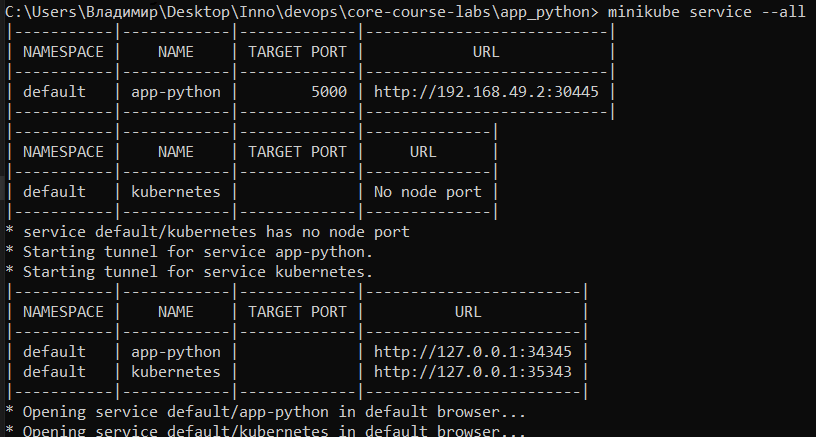

# Kubernetes

Kubernetes is open source software that automates the deployment, 
scaling, and coordination of containerized applications in a cluster. 
Supports key containerization technologies such as Docker, rkt, and hardware virtualization technologies.

## Get

### Task1

`$ kubectl get pods,svc`

```
NAME                             READY   STATUS    RESTARTS   AGE
pod/app-python-77bb7859c-xwvt4   1/1     Running   0          49s

NAME                 TYPE           CLUSTER-IP    EXTERNAL-IP   PORT(S)          AGE
service/app-python   LoadBalancer   10.97.20.163  <pending>     5000:30147/TCP   15m
service/kubernetes   ClusterIP      10.96.0.1     <none>        443/TCP          15m
```
### Task2

`$ kubectl get pods,svc`

```
NAME                              READY   STATUS    RESTARTS   AGE
pod/app-python-86b44b58ff-8pbhr   1/1     Running   0          39s
pod/app-python-86b44b58ff-b4pqj   1/1     Running   0          39s
pod/app-python-86b44b58ff-rr55s   1/1     Running   0          39s

NAME                         TYPE           CLUSTER-IP       EXTERNAL-IP   PORT(S)          AGE
service/app-python-service   LoadBalancer   10.107.68.97     <pending>     5000:30363/TCP   15m
service/kubernetes           ClusterIP      10.96.0.1        <none>        443/TCP          6m27s
```

## Minikube

`$ minikube service --all`




## Ingress

`$ kubectl get ingress`

```
NAME      CLASS    HOSTS        ADDRESS        PORTS   AGE
ingress   nginx    *            192.168.49.2   80      4m7s
```