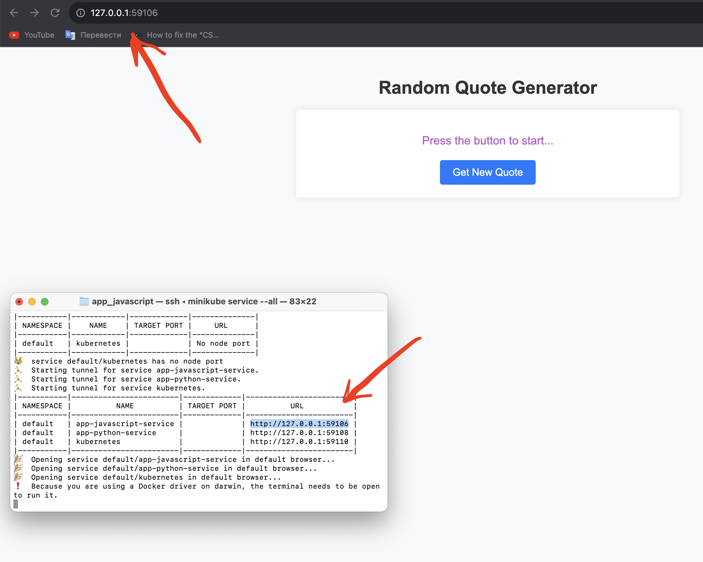

# Introduction to Kubernetes

## Installation kubectl and minikube

To install kubectl I use this command:
```
brew install kubectl
```
After installing:
```
kubectl version --short
```
Output:
```
Client Version: v1.27.2
Kustomize Version: v5.0.1
The connection to the server localhost:8080 was refused - did you specify the right host or port?
```
To install minicube:
```
brew install minikube
```
After installing:
```
minikube version
```
Output:
```
minikube version: v1.31.2
commit: fd7ecd9c4599bef9f04c0986c4a0187f98a4396e
```
After:
```
minikube start --vm-driver=docker
```
Output:
```
😄  minikube v1.31.2 на Darwin 13.5.2 (arm64)
✨  Используется драйвер docker на основе конфига пользователя
📌  Using Docker Desktop driver with root privileges
👍  Запускается control plane узел minikube в кластере minikube
🚜  Скачивается базовый образ ...
💾  Скачивается Kubernetes v1.27.4 ...
    > preloaded-images-k8s-v18-v1...:  327.74 MiB / 327.74 MiB  100.00% 12.22 M
    > gcr.io/k8s-minikube/kicbase...:  404.50 MiB / 404.50 MiB  100.00% 10.23 M
🔥  Creating docker container (CPUs=2, Memory=7802MB) ...
❗  This container is having trouble accessing https://registry.k8s.io
💡  To pull new external images, you may need to configure a proxy: https://minikube.sigs.k8s.io/docs/reference/networking/proxy/
🐳  Подготавливается Kubernetes v1.27.4 на Docker 24.0.4 ...
    ▪ Generating certificates and keys ...
    ▪ Booting up control plane ...
    ▪ Configuring RBAC rules ...
🔗  Configuring bridge CNI (Container Networking Interface) ...
🔎  Компоненты Kubernetes проверяются ...
    ▪ Используется образ gcr.io/k8s-minikube/storage-provisioner:v5
🌟  Включенные дополнения: default-storageclass, storage-provisioner
🏄  Готово! kubectl настроен для использования кластера "minikube" и "default" пространства имён по умолчанию
```
After:
```
minikube status
```
Output:
```
minikube
type: Control Plane
host: Running
kubelet: Running
apiserver: Running
kubeconfig: Configured
```
To stop:
```
minikube stop
```

## Deploy your application

To deploy use this command:
```
minikube start
kubectl create deployment app-python --image=arseniy5443/moscowtime:latest
kubectl create deployment app-javascript --image=arseniy5443/randomquote:latest
```
To see:
```
kubectl get deployments
```
Output:
```
NAME             READY   UP-TO-DATE   AVAILABLE   AGE
app-javascript   1/1     1            1           4m45s
app-python       1/1     1            1           5m4s
```
To see the pods:
```
kubectl get pods
```
Output:
```
NAME                          READY   STATUS    RESTARTS   AGE
app-javascript-b49d4c-t5bw6   1/1     Running   0          8m29s
app-python-76656f9f6b-r8sc6   1/1     Running   0          8m48s
```

## Create service

To create service:
```
kubectl expose deployment app-python --type=LoadBalancer --port=5000
kubectl expose deployment app-javascript --type=LoadBalancer --port=3000
```
To see services:
```
kubectl get services
```
Output:
```
NAME             TYPE           CLUSTER-IP      EXTERNAL-IP   PORT(S)          AGE
app-javascript   LoadBalancer   10.98.201.132   <pending>     3000:32148/TCP   5s
app-python       LoadBalancer   10.109.129.33   <pending>     5000:30527/TCP   22s
kubernetes       ClusterIP      10.96.0.1       <none>        443/TCP          88m
```
To open service in browser:
```
minikube service app-python
```
Output:
```
|-----------|------------|-------------|---------------------------|
| NAMESPACE |    NAME    | TARGET PORT |            URL            |
|-----------|------------|-------------|---------------------------|
| default   | app-python |        5000 | http://192.168.49.2:30527 |
|-----------|------------|-------------|---------------------------|
🏃  Starting tunnel for service app-python.
|-----------|------------|-------------|------------------------|
| NAMESPACE |    NAME    | TARGET PORT |          URL           |
|-----------|------------|-------------|------------------------|
| default   | app-python |             | http://127.0.0.1:58872 |
|-----------|------------|-------------|------------------------|
🎉  Opening service default/app-python in default browser...
❗  Because you are using a Docker driver on darwin, the terminal needs to be open to run it.
```
Other service:
```
minikube service app-javascript
```
Output:
```
|-----------|----------------|-------------|---------------------------|
| NAMESPACE |      NAME      | TARGET PORT |            URL            |
|-----------|----------------|-------------|---------------------------|
| default   | app-javascript |        3000 | http://192.168.49.2:32148 |
|-----------|----------------|-------------|---------------------------|
🏃  Starting tunnel for service app-javascript.
|-----------|----------------|-------------|------------------------|
| NAMESPACE |      NAME      | TARGET PORT |          URL           |
|-----------|----------------|-------------|------------------------|
| default   | app-javascript |             | http://127.0.0.1:58887 |
|-----------|----------------|-------------|------------------------|
🎉  Opening service default/app-javascript in default browser...
❗  Because you are using a Docker driver on darwin, the terminal needs to be open to run it.
```
## kubectl get pods,svc command
Run command:
```
kubectl get pods,svc
```
Output:
```
NAME                              READY   STATUS    RESTARTS   AGE
pod/app-javascript-b49d4c-t5bw6   1/1     Running   0          79m
pod/app-python-76656f9f6b-r8sc6   1/1     Running   0          79m

NAME                     TYPE           CLUSTER-IP      EXTERNAL-IP   PORT(S)          AGE
service/app-javascript   LoadBalancer   10.98.201.132   <pending>     3000:32148/TCP   16m
service/app-python       LoadBalancer   10.109.129.33   <pending>     5000:30527/TCP   16m
service/kubernetes       ClusterIP      10.96.0.1       <none>        443/TCP          104m
```

## Clean up
To delete service:
```
kubectl delete service app-python
kubectl delete service app-javascript
```
To delete deployment:
```
kubectl delete deployment app-python
kubectl delete deployment app-javascript
```


## Create deployment.yml and service.yml
After creating we need to apply them:
```
kubectl apply -f deployment.yml
kubectl apply -f service.yml
```
Executing command kubectl get pods,svc:
```
kubectl get pods,svc
```
Output:
```
NAME                                             READY   STATUS    RESTARTS   AGE
pod/app-javascript-deployment-554d7dcf69-gjkhs   1/1     Running   0          117s
pod/app-javascript-deployment-554d7dcf69-m7psg   1/1     Running   0          117s
pod/app-javascript-deployment-554d7dcf69-qbnhl   1/1     Running   0          117s
pod/app-python-deployment-75b6b5df7c-7pg9k       1/1     Running   0          2m32s
pod/app-python-deployment-75b6b5df7c-gl2w2       1/1     Running   0          2m32s
pod/app-python-deployment-75b6b5df7c-phgd6       1/1     Running   0          2m32s

NAME                             TYPE           CLUSTER-IP       EXTERNAL-IP   PORT(S)        AGE
service/app-javascript-service   LoadBalancer   10.100.225.246   <pending>     80:32394/TCP   114s
service/app-python-service       LoadBalancer   10.97.235.26     <pending>     80:31153/TCP   2m14s
service/kubernetes               ClusterIP      10.96.0.1        <none>        443/TCP        141m
```
Executing command minikube service --all:
```
minikube service --all
```
Output:
```
arseniyrubtsov@MacBook-Pro-Arseniy app_javascript % minikube service --all
|-----------|------------------------|-------------|---------------------------|
| NAMESPACE |          NAME          | TARGET PORT |            URL            |
|-----------|------------------------|-------------|---------------------------|
| default   | app-javascript-service |          80 | http://192.168.49.2:32394 |
|-----------|------------------------|-------------|---------------------------|
|-----------|--------------------|-------------|---------------------------|
| NAMESPACE |        NAME        | TARGET PORT |            URL            |
|-----------|--------------------|-------------|---------------------------|
| default   | app-python-service |          80 | http://192.168.49.2:31153 |
|-----------|--------------------|-------------|---------------------------|
|-----------|------------|-------------|--------------|
| NAMESPACE |    NAME    | TARGET PORT |     URL      |
|-----------|------------|-------------|--------------|
| default   | kubernetes |             | No node port |
|-----------|------------|-------------|--------------|
😿  service default/kubernetes has no node port
🏃  Starting tunnel for service app-javascript-service.
🏃  Starting tunnel for service app-python-service.
🏃  Starting tunnel for service kubernetes.
|-----------|------------------------|-------------|------------------------|
| NAMESPACE |          NAME          | TARGET PORT |          URL           |
|-----------|------------------------|-------------|------------------------|
| default   | app-javascript-service |             | http://127.0.0.1:59106 |
| default   | app-python-service     |             | http://127.0.0.1:59108 |
| default   | kubernetes             |             | http://127.0.0.1:59110 |
|-----------|------------------------|-------------|------------------------|
🎉  Opening service default/app-javascript-service in default browser...
🎉  Opening service default/app-python-service in default browser...
🎉  Opening service default/kubernetes in default browser...
❗  Because you are using a Docker driver on darwin, the terminal needs to be open to run it.
```




# Bonus

## Created deployment.yml and service.yml for another app.

## Enabled addons
```
minikube addons enable ingress
```
Also in my system I need to open tunnel for ingress to work:
```
minikube tunnel
```

## Created ingress.yml

To apply in use the command for each app:
```
kubectl apply -f ingress.yml
```

To see the ingress use command:
```
kubectl get ingress
```
Output:
```
NAME                     CLASS   HOSTS            ADDRESS        PORTS   AGE
app-javascript-ingress   nginx   app.javascript   192.168.49.2   80      5m24s
app-python-ingress       nginx   app.python       192.168.49.2   80      13h
```

In my case because of the tunnel the ip address of the app will be different to call curl I need to specify localhost and set header:
```
curl -H "Host: app.python" http://127.0.0.1 
```
Output:
```
<!DOCTYPE html>
<html>
<head>
    <title>Moscow Time</title>
    <link rel="stylesheet" type="text/css" href="/static/style.css">
</head>
<body>
    <h1>Current Time in Moscow:</h1>
    <p>2023-10-31 16:23:46</p>
</body>
</html>
```
For other app:
```
curl -H "Host: app.javascript" http://127.0.0.1
```
Output:
```
<!DOCTYPE html>
<html lang="en">
<head>
    <meta charset="UTF-8">
    <meta name="viewport" content="width=device-width, initial-scale=1.0">
    <link rel="stylesheet" href="/css/style.css">
    <title>Random Quote Generator</title>
</head>
<body>
    <div class="container mt-5">
        <h1 class="text-center">Random Quote Generator</h1>
        <div id="quote-container" class="text-center mt-4">
            <p id="quote-text">Press the button to start...</p>
            <button id="get-quote" class="btn btn-primary">Get New Quote</button>
        </div>
    </div>
    <script src="/js/main.js"></script>
</body>
</html>
```
