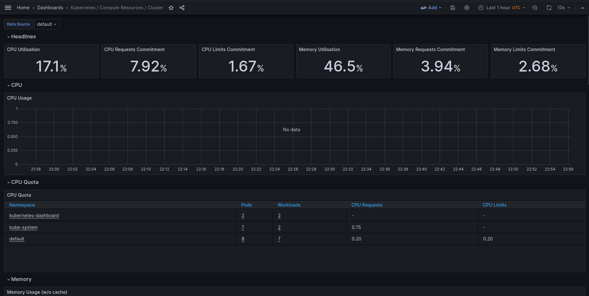

# k8s

**Creating minikube cluster**

```
minikube start
```

**Creating deployment**

```
kubectl create deployment web-app-node --image=docker.io/elatypovinno/devops_inno:latest
```

**Creating service**

```
kubectl expose deployment web-app-node --type=LoadBalancer --port=8080
```

**Running service**

```
minikube service web-app-node
```

---

After the application successfully deployed, I run following command:

```
kubectl get pods,svc
```

And the output is:

```
NAME                               READY   STATUS    RESTARTS   AGE
pod/web-app-node-77c9d4f58-6lg28   1/1     Running   0          107s

NAME                   TYPE           CLUSTER-IP      EXTERNAL-IP   PORT(S)          AGE
service/kubernetes     ClusterIP      10.96.0.1       <none>        443/TCP          25m
service/web-app-node   LoadBalancer   10.111.211.46   <pending>     8080:32569/TCP   102s
```

---

To delete service and deployment, run:

```
kubectl delete service web-app-node
kubectl delete deployment web-app-node
```

---

After cleaning up service and deployment, it is also possible to deploy our container using config files (see `deployment.yml` and `service.yml`). There are 3 replicas are specified.

```
kubectl apply -f deployment.yml
kubectl apply -f service.yml
```

and run minikube again:

```
minikube service web-app-node
```

---

Output of `kubectl get pods,svc`:

```
NAME                                READY   STATUS    RESTARTS   AGE
pod/web-app-node-5b9ffd7b46-5f6vb   1/1     Running   0          51s
pod/web-app-node-5b9ffd7b46-9qpgm   1/1     Running   0          51s
pod/web-app-node-5b9ffd7b46-fqdq6   1/1     Running   0          51s

NAME                   TYPE           CLUSTER-IP      EXTERNAL-IP   PORT(S)          AGE
service/kubernetes     ClusterIP      10.96.0.1       <none>        443/TCP          66m
service/web-app-node   LoadBalancer   10.106.21.202   <pending>     8080:32619/TCP   47s
```

Output of `minikube service --all`

```
|-----------|------------|-------------|--------------|
| NAMESPACE |    NAME    | TARGET PORT |     URL      |
|-----------|------------|-------------|--------------|
| default   | kubernetes |             | No node port |
|-----------|------------|-------------|--------------|
😿  service default/kubernetes has no node port
|-----------|--------------|-------------|---------------------------|
| NAMESPACE |     NAME     | TARGET PORT |            URL            |
|-----------|--------------|-------------|---------------------------|
| default   | web-app-node |        8080 | http://192.168.49.2:32619 |
|-----------|--------------|-------------|---------------------------|
🎉  Opening service default/web-app-node in default browser...
```

Screenshot from browser with service IP:


