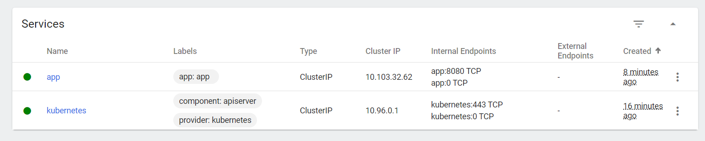
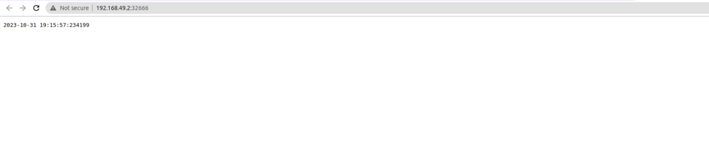

# Part 1

## Start minikube

```
😄  minikube v1.31.2 on Linuxmint 20.1
✨  Automatically selected the docker driver. Other choices: qemu2, virtualbox, none, ssh
📌  Using Docker driver with root privileges
👍  Starting control plane node minikube in cluster minikube
🚜  Pulling base image ...
💾  Downloading Kubernetes v1.27.4 preload ...
    > preloaded-images-k8s-v18-v1...:  393.21 MiB / 393.21 MiB  100.00% 6.29 Mi
    > gcr.io/k8s-minikube/kicbase...:  447.62 MiB / 447.62 MiB  100.00% 5.49 Mi
🔥  Creating docker container (CPUs=2, Memory=5900MB) ...

🧯  Docker is nearly out of disk space, which may cause deployments to fail! (92% of capacity). You can pass '--force' to skip this check.
💡  Suggestion: 

    Try one or more of the following to free up space on the device:
    
    1. Run "docker system prune" to remove unused Docker data (optionally with "-a")
    2. Increase the storage allocated to Docker for Desktop by clicking on:
    Docker icon > Preferences > Resources > Disk Image Size
    3. Run "minikube ssh -- docker system prune" if using the Docker container runtime
🍿  Related issue: https://github.com/kubernetes/minikube/issues/9024

🐳  Preparing Kubernetes v1.27.4 on Docker 24.0.4 ...
    ▪ Generating certificates and keys ...
    ▪ Booting up control plane ...
    ▪ Configuring RBAC rules ...
🔗  Configuring bridge CNI (Container Networking Interface) ...
🔎  Verifying Kubernetes components...
    ▪ Using image gcr.io/k8s-minikube/storage-provisioner:v5
🌟  Enabled addons: storage-provisioner, default-storageclass
🏄  Done! kubectl is now configured to use "minikube" cluster and "default" namespace by default
```


## Check results
```kubectl get pods -A```

```
NAMESPACE     NAME                               READY   STATUS    RESTARTS   AGE
kube-system   coredns-5d78c9869d-6k9r2           1/1     Running   0          29s
kube-system   etcd-minikube                      1/1     Running   0          41s
kube-system   kube-apiserver-minikube            1/1     Running   0          41s
kube-system   kube-controller-manager-minikube   1/1     Running   0          41s
kube-system   kube-proxy-54f42                   1/1     Running   0          29s
kube-system   kube-scheduler-minikube            1/1     Running   0          41s
kube-system   storage-provisioner                1/1     Running   0          39s
```

## Configure deployment
``` kubectl get deployment -A ```
```
NAMESPACE     NAME         READY   UP-TO-DATE   AVAILABLE   AGE
default       app-cpp      1/1     1            1           4m54s
default       app-python   1/1     1            1           7m
kube-system   coredns      1/1     1            1           55m
```

P.S: Commands for adding containers to cluster
```
kubectl create deployment app-python --image=docker.io/dashvayet/python_app:latest --port=5000
```
```
kubectl expose deployment app-python --type=LoadBalancer --port=5000
```

```
kubectl expose deployment app-cpp --type=LoadBalancer --port=10000
```
```
kubectl expose deployment app-cpp --type=LoadBalancer --port=10000
```
    

## Making app accessible
Example of creating service

I have used LoadBalancer type as ti looks more reasonable for my apps
```
apiVersion: v1
kind: Service
metadata:
  name: app-python
  labels:
    app: app_python
spec:
  type: LoadBalancer
  selector:
    app: app_python
  ports:
  - protocol: TCP
    port: 5000
    targetPort: 5000
```
After I have created services I have used 
```minikube tunnel``` 
```
Status: 
        machine: minikube
        pid: 317029
        route: 10.96.0.0/12 -> 192.168.49.2
        minikube: Running
        services: [app-cpp, app-python]
    errors: 
                minikube: no errors
                router: no errors
                loadbalancer emulator: no errors

```

This action supplies me with an ip address for getting access to my containers in cluster


## Output for pods, svc
```kubectl get pods,svc```
```
NAME                              READY   STATUS    RESTARTS      AGE
pod/app-cpp-575c88d7b5-qq9xw      1/1     Running   2 (13m ago)   19h
pod/app-python-78cd95d5f7-s2wnx   1/1     Running   0             19h

NAME                 TYPE           CLUSTER-IP       EXTERNAL-IP      PORT(S)           AGE
service/app-cpp      LoadBalancer   10.99.249.45     10.99.249.45     10000:30935/TCP   19h
service/app-python   LoadBalancer   10.108.237.187   10.108.237.187   5000:30524/TCP    13m
service/kubernetes   ClusterIP      10.96.0.1        <none>           443/TCP           20h
```


## Clear the environment
```kubectl delete deployment```
```kubectl delete service```

After cleaning we have the following
```
NAME                 TYPE        CLUSTER-IP   EXTERNAL-IP   PORT(S)   AGE
service/kubernetes   ClusterIP   10.96.0.1    <none>        443/TCP   20h
```


# Part 2
After creating manifest files I have applied them
```
kubectl apply -f app_<type>/deployment.yml 
```
```   
deployment.apps/app-<type> created
```
```
kubectl apply -f app_<type>/service.yml 
```
```
service/app-<type> created
```

## Testing applied manifests
```
minikube service --all
|-----------|---------|-------------|---------------------------|
| NAMESPACE |  NAME   | TARGET PORT |            URL            |
|-----------|---------|-------------|---------------------------|
| default   | app-cpp |       10000 | http://192.168.49.2:31961 |
|-----------|---------|-------------|---------------------------|
|-----------|------------|-------------|---------------------------|
| NAMESPACE |    NAME    | TARGET PORT |            URL            |
|-----------|------------|-------------|---------------------------|
| default   | app-python |        5000 | http://192.168.49.2:32666 |
|-----------|------------|-------------|---------------------------|
|-----------|------------|-------------|--------------|
| NAMESPACE |    NAME    | TARGET PORT |     URL      |
|-----------|------------|-------------|--------------|
| default   | kubernetes |             | No node port |
|-----------|------------|-------------|--------------|
😿  service default/kubernetes has no node port
🎉  Opening service default/app-cpp in default browser...
🎉  Opening service default/app-python in default browser...
````


APP_CPP


APP_PYTHON



## kubectl get pods,svc again!
```
NAME                              READY   STATUS    RESTARTS   AGE
pod/app-cpp-6968bbd575-8fs78      1/1     Running   0          98m
pod/app-cpp-6968bbd575-rzrnb      1/1     Running   0          98m
pod/app-cpp-6968bbd575-thw48      1/1     Running   0          98m
pod/app-python-7bbc6485f6-2ffz2   1/1     Running   0          101m
pod/app-python-7bbc6485f6-8xcdt   1/1     Running   0          101m
pod/app-python-7bbc6485f6-xvb46   1/1     Running   0          101m

NAME                 TYPE           CLUSTER-IP     EXTERNAL-IP    PORT(S)           AGE
service/app-cpp      LoadBalancer   10.102.81.49   10.102.81.49   10000:31961/TCP   98m
service/app-python   LoadBalancer   10.96.147.43   10.96.147.43   5000:32666/TCP    101m
service/kubernetes   ClusterIP      10.96.0.1      <none>         443/TCP           22h
```

# Bonus task
First of all, we need to enable ingress in kuber :)
```
minikube addons enable ingress
```

```
💡  ingress is an addon maintained by Kubernetes. For any concerns contact minikube on GitHub.
You can view the list of minikube maintainers at: https://github.com/kubernetes/minikube/blob/master/OWNERS
    ▪ Using image registry.k8s.io/ingress-nginx/controller:v1.8.1
    ▪ Using image registry.k8s.io/ingress-nginx/kube-webhook-certgen:v20230407
    ▪ Using image registry.k8s.io/ingress-nginx/kube-webhook-certgen:v20230407
🔎  Verifying ingress addon...
🌟  The 'ingress' addon is enabled
```

# Utilize manifest
use following command with ingress manifest files
```kubectl apply -f <path_to_file>``` 

# Results
After utilizing ingress we can call services via host names


```
ruslan@Elestrias:~/Downloads/devops/core-course-labs/k8s$ curl -H "Host: python.time.app"  http://192.168.49.2
2023-10-31 21:15:28:064253

ruslan@Elestrias:~/Downloads/devops/core-course-labs/k8s$ curl -H "Host: cpp.guess.game"  http://192.168.49.2
<!DOCTYPE html>
<html>
<head>
    <title>Guessing game</title>
</head>
<body>
<h1>Number 1 to 1000</h1>
<form action="/handle_post">
    <input type="text" id="fnumber" name="message">
    <input type="submit" value="Send">
</form>
</body>
</html>
```


