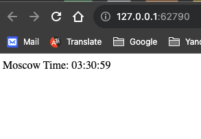
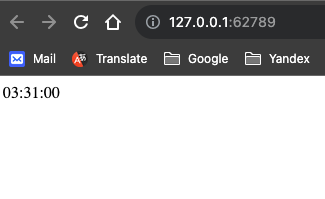

# Kubernetes

## Kubernetes Config
Custom K8s config is used for **minikube**: `./k8s/kubeconfig.yaml`.
It contains:
* ***minikube*** cluster
* ***minikube*** user
* ***minikube*** context that contains the cluster and the user
---

## Kubernetes Setup & Basic Deployment

### Deployment
* Create
    ```shell
    kubectl --kubeconfig=kubeconfig.yaml create deployment app-python --image=iskanred/app_python:1.0.0 --port=8080 --replicas=2
    ```
  **Output:**
    ```text
    deployment.apps/app-python created
    ```

* Check Pods
   ```shell
   kubectl --kubeconfig=kubeconfig.yaml get pods
   ``` 
  **Output:**
    ```text
    NAME                          READY   STATUS    RESTARTS   AGE
    app-python-599bdd5d49-7dv44   1/1     Running   0          35s
    app-python-599bdd5d49-kgl78   1/1     Running   0          35s
    ```
  
### Service
* Create
    ```shell
    kubectl --kubeconfig=kubeconfig.yaml expose deploy app-python --type=LoadBalancer
    ```
  **Output:**
    ```text
    service/app-python exposed 
    ```

* Check Service
   ```shell
   kubectl --kubeconfig=kubeconfig.yaml get svc
   ``` 
  **Output:**
    ```text
    NAME         TYPE           CLUSTER-IP     EXTERNAL-IP   PORT(S)          AGE
    app-python   LoadBalancer   10.97.15.175   <pending>     8080:31435/TCP   3m17s
    kubernetes   ClusterIP      10.96.0.1      <none>        443/TCP          7m57s
    ```
---

## Declarative Kubernetes Manifests
From here I have already added the `app-kotlin` application besides the `app-python`.
The manifests for **Kotlin** application are located in `k8s/app_kotlin`
while for **Python** are in `k8s/app_python`.

### Deployment
* Apply **Python** Deployment Manifest
    ```shell
    kubectl --kubeconfig=kubeconfig.yaml apply -f app_python/deployment.yaml 
    ```
    **Output:**
    ```text
    deployment.apps/app-python-deployment created
    ```
  
* Apply **Kotlin** Deployment Manifest
    ```shell
    kubectl --kubeconfig=kubeconfig.yaml apply -f app_kotlin/deployment.yaml 
    ```
    **Output:**
    ```text
    deployment.apps/app-kotlin-deployment created
    ```

* Get info
    ```shell
    kubectl get deploy; kubectl get pods
    ```
  **Output:**
    ```text
    NAME                    READY   UP-TO-DATE   AVAILABLE   AGE
    app-kotlin-deployment   3/3     3            3           4m25s
    app-python-deployment   3/3     3            3           17m
 
    NAME                                     READY   STATUS    RESTARTS   AGE
    app-kotlin-deployment-7d6789b9b8-dvr8w   1/1     Running   0          4m25s
    app-kotlin-deployment-7d6789b9b8-l5d52   1/1     Running   0          4m25s
    app-kotlin-deployment-7d6789b9b8-tn28b   1/1     Running   0          4m25s
    app-python-deployment-85b97b56b7-2j8k2   1/1     Running   0          17m
    app-python-deployment-85b97b56b7-pdkzf   1/1     Running   0          17m
    app-python-deployment-85b97b56b7-sxkx2   1/1     Running   0          17m
    ```

### Service
* Apply **Python** Service Manifest
    ```shell
    kubectl --kubeconfig=kubeconfig.yaml apply -f app_kotlin/deployment.yaml 
    ```
  **Output:**
    ```text
    service/app-python-service created
    ```
* Apply **Kotlin** Service Manifest
    ```shell
    kubectl --kubeconfig=kubeconfig.yaml apply -f app_kotlin/service.yaml
    ```
  **Output:**
    ```text
    service/app-kotlin-service created
    ```
* Get info
    ```shell
    kubectl get svc; minikube service list
    ```
  **Output:**
    ```text
    app-kotlin-service   LoadBalancer   10.102.142.89   <pending>     8080:31107/TCP   14m
    app-python-service   LoadBalancer   10.101.44.3     <pending>     80:30576/TCP     15m
    kubernetes           ClusterIP      10.96.0.1       <none>        443/TCP          56m

    |-------------|--------------------|--------------|-----|
    |  NAMESPACE  |        NAME        | TARGET PORT  | URL |
    |-------------|--------------------|--------------|-----|
    | default     | app-kotlin-service |         8080 |     |
    | default     | app-python-service |           80 |     |
    | default     | kubernetes         | No node port |     |
    | kube-system | kube-dns           | No node port |     |
    |-------------|--------------------|--------------|-----|
    ```
* Run `minikube service`
    ```shell
    minkube service -all
    ```
    **Output:**
    ```text
    {username@hostname} iu-devops-course % minikube service --all 
    |-----------|--------------------|-------------|---------------------------|
    | NAMESPACE |        NAME        | TARGET PORT |            URL            |
    |-----------|--------------------|-------------|---------------------------|
    | default   | app-kotlin-service |        8080 | http://192.168.49.2:31107 |
    |-----------|--------------------|-------------|---------------------------|
    |-----------|--------------------|-------------|---------------------------|
    | NAMESPACE |        NAME        | TARGET PORT |            URL            |
    |-----------|--------------------|-------------|---------------------------|
    | default   | app-python-service |          80 | http://192.168.49.2:30576 |
    |-----------|--------------------|-------------|---------------------------|
    |-----------|------------|-------------|--------------|
    | NAMESPACE |    NAME    | TARGET PORT |     URL      |
    |-----------|------------|-------------|--------------|
    | default   | kubernetes |             | No node port |
    |-----------|------------|-------------|--------------|
    😿  service default/kubernetes has no node port
    🏃  Starting tunnel for service app-kotlin-service.
    🏃  Starting tunnel for service app-python-service.
    🏃  Starting tunnel for service kubernetes.
    |-----------|--------------------|-------------|------------------------|
    | NAMESPACE |        NAME        | TARGET PORT |          URL           |
    |-----------|--------------------|-------------|------------------------|
    | default   | app-kotlin-service |             | http://127.0.0.1:62789 |
    | default   | app-python-service |             | http://127.0.0.1:62790 |
    | default   | kubernetes         |             | http://127.0.0.1:62793 |
    |-----------|--------------------|-------------|------------------------|
    🎉  Opening service default/app-kotlin-service in default browser...
    🎉  Opening service default/app-python-service in default browser...
    🎉  Opening service default/kubernetes in default browser...

    ```
* Obtaining **Python** application from **minikube** node container
    ```shell
    curl -if http://192.168.49.2:30576; echo "\n"
    ```
  **Output:**
    ```text
    Content-Length: 21
    Content-Type: text/html; charset=utf-8
    Date: Tue, 31 Oct 2023 01:09:18 GMT
    Server: waitress

    Moscow Time: 04:09:18\n
    ```
* Obtaining **Kotlin** application from **minikube** node container
    ```shell
    curl -if http://192.168.49.2:31107; echo "\n"
    ```
    **Output:** 
    ```text
    HTTP/1.1 200 
    Content-Type: text/plain;charset=UTF-8
    Content-Length: 8
    Date: Tue, 31 Oct 2023 01:05:16 GMT

    04:05:16\n
    ```
* Obtaining **Python** application from macOS host machine via **minikube** `LoadBalancer` tunneling

  
* Obtaining **Kotlin** application from macOS host machine via **minikube** `LoadBalancer` tunneling

  
 
---

## Ingress manifest
The ingress manifest's location is `k8s/ingress.yaml`.

* Enable default **minikube** `ingress` addon to add Kubernetes NGINX Ingress Controller:
    ```shell
    minikube addons enable ingress
    ```
    **Output:**
    ```text
    💡  ingress is an addon maintained by Kubernetes. For any concerns contact minikube on GitHub.
    You can view the list of minikube maintainers at: https://github.com/kubernetes/minikube/blob/master/OWNERS
    💡  After the addon is enabled, please run "minikube tunnel" and your ingress resources would be available at "127.0.0.1"
    ▪ Using image registry.k8s.io/ingress-nginx/controller:v1.8.1
    ▪ Using image registry.k8s.io/ingress-nginx/kube-webhook-certgen:v20230407
    ▪ Using image registry.k8s.io/ingress-nginx/kube-webhook-certgen:v20230407
    🔎  Verifying ingress addon...
    🌟  The 'ingress' addon is enabled
    ```
* Get `ingress-nginx` pods
    ```shell
    kubectl --kubeconfig=kubeconfig.yaml get pods -n ingress-nginx
    ```
    **Output:**
    ```
    NAME                                        READY   STATUS      RESTARTS   AGE
    ingress-nginx-admission-create-fwj2d        0/1     Completed   0          92s
    ingress-nginx-admission-patch-q45mm         0/1     Completed   0          92s
    ingress-nginx-controller-7799c6795f-zxgvl   1/1     Running     0          92s
    ```
* Apply Ingress Manifest
    ```shell
    kubectl --kubeconfig=kubeconfig.yaml apply -f ingress.yaml
    ```
    **Output:**
    ```
    ingress.networking.k8s.io/ingress created
    ```
* Get info
    ```shell
    kubectl --kubeconfig=kubeconfig.yaml get ingress
    ```
    **Output:**
    ```
    NAME      CLASS   HOSTS                   ADDRESS        PORTS   AGE
    ingress   nginx   app.python,app.kotlin   192.168.49.2   80      100s
    ```

### Application availability check
* Get **minikube** node ip
    ```shell
    minikube ip
    ```
    **Output:**
    ```text
    192.168.49.2
    ```
* Check Python application
    ```shell
    curl --resolve "app.python:80:192.168.49.2" -i http://app.python; echo "\n"
    ```
    **Output:**
    ```text
    HTTP/1.1 200 OK
    Date: Tue, 31 Oct 2023 02:03:30 GMT
    Content-Type: text/html; charset=utf-8
    Content-Length: 21
    Connection: keep-alive

    Moscow Time: 05:03:30\n
    ```
* Check
    ```shell
    curl --resolve "app.kotlin:80:192.168.49.2" -i http://app.kotlin; echo "\n"
    ```
    **Output:**
    ```text
    HTTP/1.1 200 
    Date: Tue, 31 Oct 2023 02:02:55 GMT
    Content-Type: text/plain;charset=UTF-8
    Content-Length: 8
    Connection: keep-alive

    05:02:55\n
    ```
---
