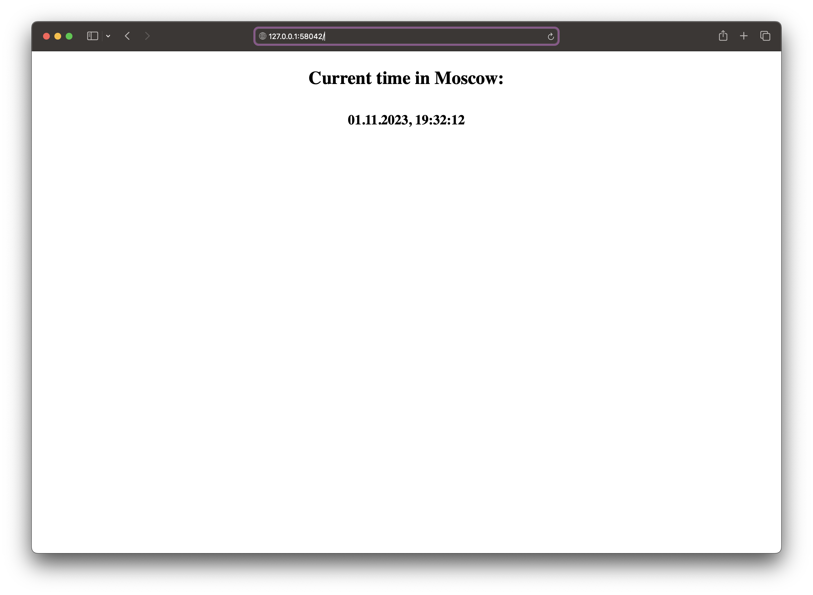
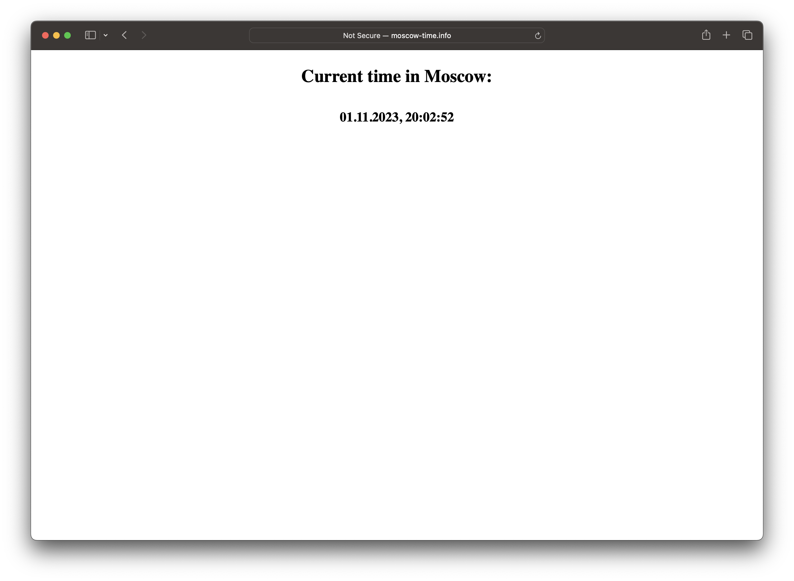

# Kubernetes

## Report of pods and services (Task 1)

```bash
NAME                              READY   STATUS    RESTARTS   AGE
pod/app-python-645d897584-pjhvv   1/1     Running   0          7m38s

NAME                 TYPE           CLUSTER-IP      EXTERNAL-IP   PORT(S)          AGE
service/app-python   LoadBalancer   10.102.195.26   <pending>     8080:31923/TCP   6m24s
service/kubernetes   ClusterIP      10.96.0.1       <none>        443/TCP          18m
```

## Report of pods and services (Task 2)

```bash
NAME                                         READY   STATUS    RESTARTS   AGE
pod/app-python-deployment-54d7dd94f4-2rp5v   1/1     Running   0          108s
pod/app-python-deployment-54d7dd94f4-bshz9   1/1     Running   0          108s
pod/app-python-deployment-54d7dd94f4-jt525   1/1     Running   0          108s

NAME                 TYPE        CLUSTER-IP       EXTERNAL-IP   PORT(S)          AGE
service/app-python   NodePort    10.103.218.243   <none>        8080:32031/TCP   9s
service/kubernetes   ClusterIP   10.96.0.1        <none>        443/TCP          2m23s
```

## Output of `minikube service --all`

```bash
|-----------|------------|-------------|---------------------------|
| NAMESPACE |    NAME    | TARGET PORT |            URL            |
|-----------|------------|-------------|---------------------------|
| default   | app-python |        8080 | http://192.168.49.2:32031 |
|-----------|------------|-------------|---------------------------|
|-----------|------------|-------------|--------------|
| NAMESPACE |    NAME    | TARGET PORT |     URL      |
|-----------|------------|-------------|--------------|
| default   | kubernetes |             | No node port |
|-----------|------------|-------------|--------------|
😿  service default/kubernetes has no node port
🏃  Starting tunnel for service app-python.
🏃  Starting tunnel for service kubernetes.
|-----------|------------|-------------|------------------------|
| NAMESPACE |    NAME    | TARGET PORT |          URL           |
|-----------|------------|-------------|------------------------|
| default   | app-python |             | http://127.0.0.1:58042 |
| default   | kubernetes |             | http://127.0.0.1:58044 |
|-----------|------------|-------------|------------------------|
🎉  Opening service default/app-python in default browser...
🎉  Opening service default/kubernetes in default browser...
❗  Because you are using a Docker driver on darwin, the terminal needs to be open to run it.
```



## Output of `kubectl get ingress`

```bash
NAME          CLASS   HOSTS              ADDRESS        PORTS   AGE
app-ingress   nginx   moscow-time.info   192.168.49.2   80      7m30s
```


