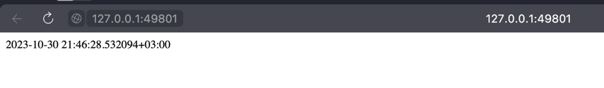

## Running the application on Kubernetes
To run my python application I used the following commands:
```
kubectl create deployment lab-node --image=klemencja/app_python
kubectl expose deployment lab-node --type=LoadBalancer --port=8000
minikube service lab-node
```

After the minkube response:
```
|-----------|----------|-------------|---------------------------|
| NAMESPACE |   NAME   | TARGET PORT |            URL            |
|-----------|----------|-------------|---------------------------|
| default   | lab-node |        8000 | http://192.168.49.2:32617 |
|-----------|----------|-------------|---------------------------|
🏃  Starting tunnel for service lab-node.
|-----------|----------|-------------|------------------------|
| NAMESPACE |   NAME   | TARGET PORT |          URL           |
|-----------|----------|-------------|------------------------|
| default   | lab-node |             | http://127.0.0.1:49801 |
|-----------|----------|-------------|------------------------|
```
The page with running python application was opened:


### Checking pods and services state
```
kubectl get pods,svc
NAME                            READY   STATUS    RESTARTS   AGE
pod/lab-node-576c4646c7-wqshl   1/1     Running   0          3m32s

NAME                 TYPE           CLUSTER-IP      EXTERNAL-IP   PORT(S)          AGE
service/kubernetes   ClusterIP      10.96.0.1       <none>        443/TCP          30h
service/lab-node     LoadBalancer   10.109.131.29   <pending>     8000:32617/TCP   3m6s
```

### Cleanup
After successfull test I cleaned my service and deployment with commands:
```
kubectl delete service lab-node
kubectl delete deployment lab-node
```