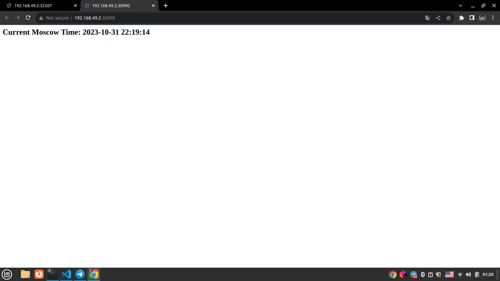
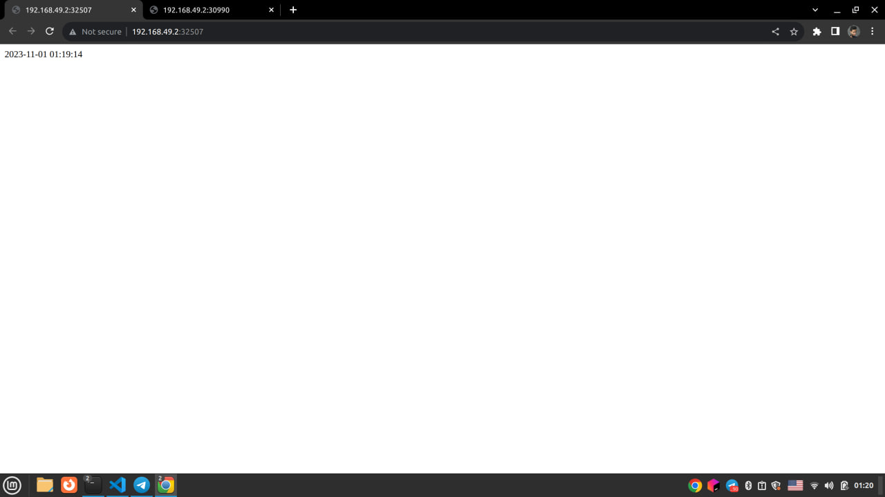

```
muurrk@muurrk-PS42-8M:~$ minikube start
😄  minikube v1.31.2 on Linuxmint 21.1
✨  Automatically selected the docker driver. Other choices: none, ssh
📌  Using Docker driver with root privileges
👍  Starting control plane node minikube in cluster minikube
🚜  Pulling base image ...
💾  Downloading Kubernetes v1.27.4 preload ...
    > gcr.io/k8s-minikube/kicbase...:  447.62 MiB / 447.62 MiB  100.00% 1.34 Mi^[
    > preloaded-images-k8s-v18-v1...:  393.21 MiB / 393.21 MiB  100.00% 1.16 Mi
🔥  Creating docker container (CPUs=2, Memory=2200MB) ...
🐳  Preparing Kubernetes v1.27.4 on Docker 24.0.4 ...
    ▪ Generating certificates and keys ...
    ▪ Booting up control plane ...
    ▪ Configuring RBAC rules ...
🔗  Configuring bridge CNI (Container Networking Interface) ...
    ▪ Using image gcr.io/k8s-minikube/storage-provisioner:v5
🔎  Verifying Kubernetes components...
🌟  Enabled addons: storage-provisioner, default-storageclass
🏄  Done! kubectl is now configured to use "minikube" cluster and "default" namespace by default
```

```
muurrk@muurrk-PS42-8M:~/core-course-labs/monitoring$ kubectl get pods
NAME                         READY   STATUS    RESTARTS   AGE
cpp-app-7bbbc5f7f4-vcrpz     1/1     Running   0          2m26s
python-app-fcd55c6dc-mss5l   1/1     Running   0          3m11s

muurrk@muurrk-PS42-8M:~/core-course-labs/monitoring$ kubectl get svc
NAME         TYPE           CLUSTER-IP      EXTERNAL-IP   PORT(S)          AGE
cpp-app      LoadBalancer   10.110.151.12   <pending>     8080:31326/TCP   66s
kubernetes   ClusterIP      10.96.0.1       <none>        443/TCP          17m
python-app   LoadBalancer   10.111.15.11    <pending>     8080:32399/TCP   78s
```

```
muurrk@muurrk-PS42-8M:~/core-course-labs/monitoring$ kubectl delete deployment python-app
deployment.apps "python-app" deleted

muurrk@muurrk-PS42-8M:~/core-course-labs/monitoring$ kubectl delete deployment cpp-app
deployment.apps "cpp-app" deleted
```

```
muurrk@muurrk-PS42-8M:~/core-course-labs/k8s$ kubectl apply -f python-app/deployment.yaml 
deployment.apps/my-app-python created

muurrk@muurrk-PS42-8M:~/core-course-labs/k8s$ kubectl apply -f cpp-app/deployment.yaml 
deployment.apps/my-app-cpp created

muurrk@muurrk-PS42-8M:~/core-course-labs/k8s$ kubectl apply -f python-app/service.yaml 
service/my-app-python created

muurrk@muurrk-PS42-8M:~/core-course-labs/k8s$ kubectl apply -f cpp-app/service.yaml 
service/my-app-cpp created
```

```
muurrk@muurrk-PS42-8M:~/core-course-labs/k8s$ minikube service --all
|-----------|------------|-------------|--------------|
| NAMESPACE |    NAME    | TARGET PORT |     URL      |
|-----------|------------|-------------|--------------|
| default   | kubernetes |             | No node port |
|-----------|------------|-------------|--------------|
😿  service default/kubernetes has no node port
|-----------|------------|-------------|---------------------------|
| NAMESPACE |    NAME    | TARGET PORT |            URL            |
|-----------|------------|-------------|---------------------------|
| default   | my-app-cpp |        8080 | http://192.168.49.2:30990 |
|-----------|------------|-------------|---------------------------|
|-----------|---------------|-------------|---------------------------|
| NAMESPACE |     NAME      | TARGET PORT |            URL            |
|-----------|---------------|-------------|---------------------------|
| default   | my-app-python |        8080 | http://192.168.49.2:32507 |
|-----------|---------------|-------------|---------------------------|
🎉  Opening service default/my-app-cpp in default browser...
🎉  Opening service default/my-app-python in default browser...
muurrk@muurrk-PS42-8M:~/core-course-labs/k8s$ MESA-INTEL: warning: Performance support disabled, consider sysctl dev.i915.perf_stream_paranoid=0

Opening in existing browser session.
MESA-INTEL: warning: Performance support disabled, consider sysctl dev.i915.perf_stream_paranoid=0

Opening in existing browser session.
MESA-INTEL: warning: Performance support disabled, consider sysctl dev.i915.perf_stream_paranoid=0

MESA-INTEL: warning: Performance support disabled, consider sysctl dev.i915.perf_stream_paranoid=0


```

After that open automaticaly:
 

## Bonus 

```
muurrk@muurrk-PS42-8M:~/core-course-labs/k8s$ minikube service --all
|-----------|------------|-------------|--------------|
| NAMESPACE |    NAME    | TARGET PORT |     URL      |
|-----------|------------|-------------|--------------|
| default   | kubernetes |             | No node port |
|-----------|------------|-------------|--------------|
😿  service default/kubernetes has no node port
|-----------|------------|-------------|---------------------------|
| NAMESPACE |    NAME    | TARGET PORT |            URL            |
|-----------|------------|-------------|---------------------------|
| default   | my-app-cpp |        8080 | http://192.168.49.2:31095 |
|-----------|------------|-------------|---------------------------|
|-----------|---------------|-------------|---------------------------|
| NAMESPACE |     NAME      | TARGET PORT |            URL            |
|-----------|---------------|-------------|---------------------------|
| default   | my-app-python |        8080 | http://192.168.49.2:31556 |
|-----------|---------------|-------------|---------------------------|
🎉  Opening service default/my-app-cpp in default browser...
```

```
muurrk@muurrk-PS42-8M:~/core-course-labs$ curl -H "Host: my.app.cpp.ingress.com"  http://192.168.49.2:31095/
<h2>Current Moscow Time: 2023-10-31 23:23:48</h2>

muurrk@muurrk-PS42-8M:~/core-course-labs$ curl -H "Host: my.app.python.ingress.com"  http://192.168.49.2
2023-11-01 02:24:19muurrk@muurrk-PS42-8M:~/core-course-labs$ 
```