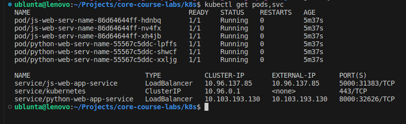
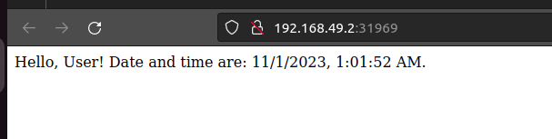
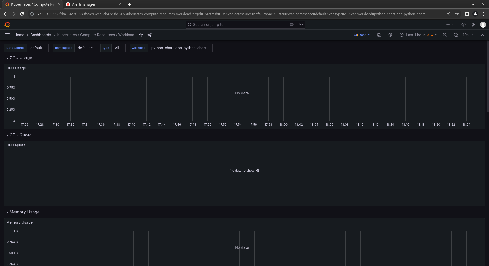
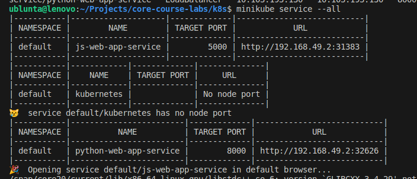
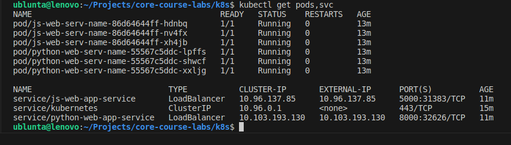
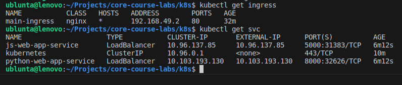
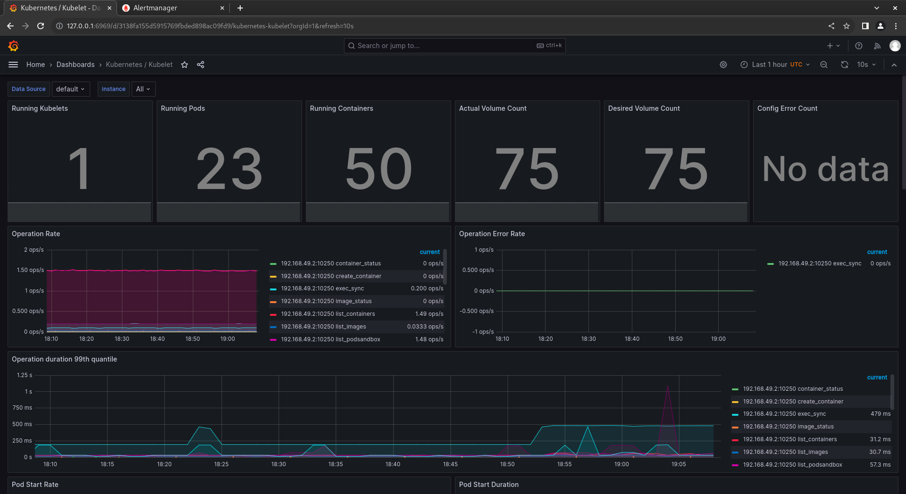

# K8S

## Task 1
Pods created 



## Task 2
Pods created and apps is accessible

### Js web server


### Python web server






## Bonus Task

We need to enable ingress

```bash
minikube addons enable ingress
```

Pods created and accessible from outside network.


Ingress:
