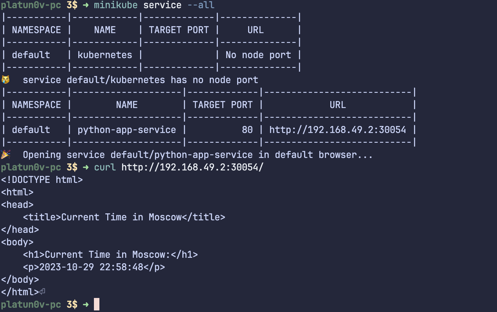

# Kubernetes 

## Declarative deployment

1. Apply manifests

```bash
kubectl apply -f service.yml -f deployment.yml
```

```bash
service/python-app-service created
deployment.apps/python-app-deployment created
```

2. Running pods and services

```bash
kubectl get pods,svc
```

```bash
NAME                                         READY   STATUS    RESTARTS   AGE
pod/python-app-deployment-667c968cc9-gc2n7   1/1     Running   0          31s
pod/python-app-deployment-667c968cc9-kdh59   1/1     Running   0          31s
pod/python-app-deployment-667c968cc9-m8kqq   1/1     Running   0          31s

NAME                         TYPE           CLUSTER-IP     EXTERNAL-IP   PORT(S)        AGE
service/kubernetes           ClusterIP      10.96.0.1      <none>        443/TCP        4h28m
service/python-app-service   LoadBalancer   10.104.87.44   <pending>     80:30054/TCP   31s
```

3. Opening service

```bash
platun0v-pc 3$ ➜ minikube service --all
```

```bash
|-----------|------------|-------------|--------------|
| NAMESPACE |    NAME    | TARGET PORT |     URL      |
|-----------|------------|-------------|--------------|
| default   | kubernetes |             | No node port |
|-----------|------------|-------------|--------------|
😿  service default/kubernetes has no node port
|-----------|--------------------|-------------|---------------------------|
| NAMESPACE |        NAME        | TARGET PORT |            URL            |
|-----------|--------------------|-------------|---------------------------|
| default   | python-app-service |          80 | http://192.168.49.2:30054 |
|-----------|--------------------|-------------|---------------------------|
🎉  Opening service default/python-app-service in default browser...
```


