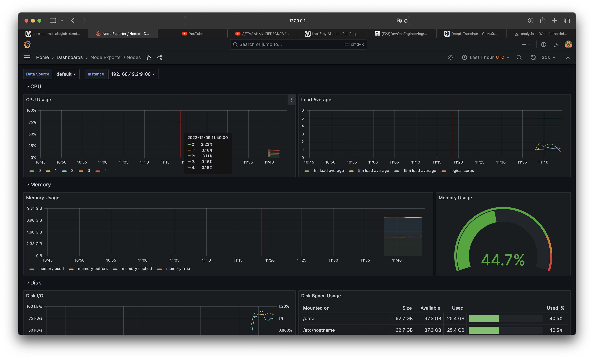
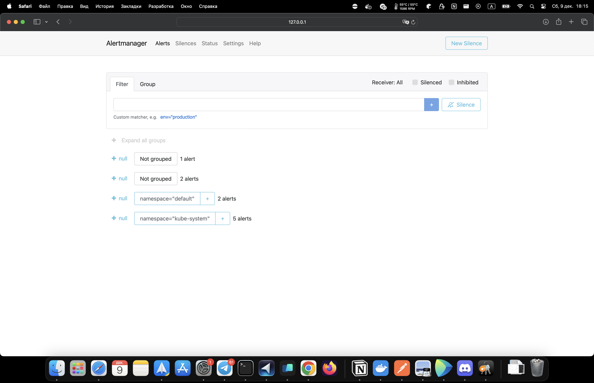

#### Prometheus Operator:
The Prometheus Operator provides Kubernetes native deployment and management of Prometheus and related monitoring components. The purpose of this project is to simplify and automate the configuration of a Prometheus based monitoring stack for Kubernetes clusters.

#### Prometheus

Prometheus is an open-source systems monitoring and alerting toolkit. It collects metrics from configured targets at given intervals, evaluates rule expressions, displays the results, and can trigger alerts if some condition is observed to be true.

#### Alertmanager

Alertmanager handles alerts sent by client applications such as the Prometheus server. It takes care of deduplicating, grouping, and routing them to the correct receiver integrations such as email, PagerDuty, or OpsGenie. It also takes care of silencing and inhibition of alerts.

#### Node Exporter

Node Exporter is a Prometheus exporter for hardware and OS metrics with pluggable metric collectors. It allows you to measure various machine resources such as memory, disk I/O, CPU, network, etc.

#### kube-state-metrics

kube-state-metrics is a service that listens to the Kubernetes API server and generates metrics about the state of the objects. It is not focused on the health of the individual Kubernetes components, but rather on the health of the various objects inside, such as deployments, nodes and pods.

#### Grafana

Grafana is a multi-platform open source analytics and interactive visualization web application. It provides charts, graphs, and alerts for the web when connected to supported data sources, in this case, Prometheus.

#### Overall
Each of these components plays a crucial role in the Kube Prometheus Stack, working together to provide a comprehensive monitoring solution for Kubernetes clusters.


```bash
kubectl get po
NAME                                                     READY   STATUS      RESTARTS     AGE
alertmanager-app-python-operate-kube-pr-alertmanager-0   2/2     Running     0            2m12s
app-python-77d84458f7-nh7nt                              1/1     Running     1 (9d ago)   9d
app-python-operate-grafana-696989978-r4zwf               3/3     Running     0            2m29s
app-python-operate-kube-pr-operator-6b44799fb-qbg9h      1/1     Running     0            2m29s
app-python-operate-kube-state-metrics-8478797785-7sxdz   1/1     Running     0            2m29s
app-python-operate-prometheus-node-exporter-r227p        1/1     Running     0            2m29s
post-install-hook                                        0/1     Completed   0            30d
pre-install-hook                                         0/1     Completed   0            30d
prometheus-app-python-operate-kube-pr-prometheus-0       2/2     Running     0            2m12s

kubectl get sts
NAME                                                   READY   AGE
alertmanager-app-python-operate-kube-pr-alertmanager   1/1     2m38s
prometheus-app-python-operate-kube-pr-prometheus       1/1     2m38s

kubectl get svc
NAME                                          TYPE        CLUSTER-IP       EXTERNAL-IP   PORT(S)                      AGE
alertmanager-operated                         ClusterIP   None             <none>        9093/TCP,9094/TCP,9094/UDP   2m48s
app-python                                    NodePort    10.109.55.121    <none>        5000:32598/TCP               9d
app-python-operate-grafana                    ClusterIP   10.111.153.107   <none>        80/TCP                       3m5s
app-python-operate-kube-pr-alertmanager       ClusterIP   10.107.177.209   <none>        9093/TCP,8080/TCP            3m5s
app-python-operate-kube-pr-operator           ClusterIP   10.103.35.23     <none>        443/TCP                      3m5s
app-python-operate-kube-pr-prometheus         ClusterIP   10.99.121.83     <none>        9090/TCP,8080/TCP            3m5s
app-python-operate-kube-state-metrics         ClusterIP   10.97.73.117     <none>        8080/TCP                     3m5s
app-python-operate-prometheus-node-exporter   ClusterIP   10.103.154.5     <none>        9100/TCP                     3m5s
kubernetes                                    ClusterIP   10.96.0.1        <none>        443/TCP                      38d
prometheus-operated                           ClusterIP   None             <none>        9090/TCP                     2m48s

kubectl get pvc
No resources found in default namespace.

kubectl get cm
NAME                                                           DATA   AGE
app-python-config                                              1      9d
app-python-operate-grafana                                     1      3m27s
app-python-operate-grafana-config-dashboards                   1      3m27s
app-python-operate-kube-pr-alertmanager-overview               1      3m27s
app-python-operate-kube-pr-apiserver                           1      3m27s
app-python-operate-kube-pr-cluster-total                       1      3m27s
app-python-operate-kube-pr-controller-manager                  1      3m27s
app-python-operate-kube-pr-etcd                                1      3m27s
app-python-operate-kube-pr-grafana-datasource                  1      3m27s
app-python-operate-kube-pr-grafana-overview                    1      3m27s
app-python-operate-kube-pr-k8s-coredns                         1      3m27s
app-python-operate-kube-pr-k8s-resources-cluster               1      3m27s
app-python-operate-kube-pr-k8s-resources-multicluster          1      3m27s
app-python-operate-kube-pr-k8s-resources-namespace             1      3m27s
app-python-operate-kube-pr-k8s-resources-node                  1      3m27s
app-python-operate-kube-pr-k8s-resources-pod                   1      3m27s
app-python-operate-kube-pr-k8s-resources-workload              1      3m27s
app-python-operate-kube-pr-k8s-resources-workloads-namespace   1      3m27s
app-python-operate-kube-pr-kubelet                             1      3m27s
app-python-operate-kube-pr-namespace-by-pod                    1      3m27s
app-python-operate-kube-pr-namespace-by-workload               1      3m27s
app-python-operate-kube-pr-node-cluster-rsrc-use               1      3m27s
app-python-operate-kube-pr-node-rsrc-use                       1      3m27s
app-python-operate-kube-pr-nodes                               1      3m27s
app-python-operate-kube-pr-nodes-darwin                        1      3m27s
app-python-operate-kube-pr-persistentvolumesusage              1      3m27s
app-python-operate-kube-pr-pod-total                           1      3m27s
app-python-operate-kube-pr-prometheus                          1      3m27s
app-python-operate-kube-pr-proxy                               1      3m27s
app-python-operate-kube-pr-scheduler                           1      3m27s
app-python-operate-kube-pr-workload-total                      1      3m27s
kube-root-ca.crt                                               1      38d
prometheus-app-python-operate-kube-pr-prometheus-rulefiles-0   34     3m9s
```

### Grafana results:

#### Answers:
Check CPU and Memory consumption of your StatefulSet - CPU: 3.10% , MEM: 44.70%

Identify Pods with higher and lower CPU usage in the default namespace - app-python-77d84458f7-nh7nt

Monitor node memory usage in percentage and megabytes - 

Count the number of pods and containers managed by the Kubelet service - 17 running pods, 36 running containers

Evaluate network usage of Pods in the default namespace - received - 300 B/s, transmitted - 310 B/s

Determine the number of active alerts; also check the Web UI with minikube service monitoring-kube-prometheus-alertmanager - 


#### Container init

```bash
kubectl exec -it app-python-76f6f958b6-9ndzw -c app-python -- cat /appdata/index.html

<!DOCTYPE html>
<html>
<head>
<title>Welcome to nginx!</title>
<style>
    body {
        width: 35em;
        margin: 0 auto;
        font-family: Tahoma, Verdana, Arial, sans-serif;
    }
</style>
</head>
<body>
<h1>Welcome to nginx!</h1>
<p>If you see this page, the nginx web server is successfully installed and working. Further configuration is required.</p>

<p>For online documentation and support please refer to <a href="http://nginx.org/">nginx.org</a>.<br/>
Commercial support is available at <a href="http://nginx.com/">nginx.com</a>.</p>

<p><em>Thank you for using nginx.</em></p>
</body>
</html>
```