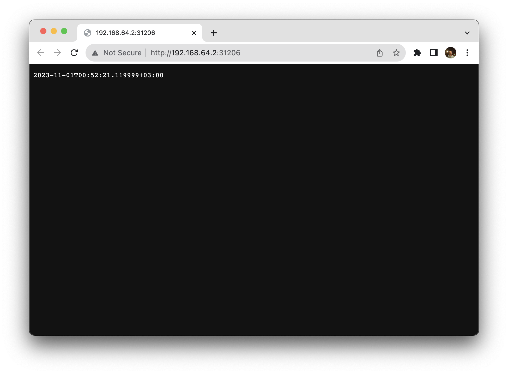

### `kubectl get pods,svc`
```shell
NAME                                       READY   STATUS    RESTARTS   AGE
pod/app-python-5d95765f48-54dl5            1/1     Running   0          4m57s
pod/app-python-5d95765f48-f8kxt            1/1     Running   0          4m57s
pod/app-python-5d95765f48-tfj2c            1/1     Running   0          4m57s
pod/app-python-deployment-5759db47-b675s   1/1     Running   0          4m57s
pod/app-python-deployment-5759db47-bvcdw   1/1     Running   0          4m57s
pod/app-python-deployment-5759db47-zb9fg   1/1     Running   0          4m57s

NAME                 TYPE        CLUSTER-IP       EXTERNAL-IP   PORT(S)        AGE
service/app-python   NodePort    10.101.208.157   <none>        80:31206/TCP   24m
service/kubernetes   ClusterIP   10.96.0.1        <none>        443/TCP        25m
```

### `minikube service --all`
```shell
|-----------|------------|-------------|---------------------------|
| NAMESPACE |    NAME    | TARGET PORT |            URL            |
|-----------|------------|-------------|---------------------------|
| default   | app-python |          80 | http://192.168.64.2:31206 |
|-----------|------------|-------------|---------------------------|
|-----------|------------|-------------|--------------|
| NAMESPACE |    NAME    | TARGET PORT |     URL      |
|-----------|------------|-------------|--------------|
| default   | kubernetes |             | No node port |
|-----------|------------|-------------|--------------|
😿  service default/kubernetes has no node port
🎉  Opening service default/app-python in default browser...
```

### Screenshot
