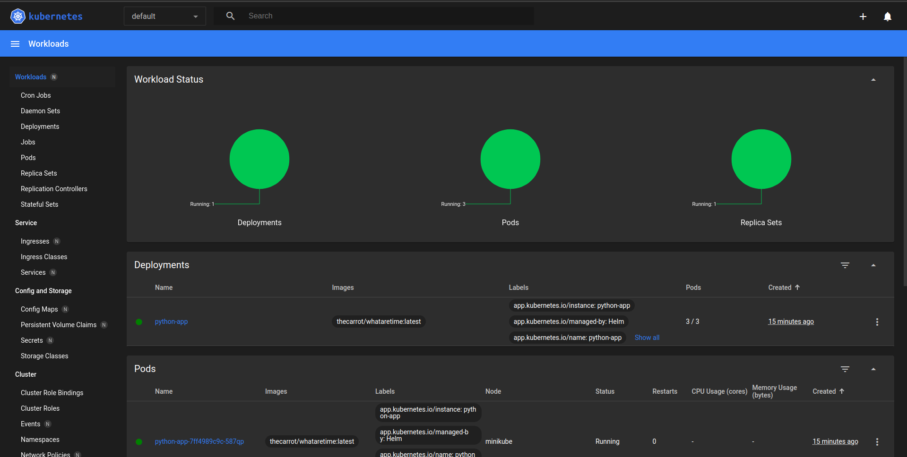

# Lab 10

## Task 1

### kubectl get pods,svc

```bash
$ kubectl get pods,svc
NAME                              READY   STATUS    RESTARTS   AGE
pod/helm-app-7ff4989c9c-587qp   1/1     Running   0          17m
pod/helm-app-7ff4989c9c-7qwht   1/1     Running   0          17m
pod/helm-app-7ff4989c9c-mm995   1/1     Running   0          17m

NAME                 TYPE        CLUSTER-IP       EXTERNAL-IP   PORT(S)        AGE
service/kubernetes   ClusterIP   10.96.0.1        <none>        443/TCP        13h
service/helm-app   NodePort    10.110.183.114   <none>        80:31929/TCP   17m
```



## Task 2

### kubectl get po

```bash
$ kubectl get po
NAME                          READY   STATUS      RESTARTS   AGE
helm-app-post-install       0/1     Completed   0          40s
helm-app-pre-install        0/1     Completed   0          111s
helm-app-7ff4989c9c-47r6r   1/1     Running     0          40s
helm-app-7ff4989c9c-cmtgb   1/1     Running     0          40s
helm-app-7ff4989c9c-dbmbr   1/1     Running     0          40s
```

### kubectl describe po helm-app-post-install

```bash
$ kubectl describe po helm-app-post-install
Name:             helm-app-post-install
Namespace:        default
Priority:         0
Service Account:  default
Node:             minikube/192.168.49.2
Start Time:       Sat, 18 Nov 2023 17:33:02 +0300
Labels:           <none>
Annotations:      helm.sh/hook: post-install
Status:           Succeeded
IP:               10.244.0.12
IPs:
  IP:  10.244.0.12
Containers:
  post-install-container:
    Container ID:  docker://4fbfae1a8476d38bdbccb0934c3a65bfa0953e35eb3e7695976f6daddf3dd748
    Image:         busybox
    Image ID:      docker-pullable://busybox@sha256:3fbc632167424a6d997e74f52b878d7cc478225cffac6bc977eedfe51c7f4e79
    Port:          <none>
    Host Port:     <none>
    Command:
      sh
      -c
      echo The post-install hook is running && sleep 15
    State:          Terminated
      Reason:       Completed
      Exit Code:    0
      Started:      Sat, 18 Nov 2023 17:33:07 +0300
      Finished:     Sat, 18 Nov 2023 17:33:22 +0300
    Ready:          False
    Restart Count:  0
    Environment:    <none>
    Mounts:
      /var/run/secrets/kubernetes.io/serviceaccount from kube-api-access-bv2lj (ro)
Conditions:
  Type              Status
  Initialized       True 
  Ready             False 
  ContainersReady   False 
  PodScheduled      True 
Volumes:
  kube-api-access-bv2lj:
    Type:                    Projected (a volume that contains injected data from multiple sources)
    TokenExpirationSeconds:  3607
    ConfigMapName:           kube-root-ca.crt
    ConfigMapOptional:       <nil>
    DownwardAPI:             true
QoS Class:                   BestEffort
Node-Selectors:              <none>
Tolerations:                 node.kubernetes.io/not-ready:NoExecute op=Exists for 300s
                             node.kubernetes.io/unreachable:NoExecute op=Exists for 300s
Events:
  Type    Reason     Age   From               Message
  ----    ------     ----  ----               -------
  Normal  Scheduled  55s   default-scheduler  Successfully assigned default/helm-app-post-install to minikube
  Normal  Pulling    55s   kubelet            Pulling image "busybox"
  Normal  Pulled     50s   kubelet            Successfully pulled image "busybox" in 4.887s (4.887s including waiting)
  Normal  Created    50s   kubelet            Created container post-install-container
  Normal  Started    50s   kubelet            Started container post-install-container
```

### kubectl describe po helm-app-pre-install

```bash
$ kubectl describe po helm-app-pre-install
Name:             helm-app-pre-install
Namespace:        default
Priority:         0
Service Account:  default
Node:             minikube/192.168.49.2
Start Time:       Sat, 18 Nov 2023 17:31:51 +0300
Labels:           <none>
Annotations:      helm.sh/hook: pre-install
Status:           Succeeded
IP:               10.244.0.8
IPs:
  IP:  10.244.0.8
Containers:
  pre-install-container:
    Container ID:  docker://2a77e1da856dc96d843d34d04f1993feb8ddd759abb8ae0ec8e4e0d9cf997ec8
    Image:         busybox
    Image ID:      docker-pullable://busybox@sha256:3fbc632167424a6d997e74f52b878d7cc478225cffac6bc977eedfe51c7f4e79
    Port:          <none>
    Host Port:     <none>
    Command:
      sh
      -c
      echo The pre-install hook is running && sleep 20
    State:          Terminated
      Reason:       Completed
      Exit Code:    0
      Started:      Sat, 18 Nov 2023 17:32:40 +0300
      Finished:     Sat, 18 Nov 2023 17:33:00 +0300
    Ready:          False
    Restart Count:  0
    Environment:    <none>
    Mounts:
      /var/run/secrets/kubernetes.io/serviceaccount from kube-api-access-wxdql (ro)
Conditions:
  Type              Status
  Initialized       True 
  Ready             False 
  ContainersReady   False 
  PodScheduled      True 
Volumes:
  kube-api-access-wxdql:
    Type:                    Projected (a volume that contains injected data from multiple sources)
    TokenExpirationSeconds:  3607
    ConfigMapName:           kube-root-ca.crt
    ConfigMapOptional:       <nil>
    DownwardAPI:             true
QoS Class:                   BestEffort
Node-Selectors:              <none>
Tolerations:                 node.kubernetes.io/not-ready:NoExecute op=Exists for 300s
                             node.kubernetes.io/unreachable:NoExecute op=Exists for 300s
Events:
  Type    Reason     Age    From               Message
  ----    ------     ----   ----               -------
  Normal  Scheduled  2m57s  default-scheduler  Successfully assigned default/helm-app-pre-install to minikube
  Normal  Pulling    2m56s  kubelet            Pulling image "busybox"
  Normal  Pulled     2m8s   kubelet            Successfully pulled image "busybox" in 47.909s (47.909s including waiting)
  Normal  Created    2m8s   kubelet            Created container pre-install-container
  Normal  Started    2m8s   kubelet            Started container pre-install-container
```

### kubectl get pods,svc after adding hook delete policy

```bash
/core-course-labs/k8s/helm-app(lab-10)$ kubectl get pods,svc
NAME                              READY   STATUS    RESTARTS   AGE
pod/helm-app-7ff4989c9c-587qp   1/1     Running   0          46s
pod/helm-app-7ff4989c9c-7qwht   1/1     Running   0          46s
pod/helm-app-7ff4989c9c-mm995   1/1     Running   0          46s

NAME                 TYPE        CLUSTER-IP       EXTERNAL-IP   PORT(S)        AGE
service/kubernetes   ClusterIP   10.96.0.1        <none>        443/TCP        13h
service/helm-app   NodePort    10.110.183.114   <none>        80:31929/TCP   46s
```