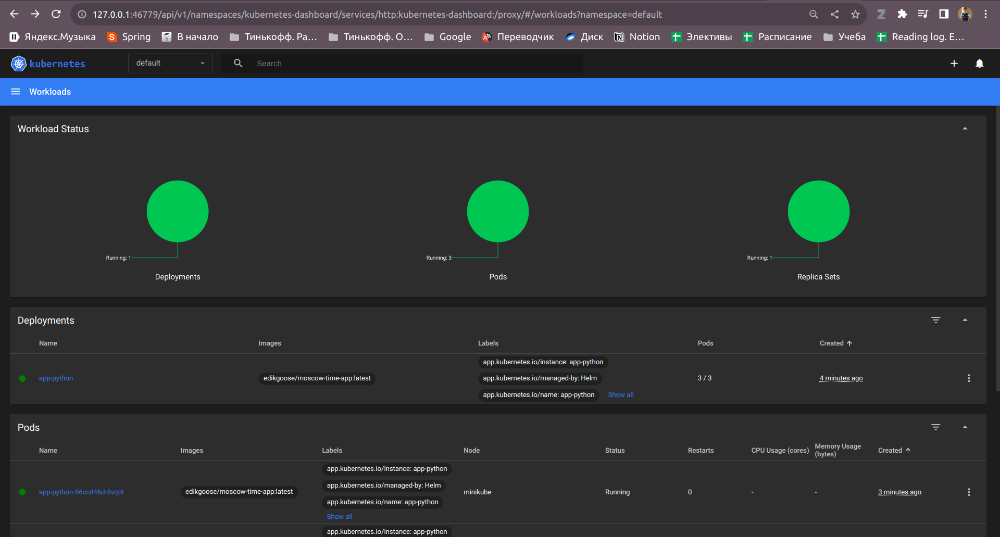
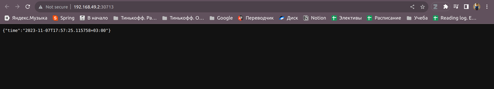

# Lab 10. Helm
## Task 1


```
~/iu-devops/k8s/helm/app-python$ minikube service app-python
|-----------|------------|-------------|---------------------------|
| NAMESPACE |    NAME    | TARGET PORT |            URL            |
|-----------|------------|-------------|---------------------------|
| default   | app-python | http/80     | http://192.168.49.2:30713 |
|-----------|------------|-------------|---------------------------|
🎉  Opening service default/app-python in default browser...
```



```
$ kubectl get pods
NAME                        READY   STATUS    RESTARTS   AGE
app-python-56ccd46d-5vqt6   1/1     Running   0          4m51s
app-python-56ccd46d-8ltdv   1/1     Running   0          5m44s
app-python-56ccd46d-mpx6g   1/1     Running   0          4m51s
```


```
$ kubectl get svc
NAME         TYPE        CLUSTER-IP       EXTERNAL-IP   PORT(S)        AGE
app-python   NodePort    10.103.153.133   <none>        80:30713/TCP   6m4s
kubernetes   ClusterIP   10.96.0.1        <none>        443/TCP        7d23h
```

Useful resources:
- https://opensource.com/article/20/5/helm-charts
- https://helm.sh/docs/chart_template_guide/getting_started/