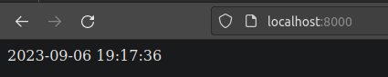
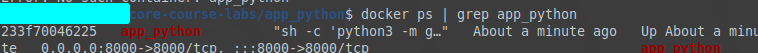
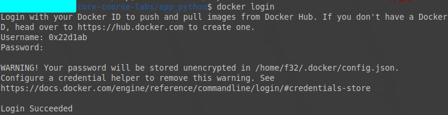
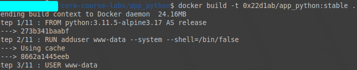
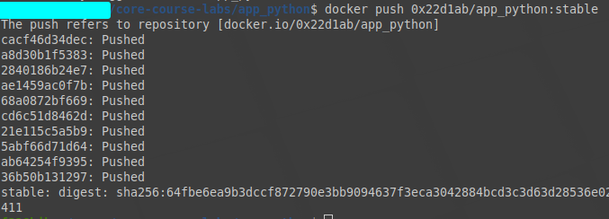
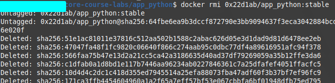
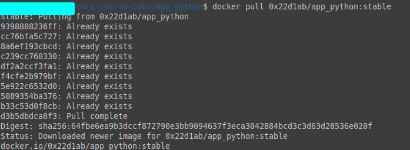
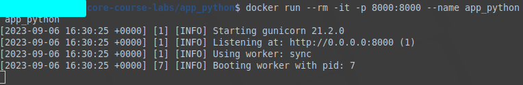

# Containerization Lab - Docker

In this lab assignment, you will learn to containerize applications using Docker, while focusing on best practices. Additionally, you will explore Docker multi-stage builds. Follow the tasks below to complete the lab assignment.

## Task 1: Dockerize Your Application

**To achieve a grade of 6/10**, follow these steps:

1. Create a `Dockerfile`:
   - Inside the `app_python` folder, craft a `Dockerfile` for your application.
   - Research and implement Docker best practices. Utilize a Dockerfile linter for quality assurance.

2. Build and Test Docker Image:
   - Build a Docker image using your Dockerfile.
   ```bash
    docker build -t app_python .
   ```

   - Thoroughly test the image to ensure it functions correctly.
   ```bash
   # Run the container
   docker run --rm -it -p 8000:8000 --name app_python app_python  
   ```
      - Ensure that the application is working 
      -  
      - Verify that container is launched
      - 
3. Push Image to Docker Hub:
   - If you lack a public Docker Hub account, create one.
   - Push your Docker image to your public Docker Hub account.
      1. Interactively login to the container registry using `docker login`
         - 
      2. Rebuild the image with tag corresponding to the remote dockerhub user
         -  `docker build -t <username>/app_python:stable .`
         
         - 
      3. Push to the container registry 
         - `docker push <username>/app_python:stable`
         - 
4. Run and Verify Docker Image:
   - Retrieve the Docker image from your Docker Hub account.
      1. Delete local image to ensure that it will be pulled from the remote registry 
         - `docker rmi <username>/app_python:stable`
         - 
      2. Pull the image from the Dockerhub
         - `docker pull <username>/app_python:stable`
         - 
   - Execute the image and validate its functionality.
         - 

## Task 2: Docker Best Practices

**To earn an additional 4 points**, follow these steps:

1. Enhance your docker image by implementing **Docker Security Best Practices**.
   - No root user inside, or you will get no points at all.

2. Write `DOCKER.md`:
   - Inside the `app_python` folder, create a `DOCKER.md` file.
   - Elaborate on the best practices you employed within your Dockerfile.
   - Implementing and listing numerous Docker best practices will earn you more points.

3. Enhance the README.md:
   - Update the `README.md` file in the `app_python` folder.
   - Include a dedicated `Docker` section, explaining your containerized application and providing clear instructions for execution.
     - How to build?
     - How to pull?
     - How to run?
  
## Bonus Task: Multi-Stage Builds Exploration

**To earn an additional 2.5 points:**

1. Dockerize Previous App:
   - Craft a `Dockerfile` for the application from the prior lab.
   - Place this Dockerfile within the corresponding `app_*` folder.

2. Follow Main Task Guidelines:
   - Apply the same steps and suggestions as in the primary Dockerization task.

3. Study Docker Multi-Stage Builds:
   - Familiarize yourself with Docker multi-stage builds.
   - Consider implementing multi-stage builds, only if they enhance your project's structure and efficiency.

### Guidelines

- Utilize appropriate Markdown formatting and structure for all documentation.
- Organize files within the lab folder with suitable naming conventions.
- Create pull requests (PRs) as needed: from your fork to the main branch of this repository, and from your fork's branch to your fork's master branch.

> Note: Utilize Docker to containerize your application, adhering to best practices. Explore Docker multi-stage builds for a deeper understanding, and document your process using Markdown.