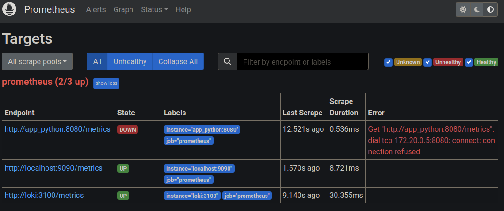
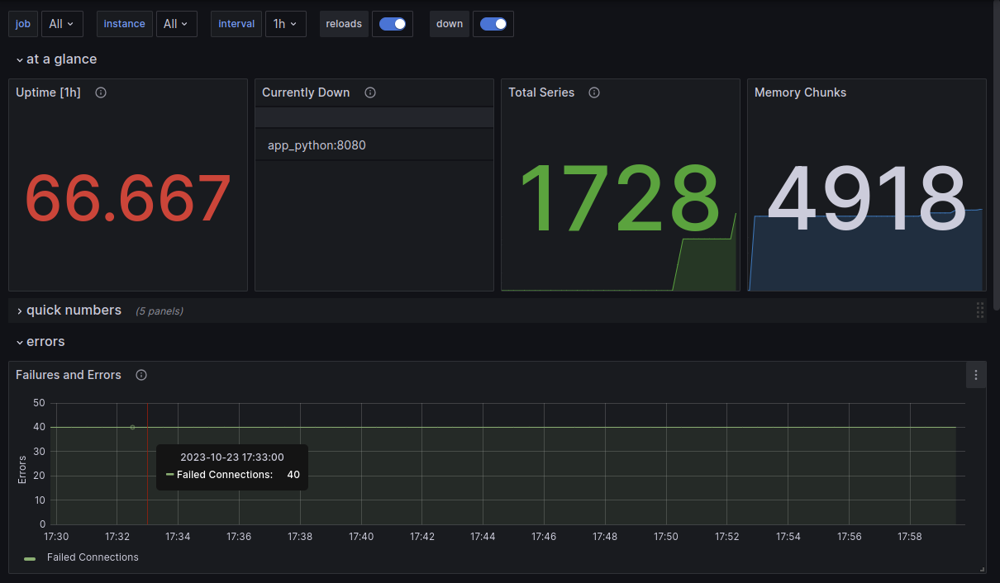
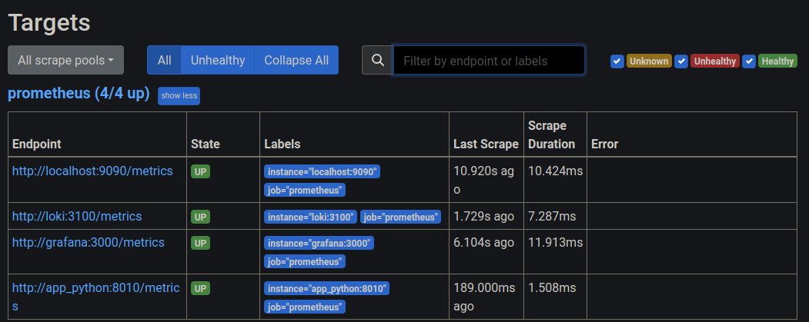

# Task 1

1. Yep.

2. Added prometheus container to docker-compose.

3. Added Prometheus config in `./config/prometheus.yml`.

4. Sucessfully compturing metrics from prometheus and loki.
   python-app will be fixed in Bonus task below.
   

# Task 2

1. Grafana Dashboards:
   * Prometheus (you can see app\_python is not fixed yet):
     
   * Loki:
     

2. Log rotation: edited `/etc/docker/daemon.json`:

   ```json
   {
   "log-driver": "json-file",
        "log-opts": {
            "max-size": "15m",
            "max-file": "5"
        }
   }
   ```

   Memory limit: Added `mem_limit` to all containers in docker-compose.

3. Added grafana as datasource.

# Bonus

1. Using `prometheus_client` library I added basic metrics to the app.

2. Added necessary changes to docker-compose and Prometheus config to expose the metrics.

   

3. Added `healthcheck` to docker compose services.
