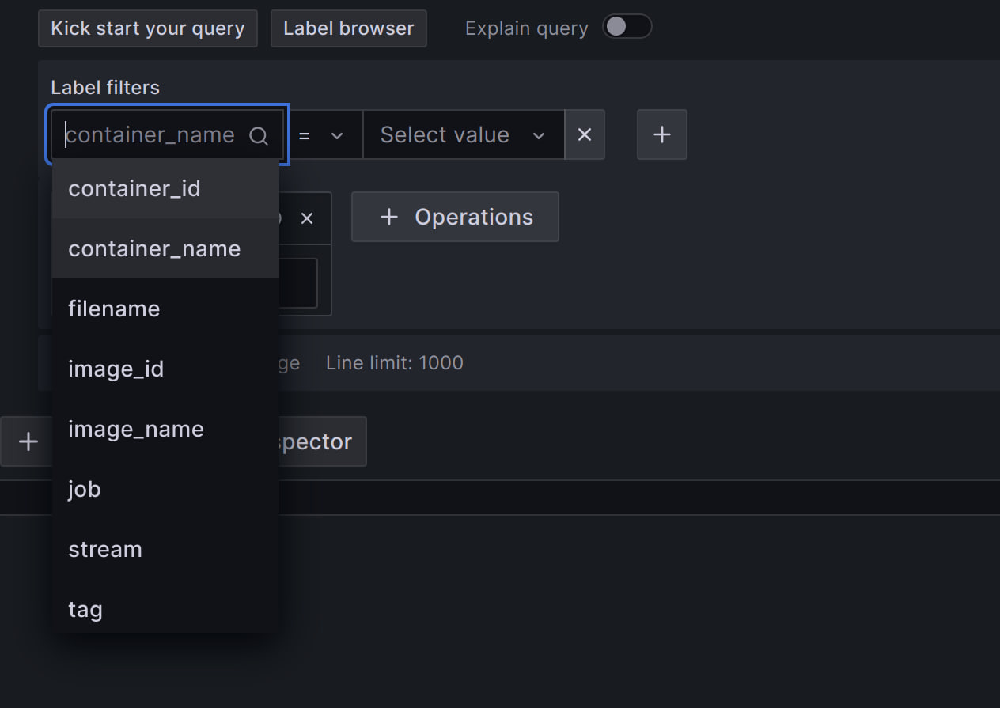
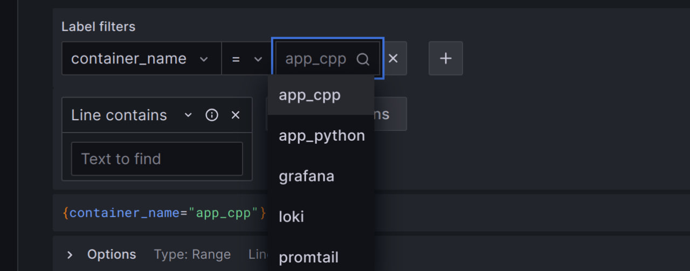
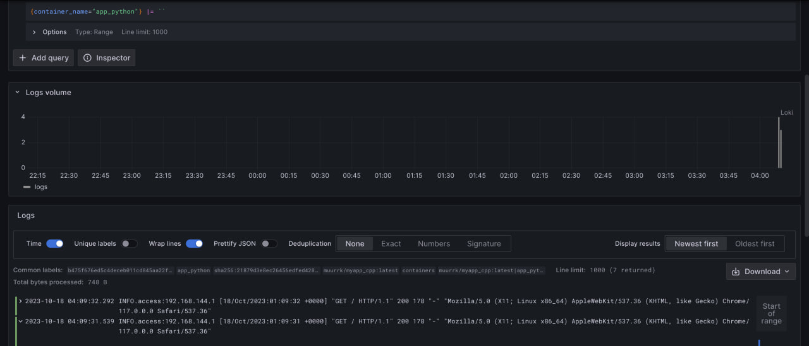
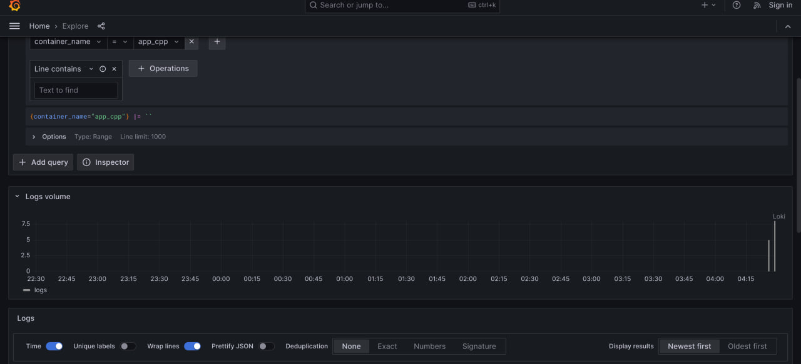
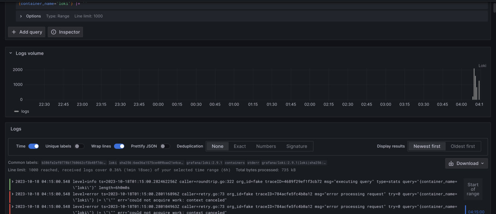
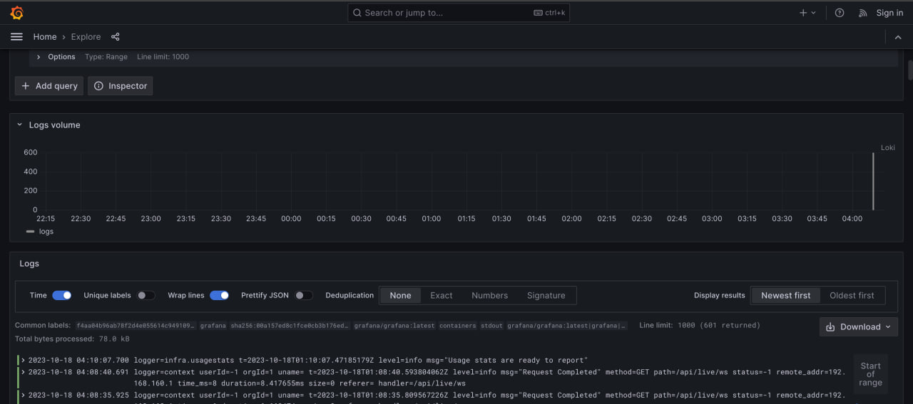
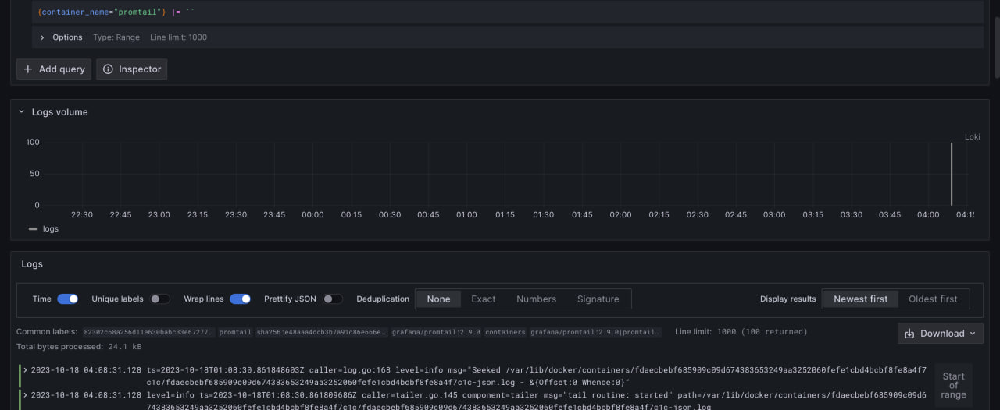

# Logging stack

## Loki: 
Loki is a horizontally scalable and highly available log aggregation system created by Grafana Labs. It provides a cost-effective and efficient approach to log management by using labels and indexes rather than indexing individual log lines. Loki stores log data in a binary format and relies on streaming logs directly into object storage,

## Grafana:
Grafana is an open-source analytics and monitoring platform that allows organizations to collect, visualize, and alert on metric data from different data sources. With its intuitive interface and extensive visualization options, Grafana is widely used for real-time monitoring of systems and applications. 

## Promtail: 
Promtail is a lightweight log shipper developed by Grafana Labs. It is specifically designed to collect log data from different sources and deliver it to Loki, a scalable log aggregation system. 

## Python Container

## Cpp Container 

## Loki

## Grafana

## Promtail
