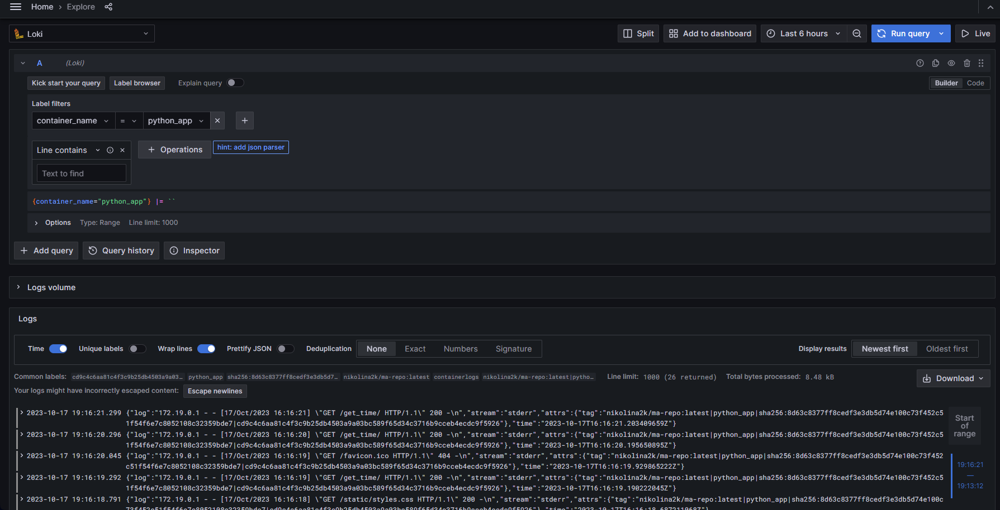
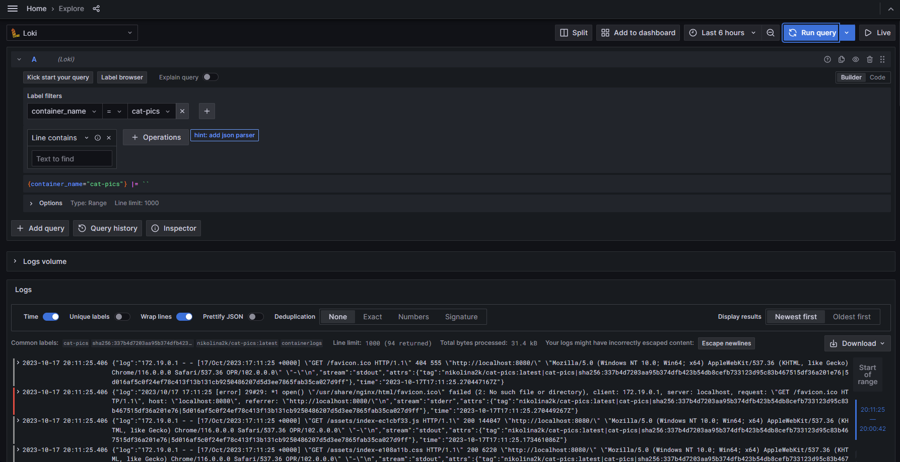
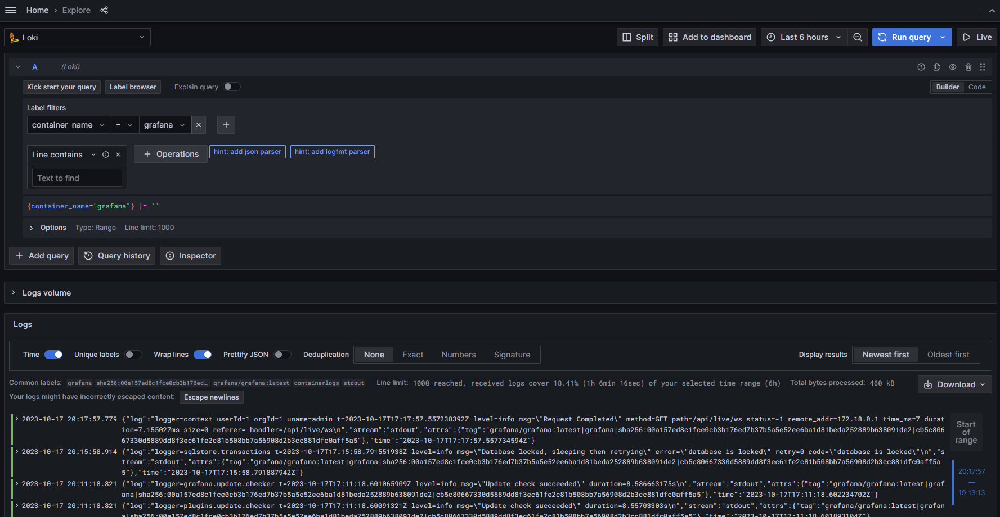

# Setup monitoring:

```
>>> cd monitoring
>>> 
>>> docker-compose run -d
```


# Docker containers:

* Python app - http://localhost:8000

* Cat pics app - http://localhost:8080
* Grafana: tool to visualize logs in GUI - http://localhost:3000 
* Loki: log aggregation system - http://localhost:3100
* Promtail: agent that ships the contents of logs to Loki - no url


## Tags: 
You can filter out logs for each container using following tags:

- image_name
- container_name
- image_id
- container_id
- filename

# Screenshots: 

## Python app:



## Typescript app:



## Graffana:


